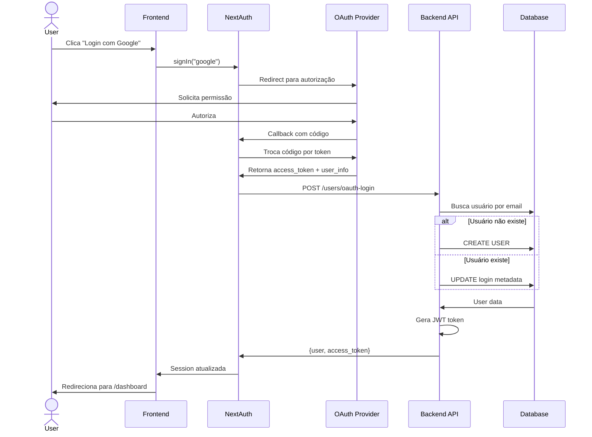

# 🔐 Módulo 01: Autenticação e Usuários

## Visão Geral

Este módulo é responsável por toda a gestão de identidade, autenticação e autorização da plataforma DoctorQ. Implementa múltiplos métodos de autenticação (OAuth2 e local) e gerenciamento completo do ciclo de vida do usuário.

---

## 📋 Casos de Uso

### UC001 - Realizar Login

**Descrição:** Permitir que usuários acessem a plataforma através de múltiplos métodos de autenticação.

**Prioridade:** 🔴 Alta | **Complexidade:** 🟡 Média | **Status:** ✅ Implementado

**Atores:**
- Principal: Usuário (qualquer tipo)
- Secundário: Sistema de autenticação OAuth (Google, Microsoft, Apple)

**Pré-condições:**
- Usuário possui conta cadastrada ou provedor OAuth configurado
- Sistema está disponível

**Fluxo Principal:**
1. Usuário acessa página de login
2. Sistema exibe opções de autenticação disponíveis
3. Usuário seleciona método de login:
   - **3a.** Login Local (email/senha)
   - **3b.** Login Google OAuth
   - **3c.** Login Microsoft OAuth
   - **3d.** Login Apple OAuth
4. Sistema valida credenciais
5. Sistema gera JWT token com claims (role, uid)
6. Sistema atualiza metadados de login (dt_ultimo_login, nr_total_logins)
7. Sistema redireciona para dashboard
8. Sistema exibe mensagem de boas-vindas

**Fluxos Alternativos:**

**FA1: Login OAuth (primeira vez)**
1. No passo 4, sistema detecta que usuário não existe
2. Sistema cria novo registro de usuário automaticamente
3. Sistema importa dados do provedor (nome, email, foto)
4. Sistema define papel padrão como "usuario"
5. Continua no passo 5

**FA2: Sincronização SEI (usuários internos)**
1. Após passo 6, sistema verifica se usuário tem domínio corporativo
2. Sistema agenda sincronização SEI em background (2s delay)
3. Sistema busca unidades do usuário no SEI
4. Sistema armazena unidades no Redis (TTL 24h)
5. Continua fluxo normal

**Fluxos de Exceção:**

**FE1: Credenciais Inválidas (Login Local)**
1. No passo 4, sistema detecta senha incorreta
2. Sistema retorna HTTP 401
3. Sistema exibe mensagem: "Credenciais inválidas"
4. Sistema registra tentativa de login falha
5. Após 5 tentativas, sistema bloqueia conta por 15 minutos
6. Fim do fluxo

**FE2: Usuário Desativado**
1. No passo 4, sistema detecta st_ativo = 'N'
2. Sistema retorna HTTP 403
3. Sistema exibe: "Conta desativada. Contate o administrador"
4. Fim do fluxo

**FE3: Provedor OAuth Indisponível**
1. No passo 4, provedor OAuth retorna erro
2. Sistema captura exceção
3. Sistema exibe: "Erro ao conectar com [Provedor]. Tente novamente"
4. Sistema registra erro no log
5. Fim do fluxo

**Pós-condições:**
- Usuário autenticado com sessão JWT ativa (30 dias)
- Metadados de login atualizados no banco
- Sessão armazenada no NextAuth

**Regras de Negócio:**

- **RN-001:** Email deve ser normalizado (lowercase + trim) antes da validação
- **RN-002:** Tokens JWT devem expirar em 30 dias
- **RN-003:** Usuários OAuth não possuem senha (nm_password_hash = NULL)
- **RN-004:** Primeiro login OAuth cria usuário automaticamente
- **RN-005:** Sincronização SEI não deve bloquear o login (assíncrona)

**Requisitos Não-Funcionais:**

- **Segurança:**
  - Passwords hasheados com Passlib (bcrypt)
  - JWT assinado com secret seguro (min 32 chars)
  - SSL/TLS obrigatório em produção
  - Rate limiting: 10 tentativas/minuto por IP

- **Performance:**
  - Tempo de resposta < 500ms (P95)
  - Cache de credenciais OAuth (Redis)

- **Usabilidade:**
  - Interface responsiva
  - Feedback visual durante autenticação
  - Opção "Lembrar-me" funcional

**Integrações:**

- **NextAuth:** Gerenciamento de sessão (frontend)
- **FastAPI:** Endpoints de autenticação (backend)
- **Google OAuth API:** Autenticação Google
- **Microsoft Graph API:** Autenticação Microsoft/Azure AD
- **Apple ID:** Autenticação Apple
- **SEI SOAP API:** Sincronização de unidades (opcional)

**Dados de Entrada:**

**Login Local:**
```json
{
  "nm_email": "string (EmailStr)",
  "senha": "string (min 1 char)"
}
```

**Login OAuth:**
```json
{
  "provider": "google" | "azure-ad" | "apple",
  "provider_id": "string",
  "email": "string (EmailStr)",
  "name": "string",
  "image": "string (URL, optional)"
}
```

**Dados de Saída:**

**Sucesso (200 OK):**
```json
{
  "user": {
    "id_user": "uuid",
    "nm_email": "string",
    "nm_completo": "string",
    "nm_papel": "admin" | "usuario" | "analista",
    "st_ativo": "S" | "N",
    "dt_ultimo_login": "datetime",
    "nr_total_logins": "string"
  },
  "access_token": "string (JWT)",
  "token_type": "bearer"
}
```

**Erro (401/403/500):**
```json
{
  "detail": "string (mensagem de erro)",
  "type": "validation_error" | "authentication_error"
}
```

**Cenários de Teste:**

**CT-001: Login local com credenciais válidas**
- **Pré-condição:** Usuário cadastrado com email/senha
- **Ação:** POST /users/login-local com credenciais corretas
- **Resultado:** HTTP 200 + JWT token + metadados atualizados

**CT-002: Login local com senha incorreta**
- **Pré-condição:** Usuário cadastrado
- **Ação:** POST /users/login-local com senha errada
- **Resultado:** HTTP 401 + mensagem "Credenciais inválidas"

**CT-003: Login Google OAuth (primeiro acesso)**
- **Pré-condição:** Usuário não existe no banco
- **Ação:** Callback OAuth com dados do Google
- **Resultado:** HTTP 200 + usuário criado + JWT token

**CT-004: Login com conta desativada**
- **Pré-condição:** Usuário com st_ativo = 'N'
- **Ação:** Tentativa de login
- **Resultado:** HTTP 403 + mensagem "Conta desativada"

**CT-005: Sincronização SEI em background**
- **Pré-condição:** Usuário com domínio corporativo
- **Ação:** Login bem-sucedido
- **Resultado:** Task async agendada + unidades no Redis após 2s

**Implementação:**

**Backend:**
- `estetiQ-api/src/services/user_service.py::login_local()`
- `estetiQ-api/src/services/user_service.py::oauth_login()`
- `estetiQ-api/src/routes/user.py::POST /users/login-local`
- `estetiQ-api/src/routes/user.py::POST /users/oauth-login`

**Frontend:**
- `estetiQ-web/src/auth.ts` - Configuração NextAuth
- `estetiQ-web/src/app/login/page.tsx` - Página de login
- `estetiQ-web/src/hooks/useAuth.ts` - Hook de autenticação

---

### UC002 - Registrar Novo Usuário

**Descrição:** Permitir que novos usuários criem conta na plataforma com email e senha.

**Prioridade:** 🔴 Alta | **Complexidade:** 🟢 Baixa | **Status:** ✅ Implementado

**Atores:**
- Principal: Visitante não autenticado

**Pré-condições:**
- Email ainda não cadastrado
- Sistema disponível

**Fluxo Principal:**
1. Visitante acessa página de registro
2. Sistema exibe formulário de cadastro
3. Visitante preenche dados obrigatórios:
   - Email
   - Nome completo
   - Senha
   - Confirmação de senha
4. Sistema valida dados:
   - Email único
   - Senha forte (min 8 chars, letra + número)
   - Senhas coincidem
5. Sistema normaliza email (lowercase + trim)
6. Sistema gera hash da senha (Passlib bcrypt)
7. Sistema cria registro de usuário com:
   - nm_papel = "usuario" (padrão)
   - st_ativo = "S"
   - nr_total_logins = "0"
8. Sistema envia email de boas-vindas (assíncrono)
9. Sistema redireciona para login
10. Sistema exibe mensagem de sucesso

**Fluxos Alternativos:**

**FA1: Registro com Papel Específico (Admin)**
1. No passo 3, administrador especifica nm_papel
2. Sistema valida permissão do solicitante
3. Continua no passo 4

**Fluxos de Exceção:**

**FE1: Email Já Cadastrado**
1. No passo 4, sistema detecta email duplicado
2. Sistema retorna HTTP 400
3. Sistema exibe: "Email já cadastrado. Faça login ou recupere sua senha"
4. Fim do fluxo

**FE2: Senha Fraca**
1. No passo 4, senha não atende critérios
2. Sistema retorna HTTP 400
3. Sistema exibe requisitos de senha:
   - Mínimo 8 caracteres
   - Pelo menos 1 letra
   - Pelo menos 1 número
4. Fim do fluxo

**FE3: Senhas Não Coincidem**
1. No passo 4, confirmação difere da senha
2. Sistema retorna HTTP 400
3. Sistema exibe: "As senhas não coincidem"
4. Fim do fluxo

**Pós-condições:**
- Usuário criado no banco de dados
- Email de boas-vindas enviado
- Usuário pode fazer login

**Regras de Negócio:**

- **RN-010:** Senha deve ter no mínimo 8 caracteres
- **RN-011:** Senha deve conter pelo menos 1 letra e 1 número
- **RN-012:** Email deve ser único no sistema
- **RN-013:** Papel padrão para novos usuários é "usuario"
- **RN-014:** Status padrão é ativo (st_ativo = 'S')

**Requisitos Não-Funcionais:**

- **Segurança:**
  - HTTPS obrigatório
  - CAPTCHA em produção (prevenção de bots)
  - Rate limiting: 3 registros/hora por IP

- **Performance:**
  - Tempo de resposta < 1s
  - Email enviado de forma assíncrona

**Integrações:**
- **SendGrid/SES:** Envio de email de boas-vindas
- **CAPTCHA (opcional):** Google reCAPTCHA v3

**Dados de Entrada:**

```json
{
  "nm_email": "string (EmailStr)",
  "nm_completo": "string (min 3 chars)",
  "senha": "string (min 8 chars)",
  "senha_confirmacao": "string",
  "nm_papel": "usuario" | "admin" | "analista" (opcional, default: usuario)
}
```

**Dados de Saída:**

**Sucesso (201 Created):**
```json
{
  "id_user": "uuid",
  "nm_email": "string",
  "nm_completo": "string",
  "nm_papel": "usuario",
  "st_ativo": "S",
  "dt_criacao": "datetime",
  "message": "Usuário registrado com sucesso. Verifique seu email."
}
```

**Cenários de Teste:**

**CT-010: Registro com dados válidos**
- **Ação:** POST /users/register com dados corretos
- **Resultado:** HTTP 201 + usuário criado + email enviado

**CT-011: Registro com email duplicado**
- **Ação:** POST /users/register com email já existente
- **Resultado:** HTTP 400 + mensagem de erro

**CT-012: Registro com senha fraca**
- **Ação:** POST /users/register com senha "123"
- **Resultado:** HTTP 400 + lista de requisitos

**Implementação:**
- Backend: `src/services/user_service.py::register_local_user()`
- Frontend: `src/app/register/page.tsx`

---

### UC003 - Recuperar Senha

**Descrição:** Permitir que usuários recuperem acesso à conta caso esqueçam a senha.

**Prioridade:** 🟡 Média | **Complexidade:** 🟡 Média | **Status:** 📝 Planejado

**Fluxo Principal:**
1. Usuário acessa "Esqueci minha senha"
2. Sistema solicita email
3. Usuário informa email
4. Sistema valida existência do email
5. Sistema gera token de recuperação (UUID + timestamp)
6. Sistema armazena token no Redis (TTL 1 hora)
7. Sistema envia email com link de recuperação
8. Usuário clica no link
9. Sistema valida token (não expirado, não usado)
10. Sistema exibe formulário de nova senha
11. Usuário informa nova senha (2x)
12. Sistema valida força da senha
13. Sistema atualiza hash da senha
14. Sistema invalida token
15. Sistema exibe confirmação
16. Sistema redireciona para login

**Regras de Negócio:**
- **RN-020:** Token de recuperação expira em 1 hora
- **RN-021:** Token pode ser usado apenas uma vez
- **RN-022:** Nova senha deve atender critérios de força
- **RN-023:** Usuários OAuth não podem recuperar senha (não possuem)

---

### UC004 - Alterar Senha

**Descrição:** Permitir que usuários alterem sua senha quando autenticados.

**Prioridade:** 🟡 Média | **Complexidade:** 🟢 Baixa | **Status:** ✅ Implementado

**Atores:**
- Principal: Usuário autenticado

**Pré-condições:**
- Usuário autenticado
- Usuário possui senha (não OAuth-only)

**Fluxo Principal:**
1. Usuário acessa "Alterar senha" no perfil
2. Sistema exibe formulário
3. Usuário preenche:
   - Senha atual
   - Nova senha
   - Confirmação da nova senha
4. Sistema valida senha atual
5. Sistema valida força da nova senha
6. Sistema valida confirmação
7. Sistema gera novo hash
8. Sistema atualiza nm_password_hash
9. Sistema atualiza dt_atualizacao
10. Sistema exibe confirmação
11. Sistema envia email de notificação de alteração

**Fluxos de Exceção:**

**FE1: Senha Atual Incorreta**
1. No passo 4, senha atual não confere
2. Sistema retorna HTTP 400
3. Sistema exibe: "Senha atual incorreta"
4. Fim do fluxo

**FE2: Usuário OAuth**
1. No passo 1, sistema detecta nm_password_hash = NULL
2. Sistema retorna HTTP 400
3. Sistema exibe: "Este usuário utiliza login social (Google/Microsoft/Apple)"
4. Fim do fluxo

**Regras de Negócio:**
- **RN-030:** Senha atual deve ser validada antes da alteração
- **RN-031:** Nova senha não pode ser igual à atual
- **RN-032:** Email de notificação deve ser enviado após alteração

**Dados de Entrada:**

```json
{
  "senha_atual": "string",
  "senha_nova": "string (min 8 chars)",
  "senha_nova_confirmacao": "string"
}
```

**Implementação:**
- Backend: `src/services/user_service.py::change_password()`
- Frontend: `src/app/perfil/alterar-senha/page.tsx`

---

### UC005 - Gerenciar Perfil de Usuário

**Descrição:** Permitir que usuários visualizem e editem seus dados pessoais.

**Prioridade:** 🟡 Média | **Complexidade:** 🟢 Baixa | **Status:** ✅ Implementado

**Fluxo Principal:**
1. Usuário autenticado acessa "Meu Perfil"
2. Sistema carrega dados do usuário
3. Sistema exibe dados em formulário editável:
   - Nome completo
   - Email (somente leitura)
   - Cargo
   - Telefone
   - Foto de perfil
   - Preferências
4. Usuário modifica campos desejados
5. Usuário clica em "Salvar"
6. Sistema valida dados
7. Sistema atualiza registro
8. Sistema atualiza dt_atualizacao
9. Sistema exibe confirmação

**Fluxos Alternativos:**

**FA1: Upload de Foto**
1. No passo 4, usuário clica em "Alterar foto"
2. Sistema abre seletor de arquivo
3. Usuário seleciona imagem
4. Sistema valida formato (JPG, PNG) e tamanho (max 5MB)
5. Sistema faz upload para storage (MinIO/S3)
6. Sistema atualiza ds_foto_url
7. Sistema exibe preview da nova foto
8. Continua no passo 5

**Regras de Negócio:**
- **RN-040:** Email não pode ser alterado (identificador único)
- **RN-041:** Foto de perfil max 5MB
- **RN-042:** Formatos aceitos: JPG, PNG, WebP

**Implementação:**
- Backend: `src/services/user_service.py::update_user()`
- Frontend: `src/app/perfil/page.tsx`

---

### UC006 - Gerenciar Permissões e Papéis

**Descrição:** Permitir que administradores gerenciem papéis e permissões de usuários.

**Prioridade:** 🟡 Média | **Complexidade:** 🟡 Média | **Status:** ✅ Implementado

**Atores:**
- Principal: Administrador da Plataforma
- Secundário: Usuário sendo gerenciado

**Pré-condições:**
- Ator principal tem papel "admin"
- Usuário alvo existe

**Fluxo Principal:**
1. Admin acessa "Gerenciar Usuários"
2. Sistema lista todos os usuários (paginado)
3. Admin busca/filtra usuário desejado
4. Admin seleciona usuário
5. Sistema exibe detalhes do usuário
6. Admin altera papel:
   - admin
   - usuario
   - analista
7. Sistema valida permissão do admin
8. Sistema atualiza nm_papel
9. Sistema registra auditoria da alteração
10. Sistema exibe confirmação
11. Sistema envia email ao usuário notificando alteração

**Fluxos Alternativos:**

**FA1: Ativar/Desativar Usuário**
1. No passo 6, admin alterna st_ativo
2. Sistema atualiza status ('S' ou 'N')
3. Se desativado, sistema invalida sessões ativas
4. Continua no passo 9

**Regras de Negócio:**
- **RN-050:** Apenas admins podem alterar papéis
- **RN-051:** Admin não pode desativar a própria conta
- **RN-052:** Deve haver pelo menos 1 admin ativo no sistema
- **RN-053:** Alterações de permissão devem ser auditadas

**Implementação:**
- Backend: `src/services/user_service.py::update_user()`
- Backend: `src/routes/user.py::PATCH /users/{user_id}`
- Frontend: `src/app/admin/usuarios/page.tsx`

---

### UC007 - Sincronizar Unidades SEI

**Descrição:** Sincronizar unidades organizacionais do sistema SEI para usuários corporativos.

**Prioridade:** 🟢 Baixa | **Complexidade:** 🔴 Alta | **Status:** ✅ Implementado

**Atores:**
- Principal: Sistema (automático)
- Secundário: SEI (Sistema Eletrônico de Informações)

**Pré-condições:**
- Usuário com email corporativo
- Credenciais SEI configuradas
- API SEI disponível

**Fluxo Principal:**
1. Sistema detecta login de usuário corporativo
2. Sistema agenda task assíncrona (delay 2s)
3. Task inicia execução
4. Sistema extrai nome_login do email (parte antes do @)
5. Sistema consulta API SEI: pesquisar_usuario(nome_login)
6. API SEI retorna dados do usuário (id_usuario)
7. Sistema consulta API SEI: pesquisar_usuario_unidade(id_usuario)
8. API SEI retorna lista de unidades
9. Sistema serializa unidades para JSON
10. Sistema armazena no Redis:
    - Chave: `user:{user_id}:sei:unidades`
    - TTL: 24 horas
    - Valor: JSON com unidades + timestamp
11. Sistema registra sucesso no log

**Fluxos Alternativos:**

**FA1: Usuário Não Encontrado no SEI**
1. No passo 6, API SEI retorna vazio
2. Sistema armazena lista vazia no Redis
3. Sistema registra no log: "Usuário não encontrado no SEI"
4. Fim do fluxo

**FA2: Forçar Sincronização Manual**
1. Usuário clica em "Sincronizar SEI" no perfil
2. Sistema chama `force_sei_sync()`
3. Sistema executa sincronização síncrona
4. Sistema retorna resultado imediatamente
5. Sistema exibe feedback visual

**Fluxos de Exceção:**

**FE1: API SEI Indisponível**
1. No passo 5 ou 7, API SEI timeout ou erro
2. Sistema captura exceção
3. Sistema armazena lista vazia no Redis
4. Sistema registra erro no log
5. Sistema não bloqueia login do usuário
6. Fim do fluxo

**Pós-condições:**
- Unidades armazenadas no Redis (sucesso ou vazio)
- Timestamp de última sincronização registrado
- Login do usuário não foi bloqueado

**Regras de Negócio:**
- **RN-060:** Sincronização não deve bloquear login (assíncrona)
- **RN-061:** Cache de unidades expira em 24 horas
- **RN-062:** Erros de sincronização são logados, mas não impedem login
- **RN-063:** Usuários podem forçar re-sincronização manualmente

**Requisitos Não-Funcionais:**
- **Performance:**
  - Delay de 2s antes de iniciar (não atrapalhar login)
  - Timeout de API SEI: 10s
  - Cache TTL: 24h

- **Confiabilidade:**
  - Falhas silenciosas (não afetam UX)
  - Retry automático em próximo login

**Integrações:**
- **SEI SOAP API:** Consulta de usuários e unidades
- **Redis:** Cache de unidades

**Dados de Entrada:**
```python
user_email: str  # "joao.silva@empresa.gov.br"
user_id: str     # UUID do usuário
```

**Dados de Saída (Redis):**
```json
{
  "unidades": [
    {
      "id_unidade": "12345",
      "sigla": "TI-SEDE",
      "descricao": "Tecnologia da Informação - Sede"
    }
  ],
  "ultimo_sync": "2025-11-07T10:30:00",
  "total": 1
}
```

**Cenários de Teste:**

**CT-070: Sincronização bem-sucedida**
- **Pré-condição:** Usuário existe no SEI
- **Ação:** Login de usuário corporativo
- **Resultado:** Unidades no Redis após 2s + log de sucesso

**CT-071: Usuário não existe no SEI**
- **Pré-condição:** Usuário não cadastrado no SEI
- **Ação:** Login de usuário corporativo
- **Resultado:** Lista vazia no Redis + log informativo

**CT-072: API SEI indisponível**
- **Pré-condição:** SEI offline
- **Ação:** Login de usuário corporativo
- **Resultado:** Lista vazia no Redis + erro logado + login bem-sucedido

**CT-073: Sincronização manual**
- **Pré-condição:** Usuário autenticado
- **Ação:** Clicar em "Sincronizar SEI"
- **Resultado:** Unidades atualizadas + feedback visual

**Implementação:**
- Backend: `src/services/user_service.py::sync_sei_unidades()`
- Backend: `src/services/user_service.py::_sync_sei_background()`
- Backend: `src/services/user_service.py::force_sei_sync()`
- Backend: `src/services/sei/sei_service.py`

---

## 🔄 Fluxos de Integração

### Diagrama de Sequência: Login OAuth



---

## 📊 Modelo de Dados

### Tabela: tb_users

| Campo | Tipo | Nullable | Descrição |
|-------|------|----------|-----------|
| id_user | UUID | NOT NULL | PK - Identificador único |
| nm_email | VARCHAR(255) | NOT NULL | Email único normalizado |
| nm_completo | VARCHAR(255) | NOT NULL | Nome completo do usuário |
| nm_papel | VARCHAR(20) | NOT NULL | admin, usuario, analista |
| st_ativo | CHAR(1) | NOT NULL | 'S' ou 'N' |
| nm_password_hash | VARCHAR(255) | NULL | Hash bcrypt (NULL para OAuth) |
| dt_ultimo_login | TIMESTAMP | NULL | Última autenticação |
| nr_total_logins | VARCHAR(10) | NOT NULL | Contador de logins |
| dt_criacao | TIMESTAMP | NOT NULL | Data de criação |
| dt_atualizacao | TIMESTAMP | NOT NULL | Data de última modificação |
| id_empresa | UUID | NULL | FK para tb_empresas |
| id_perfil | UUID | NULL | FK para tb_perfis |
| nm_cargo | VARCHAR(100) | NULL | Cargo do usuário |
| nr_telefone | VARCHAR(20) | NULL | Telefone de contato |
| ds_foto_url | VARCHAR(500) | NULL | URL da foto de perfil |
| ds_preferencias | JSONB | NULL | Preferências do usuário |

---

## 🔒 Segurança

### Autenticação

- **JWT Tokens:** Assinados com HS256 + secret de 32+ caracteres
- **OAuth 2.0:** Fluxo Authorization Code com PKCE
- **Password Hashing:** Bcrypt com cost factor 12
- **Session Storage:** HTTP-only cookies + secure flag

### Autorização

- **RBAC:** Role-Based Access Control (admin, usuario, analista)
- **Middleware:** ApiKeyAuthMiddleware para verificação de token
- **Tenant Isolation:** Multi-tenancy via id_empresa

### Proteções

- **Rate Limiting:** 10 req/min por IP em endpoints de login
- **Account Lockout:** 5 tentativas falhas = 15 min de bloqueio
- **HTTPS Only:** Cookies com flag secure em produção
- **CORS:** Whitelist de origens permitidas

---

## 📈 Métricas

### KPIs de Autenticação

- **Taxa de Sucesso de Login:** > 95%
- **Tempo de Autenticação:** < 500ms (P95)
- **Taxa de Adoção OAuth:** 60% dos usuários
- **Taxa de Recuperação de Senha:** < 5% dos logins
- **Disponibilidade:** 99.9%

### Monitoramento

- **Logins por Método:** Gráfico temporal (Local vs OAuth)
- **Tentativas Falhas:** Alertar se > 20/min (possível ataque)
- **Sessões Ativas:** Contagem em tempo real
- **Latência:** P50, P95, P99 de endpoints de autenticação

---

## 📝 Notas de Implementação

### Backend (FastAPI)

**Arquivos Principais:**
- `src/services/user_service.py` - Lógica de negócio
- `src/routes/user.py` - Endpoints REST
- `src/models/user.py` - Models SQLAlchemy + Pydantic
- `src/utils/security.py` - Helpers de segurança
- `src/middleware/apikey_auth.py` - Middleware de autenticação

**Dependências:**
```python
passlib[bcrypt]  # Password hashing
PyJWT           # JWT tokens
msal            # Microsoft authentication
```

### Frontend (Next.js)

**Arquivos Principais:**
- `src/auth.ts` - Configuração NextAuth
- `src/app/login/page.tsx` - UI de login
- `src/app/register/page.tsx` - UI de registro
- `src/hooks/useAuth.ts` - Hook de autenticação
- `src/middleware.ts` - Proteção de rotas

**Dependências:**
```json
{
  "next-auth": "^5.0.0-beta.29"
}
```

---

*Documentação completa do módulo de Autenticação e Usuários - DoctorQ v1.0.0*
