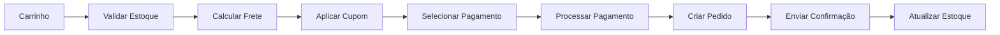

# 🛒 Módulo 06: Marketplace

## Visão Geral

Loja virtual integrada para venda de produtos estéticos (dermocosméticos, equipamentos, suplementos) com carrinho de compras, checkout, rastreamento de pedidos e sistema de avaliações.

**Status:** ✅ Implementado (maioria dos casos de uso)

---

## 📋 Casos de Uso

| ID | Caso de Uso | Prioridade | Complexidade | Status |
|----|-------------|------------|--------------|--------|
| UC050 | Navegar no Marketplace | 🔴 Alta | 🟡 Média | ✅ Implementado |
| UC051 | Adicionar ao Carrinho | 🔴 Alta | 🟡 Média | ✅ Implementado |
| UC052 | Gerenciar Carrinho de Compras | 🔴 Alta | 🟡 Média | ✅ Implementado |
| UC053 | Finalizar Pedido | 🔴 Alta | 🔴 Alta | ✅ Implementado |
| UC054 | Rastrear Pedido | 🟡 Média | 🟡 Média | 🔄 Em Desenvolvimento |
| UC055 | Avaliar Produto | 🟡 Média | 🟢 Baixa | ✅ Implementado |
| UC056 | Busca Avançada de Produtos | 🟡 Média | 🟡 Média | ✅ Implementado |
| UC128 | Onboarding de Fornecedor | 🔴 Alta | 🟡 Média | 📝 Planejado |

**Total:** 8 casos de uso | **Implementados:** 6 (75%)

---

## 📚 Documentação Completa

👉 **[CASOS_DE_USO_COMPLETOS.md](../CASOS_DE_USO_COMPLETOS.md#06-🛒-marketplace-uc050-uc056)**

---

## UC128 - Onboarding de Fornecedor

- **Objetivo:** habilitar fornecedores a publicar catálogo no marketplace B2B da DoctorQ
- **Status:** 📝 Planejado | **Prioridade:** 🔴 Alta | **Complexidade:** 🟡 Média

**Principais Etapas:**
1. Informações fiscais e upload de documentos (CNPJ, IE, contrato social)
2. Cadastro inicial de produtos e kits (manual ou importação)
3. Configuração de logística (SLAs, transportadoras, regiões)
4. Políticas comerciais (pagamento, devolução, garantia)
5. Integração com canais de atendimento / CRM

📄 Detalhes completos: [`UC-Fornecedor-Onboarding.md`](./UC-Fornecedor-Onboarding.md)

---

## 🔑 Destaques Técnicos

### Categorias de Produtos
- Skincare (cremes, sérums, máscaras)
- Maquiagem
- Suplementos estéticos
- Equipamentos profissionais
- Dermocosméticos

### Fluxo de Checkout Completo


### Sistema de Avaliações
- Nota 1-5 estrelas
- Comentário + fotos
- Moderação opcional
- Resposta do fornecedor
- Verificação de compra

---

## 📊 Principais Endpoints

```http
# Marketplace
GET    /marketplace/produtos       - Listar produtos
GET    /marketplace/categorias     - Listar categorias
GET    /marketplace/destaques      - Produtos em destaque

# Carrinho
POST   /carrinho/adicionar         - Adicionar item
GET    /carrinho                   - Visualizar carrinho
PATCH  /carrinho/item/{id}         - Atualizar quantidade
DELETE /carrinho/item/{id}         - Remover item
POST   /carrinho/limpar            - Limpar carrinho

# Checkout
POST   /checkout/calcular-frete    - Calcular frete
POST   /checkout/finalizar         - Finalizar pedido
POST   /checkout/pagamento         - Processar pagamento

# Pedidos
GET    /pedidos                    - Listar pedidos
GET    /pedidos/{id}               - Detalhes do pedido
GET    /pedidos/{id}/rastreamento  - Rastrear pedido

# Avaliações
POST   /produtos/{id}/avaliacoes   - Criar avaliação
GET    /produtos/{id}/avaliacoes   - Listar avaliações
```

---

## 🗄️ Modelo de Dados Principal

### tb_carrinho
- Itens do carrinho por usuário
- Persistência (Redis + DB)

### tb_pedidos
- Status: Pendente, Pago, Separação, Enviado, Entregue
- Dados de entrega e pagamento

### tb_itens_pedido
- Produtos, quantidade, preço unitário
- Snapshot do produto no momento da compra

### tb_avaliacoes
- Nota, comentário, fotos
- Verificação de compra
- Resposta do fornecedor

---

## 🎭 Visões que Utilizam

- 👤 **PACIENTE** - Compra de produtos, avaliações
- 🏥 **CLÍNICA** - Gestão de pedidos
- 📦 **FORNECEDOR** - Recebimento e processamento de pedidos
- ⚙️ **ADMINISTRADOR** - Configurações e analytics

---

*Documentação completa em CASOS_DE_USO_COMPLETOS.md*
