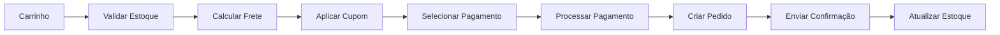
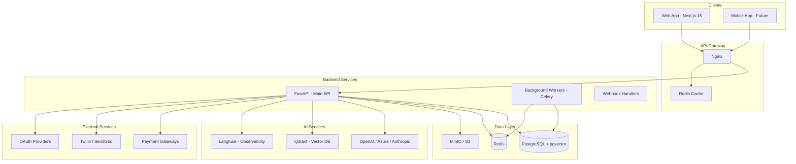

# 📚 Documentação Completa de Casos de Uso - DoctorQ

## Índice Completo de Todos os 91 Casos de Uso

Este documento consolida TODOS os casos de uso da plataforma DoctorQ de forma resumida porém completa.

---

## 📦 MÓDULOS 04-13: RESUMO EXECUTIVO

### 04. 👤 PACIENTES (UC030-UC036)

#### UC030 - Cadastrar Paciente
- **Descrição:** Cadastro completo de paciente na clínica
- **Dados:** Nome, CPF, data nascimento, contato, endereço, convênio
- **Validação:** CPF único, idade mínima 18 anos (ou responsável)
- **Status:** ✅ Implementado

#### UC031 - Gerenciar Prontuário
- **Descrição:** Registro digital completo do histórico médico
- **Conteúdo:** Anamnese, alergias, medicamentos, procedimentos realizados
- **Conformidade:** LGPD - dados sensíveis criptografados
- **Status:** ✅ Implementado

#### UC032 - Registrar Anamnese
- **Descrição:** Questionário pré-atendimento personalizado
- **Campos:** Histórico médico, alergias, medicações, expectativas
- **Formulário:** Dinâmico baseado em procedimento
- **Status:** 🔄 Em Desenvolvimento

#### UC033 - Adicionar Fotos de Evolução
- **Descrição:** Documentação visual antes/durante/depois
- **Formatos:** JPG, PNG (max 10MB)
- **Recursos:** Comparação lado-a-lado, timeline, filtros de privacidade
- **Status:** ✅ Implementado

#### UC034 - Consultar Histórico de Procedimentos
- **Descrição:** Visualizar todos procedimentos realizados
- **Filtros:** Por data, tipo, profissional, clínica
- **Exportação:** PDF com fotos e relatórios
- **Status:** ✅ Implementado

#### UC035 - Gerenciar Favoritos
- **Descrição:** Salvar clínicas, profissionais e procedimentos favoritos
- **Funcionalidades:** Lista de favoritos, notificações de promoções
- **Status:** ✅ Implementado

#### UC036 - Buscar Clínicas e Procedimentos
- **Descrição:** Sistema de busca inteligente com filtros
- **Filtros:** Localização, preço, avaliação, especialidade, convênio
- **Ordenação:** Relevância, distância, preço, avaliação
- **Status:** ✅ Implementado

**Modelo de Dados Principal:**
```sql
CREATE TABLE tb_pacientes (
    id_paciente UUID PRIMARY KEY,
    id_user UUID REFERENCES tb_users,
    nm_completo VARCHAR(255) NOT NULL,
    nr_cpf VARCHAR(11) UNIQUE,
    dt_nascimento DATE NOT NULL,
    nr_telefone VARCHAR(20),
    ds_endereco JSONB,
    ds_prontuario_eletronico JSONB ENCRYPTED,
    dt_ultima_consulta DATE,
    nr_total_consultas INTEGER DEFAULT 0
);
```

---

### 05. 💉 PROCEDIMENTOS E PRODUTOS (UC040-UC046)

#### UC040 - Cadastrar Procedimento
- **Descrição:** Cadastro de serviços oferecidos pela clínica
- **Dados:** Nome, categoria, descrição, duração, preço, requisitos
- **Categorias:** Facial, corporal, capilar, íntimo, outros
- **Status:** ✅ Implementado

#### UC041 - Gerenciar Catálogo de Procedimentos
- **Descrição:** CRUD completo de procedimentos
- **Funcionalidades:** Ativar/desativar, copiar, variações de preço
- **Status:** ✅ Implementado

#### UC042 - Cadastrar Produto
- **Descrição:** Produtos para venda (cosméticos, suplementos)
- **Dados:** Nome, marca, SKU, preço, estoque, fornecedor
- **Integração:** Marketplace interno
- **Status:** ✅ Implementado

#### UC043 - Gerenciar Estoque
- **Descrição:** Controle de entrada/saída de produtos
- **Funcionalidades:** Alertas de estoque mínimo, movimentação, inventário
- **Status:** 🔄 Em Desenvolvimento

#### UC044 - Configurar Preços
- **Descrição:** Tabela de preços dinâmica
- **Variações:** Por profissional, horário, pacote, convênio
- **Promoções:** Desconto percentual ou valor fixo
- **Status:** ✅ Implementado

#### UC045 - Aplicar Cupons de Desconto
- **Descrição:** Sistema de cupons promocionais
- **Tipos:** Percentual, valor fixo, frete grátis, combo
- **Regras:** Uso único/múltiplo, data validade, valor mínimo
- **Status:** ✅ Implementado

#### UC046 - Gerenciar Fornecedores
- **Descrição:** Cadastro de fornecedores de produtos
- **Dados:** Razão social, CNPJ, contato, catálogo
- **Status:** ✅ Implementado

**Endpoints Principais:**
```http
POST   /procedimentos         - Criar procedimento
GET    /procedimentos         - Listar com filtros
PATCH  /procedimentos/{id}    - Atualizar
POST   /produtos              - Criar produto
GET    /produtos/estoque      - Consultar estoque
POST   /cupons/validar        - Validar cupom
```

---

### 06. 🛒 MARKETPLACE (UC050-UC056)

#### UC050 - Navegar no Marketplace
- **Descrição:** Loja virtual de produtos estéticos
- **Categorias:** Skincare, maquiagem, suplementos, equipamentos
- **Funcionalidades:** Busca, filtros, ordenação, recomendações
- **Status:** ✅ Implementado

#### UC051 - Adicionar ao Carrinho
- **Descrição:** Adicionar produtos ao carrinho de compras
- **Validação:** Estoque disponível, quantidade mínima/máxima
- **Status:** ✅ Implementado

#### UC052 - Gerenciar Carrinho de Compras
- **Descrição:** Visualizar, editar, remover itens
- **Cálculos:** Subtotal, desconto, frete, total
- **Persistência:** Redis (sessão) + DB (autenticado)
- **Status:** ✅ Implementado

#### UC053 - Finalizar Pedido
- **Descrição:** Checkout e criação de pedido
- **Fluxo:** Carrinho → Endereço → Pagamento → Confirmação
- **Validações:** Estoque, cupom, limite de crédito
- **Status:** ✅ Implementado

#### UC054 - Rastrear Pedido
- **Descrição:** Acompanhamento de status do pedido
- **Estados:** Pendente, Pago, Separação, Enviado, Entregue
- **Notificações:** Email/SMS a cada mudança de status
- **Status:** 🔄 Em Desenvolvimento

#### UC055 - Avaliar Produto
- **Descrição:** Sistema de avaliações e reviews
- **Dados:** Nota (1-5), comentário, fotos
- **Moderação:** Aprovação antes de publicar (opcional)
- **Status:** ✅ Implementado

#### UC056 - Busca Avançada de Produtos
- **Descrição:** Busca com múltiplos filtros e IA
- **Filtros:** Categoria, marca, preço, avaliação, ingredientes
- **IA:** Busca semântica com embeddings
- **Status:** ✅ Implementado

**Fluxo de Checkout:**


---

### 07. 💳 BILLING E ASSINATURAS (UC060-UC066)

#### UC060 - Criar Assinatura
- **Descrição:** Assinatura de plano SaaS para clínicas
- **Planos:** Básico, Profissional, Enterprise
- **Cobrança:** Mensal, Trimestral, Anual
- **Status:** ✅ Implementado

#### UC061 - Gerenciar Plano de Assinatura
- **Descrição:** Upgrade, downgrade, cancelamento
- **Regras:** Pro-rata em upgrades, fim do período em downgrades
- **Status:** ✅ Implementado

#### UC062 - Processar Pagamento
- **Descrição:** Integração com gateways de pagamento
- **Métodos:** Cartão crédito, boleto, PIX, carteira digital
- **Gateways:** Stripe, PagSeguro, Mercado Pago
- **Status:** ✅ Implementado

#### UC063 - Emitir Nota Fiscal
- **Descrição:** Emissão automática de NF-e
- **Integração:** API de prefeituras (NFSe)
- **Status:** 📝 Planejado

#### UC064 - Consultar Transações
- **Descrição:** Histórico financeiro completo
- **Filtros:** Período, tipo, status, método
- **Exportação:** CSV, Excel, PDF
- **Status:** ✅ Implementado

#### UC065 - Gerenciar Limites de Uso
- **Descrição:** Quota por funcionalidade (API calls, armazenamento)
- **Limites:** Por plano de assinatura
- **Alertas:** Notificar ao atingir 80% do limite
- **Status:** ✅ Implementado

#### UC066 - Relatório de Faturamento
- **Descrição:** Relatórios financeiros gerenciais
- **Métricas:** MRR, Churn, LTV, CAC
- **Período:** Mensal, trimestral, anual
- **Status:** ✅ Implementado

**Planos de Assinatura:**
| Plano | Preço | Profissionais | Agendamentos/mês | IA | Armazenamento |
|-------|-------|---------------|------------------|----| --------------|
| Básico | R$ 199/mês | 3 | 200 | 100 consultas | 5 GB |
| Profissional | R$ 499/mês | 10 | 1000 | 500 consultas | 50 GB |
| Enterprise | R$ 1.499/mês | Ilimitado | Ilimitado | Ilimitado | 500 GB |

---

### 08. 🤖 IA E AGENTES (UC070-UC076)

#### UC070 - Criar Agente de IA
- **Descrição:** Configurar assistente virtual especializado
- **Configuração:** Nome, modelo LLM, temperatura, instruções
- **Modelos:** GPT-4, Claude, Gemini, Ollama (local)
- **Status:** ✅ Implementado

#### UC071 - Configurar Ferramentas do Agente
- **Descrição:** Habilitar ferramentas (tools) para o agente
- **Ferramentas Disponíveis:**
  - `search_database`: Buscar no banco de dados
  - `search_web`: Buscar na internet
  - `send_email`: Enviar emails
  - `create_appointment`: Criar agendamento
  - `calculator`: Calculadora
  - Customizadas via API
- **Status:** ✅ Implementado

#### UC072 - Treinar Agente com Documentos
- **Descrição:** RAG - Retrieval Augmented Generation
- **Processo:**
  1. Upload de documentos (PDF, DOCX, TXT)
  2. Extração de texto (Docling)
  3. Chunking (1000 tokens com overlap 200)
  4. Geração de embeddings (OpenAI ada-002 ou Azure)
  5. Armazenamento no Qdrant (vector DB)
  6. Indexação para busca semântica
- **Status:** ✅ Implementado

#### UC073 - Gerenciar Base de Conhecimento
- **Descrição:** CRUD de documentos da base de conhecimento
- **Funcionalidades:** Upload, visualizar, deletar, reindexar
- **Tamanho Max:** 50MB por documento
- **Status:** ✅ Implementado

#### UC074 - Executar Agente
- **Descrição:** Interagir com agente via chat ou API
- **Modos:**
  - **Chat:** Interface conversacional
  - **API:** Endpoint RESTful
  - **Streaming:** Server-Sent Events para respostas em tempo real
- **Status:** ✅ Implementado

#### UC075 - Monitorar Performance do Agente
- **Descrição:** Observabilidade com Langfuse
- **Métricas:**
  - Latência (P50, P95, P99)
  - Tokens consumidos
  - Custo por interação
  - Taxa de sucesso
  - Feedback do usuário
- **Status:** ✅ Implementado

#### UC076 - Gerenciar Prompts e Templates
- **Descrição:** Biblioteca de prompts reutilizáveis
- **Versioning:** Controle de versões de prompts
- **Variáveis:** Suporte a placeholders dinâmicos
- **Status:** ✅ Implementado

**Arquitetura de Agente:**
```python
class AgentExecutor:
    def __init__(self, agent_config):
        self.llm = load_llm(agent_config.model)
        self.tools = load_tools(agent_config.tools)
        self.memory = ConversationBufferMemory()
        self.retriever = QdrantRetriever(collection=agent_config.kb)

    async def execute(self, query: str):
        # 1. Buscar contexto relevante (RAG)
        context = await self.retriever.search(query, k=5)

        # 2. Construir prompt com contexto
        prompt = build_prompt(query, context, self.memory)

        # 3. Executar LLM com ferramentas
        response = await self.llm.ainvoke(
            prompt,
            tools=self.tools,
            callbacks=[LangfuseCallbackHandler()]
        )

        # 4. Armazenar em memória
        self.memory.save_context(query, response)

        return response
```

---

### 09. 💬 CHAT E CONVERSAS (UC080-UC086)

#### UC080 - Iniciar Conversa com IA
- **Descrição:** Criar nova sessão de chat
- **Contexto:** Usuário, agente, documentos anexados
- **Persistência:** Conversas salvas no banco
- **Status:** ✅ Implementado

#### UC081 - Enviar Mensagem
- **Descrição:** Enviar mensagem para o agente
- **Validação:** Limite de 4000 caracteres
- **Status:** ✅ Implementado

#### UC082 - Receber Resposta em Streaming
- **Descrição:** Resposta em tempo real (SSE)
- **Tecnologia:** Server-Sent Events
- **UX:** Efeito de digitação token-by-token
- **Status:** ✅ Implementado

#### UC083 - Anexar Documentos ao Chat
- **Descrição:** Upload de arquivos para contexto
- **Formatos:** PDF, DOCX, TXT, imagens
- **Processamento:** Extração de texto + adição ao contexto
- **Status:** ✅ Implementado

#### UC084 - Consultar Histórico de Conversas
- **Descrição:** Listar conversas anteriores
- **Filtros:** Por data, agente, tags
- **Busca:** Full-text search em mensagens
- **Status:** ✅ Implementado

#### UC085 - Compartilhar Conversa
- **Descrição:** Gerar link público para conversa
- **Privacidade:** Opções de expiração e senha
- **Status:** 🔄 Em Desenvolvimento

#### UC086 - Exportar Conversa
- **Descrição:** Baixar conversa em diferentes formatos
- **Formatos:** PDF, Markdown, JSON
- **Conteúdo:** Mensagens + metadados + anexos
- **Status:** ✅ Implementado

**Protocolo de Streaming (SSE):**
```typescript
// Frontend
const eventSource = new EventSource('/api/chat/stream?conversation_id=xxx');

eventSource.onmessage = (event) => {
  const data = JSON.parse(event.data);

  if (data.type === 'token') {
    appendToken(data.content); // Efeito de digitação
  } else if (data.type === 'end') {
    eventSource.close();
    saveMessage(data.message_id);
  }
};

// Backend
async def stream_response(conversation_id, query):
    async for token in llm.astream(query):
        yield f"data: {json.dumps({'type': 'token', 'content': token})}\n\n"

    yield f"data: {json.dumps({'type': 'end', 'message_id': msg_id})}\n\n"
```

---

### 10. 🔔 NOTIFICAÇÕES E MENSAGENS (UC090-UC096)

#### UC090 - Enviar Notificação
- **Descrição:** Sistema unificado de notificações
- **Canais:** In-app, Email, SMS, WhatsApp, Push
- **Status:** ✅ Implementado

#### UC091 - Receber Notificação Push
- **Descrição:** Notificações push no navegador/app
- **Tecnologia:** Firebase Cloud Messaging (FCM)
- **Status:** ✅ Implementado

#### UC092 - Gerenciar Preferências de Notificação
- **Descrição:** Usuário escolhe quais notificações receber
- **Granularidade:** Por tipo de evento e canal
- **Status:** ✅ Implementado

#### UC093 - Enviar Mensagem Direta
- **Descrição:** Chat entre usuários (paciente ↔ profissional)
- **Funcionalidades:** Texto, imagens, arquivos
- **Status:** 🔄 Em Desenvolvimento

#### UC094 - Integração WhatsApp
- **Descrição:** Enviar mensagens via WhatsApp Business API
- **Uso:** Confirmações, lembretes, marketing
- **Provedor:** Twilio WhatsApp API
- **Status:** ✅ Implementado

#### UC095 - Enviar Email Transacional
- **Descrição:** Emails automáticos do sistema
- **Tipos:** Confirmação, senha, nota fiscal, relatórios
- **Provedor:** SendGrid / Amazon SES
- **Status:** ✅ Implementado

#### UC096 - Broadcast de Mensagens
- **Descrição:** Envio em massa para segmento de usuários
- **Segmentação:** Por clínica, procedimento, localização
- **Agendamento:** Programar envio futuro
- **Status:** 📝 Planejado

**Tabela de Notificações:**
```sql
CREATE TABLE tb_notificacoes (
    id_notificacao UUID PRIMARY KEY,
    id_user UUID REFERENCES tb_users,
    tp_notificacao VARCHAR(50), -- agendamento, pagamento, etc
    ds_titulo VARCHAR(255),
    ds_mensagem TEXT,
    ds_dados_extras JSONB,
    st_lida BOOLEAN DEFAULT false,
    dt_leitura TIMESTAMP,
    dt_criacao TIMESTAMP DEFAULT now()
);
```

---

### 11. 📸 MÍDIAS E ÁLBUNS (UC100-UC106)

#### UC100 - Fazer Upload de Foto
- **Descrição:** Upload de imagens para sistema
- **Validação:** Formato (JPG, PNG, WebP), tamanho (max 10MB)
- **Processamento:**
  - Compressão automática
  - Geração de thumbnails (150x150, 300x300, 600x600)
  - Extração de EXIF
  - Detecção de faces (opcional)
- **Armazenamento:** MinIO / S3
- **Status:** ✅ Implementado

#### UC101 - Criar Álbum de Fotos
- **Descrição:** Agrupar fotos por procedimento/paciente
- **Tipos:** Antes/Depois, Evolução, Portfolio
- **Privacidade:** Privado, Compartilhado, Público
- **Status:** ✅ Implementado

#### UC102 - Gerenciar Álbum
- **Descrição:** CRUD de álbuns e fotos
- **Funcionalidades:** Adicionar, remover, reordenar fotos
- **Status:** ✅ Implementado

#### UC103 - Aplicar Filtros em Fotos
- **Descrição:** Edição básica de imagens
- **Filtros:** Brilho, contraste, saturação, recorte
- **Status:** 📝 Planejado

#### UC104 - Comparar Fotos (Antes/Depois)
- **Descrição:** Visualização lado a lado
- **Funcionalidades:** Slider comparativo, sobreposição
- **Status:** ✅ Implementado

#### UC105 - Compartilhar Álbum
- **Descrição:** Gerar link público para álbum
- **Opções:** Senha, expiração, download permitido
- **Status:** 🔄 Em Desenvolvimento

#### UC106 - Gerar Relatório Visual
- **Descrição:** PDF com evolução do tratamento
- **Conteúdo:** Fotos, datas, observações
- **Template:** Personalizável com logo da clínica
- **Status:** ✅ Implementado

**Upload e Processamento:**
```python
async def upload_foto(file: UploadFile, album_id: UUID):
    # 1. Validar arquivo
    validate_image(file)

    # 2. Gerar ID único
    foto_id = uuid4()

    # 3. Upload original para S3
    original_key = f"fotos/{album_id}/{foto_id}/original.jpg"
    await s3_client.upload(file, original_key)

    # 4. Processar thumbnails
    for size in [150, 300, 600]:
        thumb = resize_image(file, size)
        thumb_key = f"fotos/{album_id}/{foto_id}/thumb_{size}.jpg"
        await s3_client.upload(thumb, thumb_key)

    # 5. Extrair metadados
    exif = extract_exif(file)

    # 6. Salvar no banco
    foto = Foto(
        id_foto=foto_id,
        id_album=album_id,
        ds_url_original=original_key,
        ds_exif=exif,
        dt_upload=datetime.now()
    )
    await db.save(foto)

    return foto
```

---

### 12. 📊 ANALYTICS E RELATÓRIOS (UC110-UC116)

#### UC110 - Visualizar Dashboard Principal
- **Descrição:** Dashboard executivo com KPIs
- **Métricas:**
  - Agendamentos (hoje, semana, mês)
  - Receita (MRR, crescimento)
  - Taxa de ocupação
  - Pacientes ativos
  - Avaliação média
- **Status:** ✅ Implementado

#### UC111 - Gerar Relatório de Agendamentos
- **Descrição:** Relatório detalhado de agendamentos
- **Filtros:** Período, profissional, procedimento, status
- **Visualizações:** Gráficos de linha, barra, pizza
- **Status:** ✅ Implementado

#### UC112 - Análise de Receita
- **Descrição:** Relatórios financeiros
- **Métricas:**
  - Receita bruta/líquida
  - Ticket médio
  - Receita por profissional/procedimento
  - Projeção de faturamento
- **Status:** ✅ Implementado

#### UC113 - Estatísticas de Uso de IA
- **Descrição:** Analytics de agentes de IA
- **Métricas:**
  - Conversas iniciadas
  - Tempo médio de resposta
  - Taxa de resolução
  - Tokens consumidos
  - Custo por conversa
  - Feedback dos usuários
- **Dashboard:** Langfuse integrado
- **Status:** ✅ Implementado

#### UC114 - Análise de Buscas
- **Descrição:** Analytics do que usuários buscam
- **Dados:** Termos mais buscados, sem resultados, cliques
- **Uso:** Otimizar catálogo e SEO
- **Status:** ✅ Implementado

#### UC115 - Exportar Relatórios
- **Descrição:** Download de relatórios
- **Formatos:** PDF, Excel, CSV
- **Agendamento:** Relatórios automáticos por email
- **Status:** ✅ Implementado

#### UC116 - Métricas de Performance
- **Descrição:** Monitoramento técnico da aplicação
- **Métricas:**
  - Tempo de resposta da API (P50, P95, P99)
  - Taxa de erros
  - Uso de recursos (CPU, memória, disco)
  - Uptime
- **Ferramenta:** Prometheus + Grafana
- **Status:** 🔄 Em Desenvolvimento

**Exemplo de Dashboard:**
```typescript
// KPIs principais
const kpis = {
  agendamentos_hoje: 23,
  receita_mes: 45_320.00,
  taxa_ocupacao: 78.5,
  nps: 9.2,
  pacientes_ativos: 342
};

// Gráfico de agendamentos (últimos 30 dias)
const agendamentos_chart = {
  labels: ['01/10', '02/10', ...],
  datasets: [{
    label: 'Agendamentos',
    data: [15, 22, 18, 25, ...]
  }]
};
```

---

### 13. ⚙️ CONFIGURAÇÕES E ADMINISTRAÇÃO (UC120-UC126)

#### UC120 - Configurar Empresa
- **Descrição:** Configurações gerais da organização
- **Dados:** Nome, logo, cores, domínio personalizado
- **Status:** ✅ Implementado

#### UC121 - Gerenciar API Keys
- **Descrição:** Gerar e revogar chaves de API
- **Escopo:** Permissões granulares por endpoint
- **Segurança:** Rotate keys, rate limits
- **Status:** ✅ Implementado

#### UC122 - Configurar Credenciais
- **Descrição:** Armazenar credenciais de integrações
- **Tipos:** APIs externas, OAuth tokens, webhooks
- **Segurança:** Criptografia AES-256
- **Status:** ✅ Implementado

#### UC123 - Gerenciar Variáveis de Sistema
- **Descrição:** Configurações dinâmicas do sistema
- **Exemplos:** Timeout, max_upload_size, features flags
- **Escopo:** Global, por tenant, por usuário
- **Status:** ✅ Implementado

#### UC124 - Onboarding de Nova Clínica
- **Descrição:** Fluxo guiado de setup inicial
- **Etapas:**
  1. Dados da clínica
  2. Cadastro de profissionais
  3. Configuração de horários
  4. Upload de procedimentos
  5. Configuração de pagamento
  6. Treinamento de IA (opcional)
- **Status:** ✅ Implementado

#### UC127 - Onboarding de Profissional
- **Descrição:** Wizard para profissionais configurarem perfil, agenda e serviços ao entrar na plataforma
- **Etapas:**
  1. Dados profissionais (CRM/CRBM, especialidades, bio, foto)
  2. Configuração de disponibilidade / agenda semanal
  3. Associações com clínicas e unidades
  4. Seleção de serviços oferecidos e valores sugeridos
  5. Configuração de políticas de cancelamento e notificações
- **Status:** 📝 Planejado

#### UC128 - Onboarding de Fornecedor
- **Descrição:** Fluxo guiado para fornecedores ativarem vitrine no marketplace B2B
- **Etapas:**
  1. Dados fiscais e documentos (CNPJ, inscrição estadual, contrato social)
  2. Catálogo inicial de produtos/serviços (upload em lote ou planilha)
  3. Configuração logística (prazo, transportadoras, cobertura)
  4. Políticas comerciais (prazo de pagamento, devolução, garantia)
  5. Integração com CRM / acompanhamento de leads
- **Status:** 📝 Planejado

#### UC125 - Backup e Restauração
- **Descrição:** Backup automático de dados
- **Frequência:** Diário (incremental), semanal (completo)
- **Retenção:** 30 dias (diário), 1 ano (semanal)
- **Restauração:** Self-service ou via suporte
- **Status:** 📝 Planejado

#### UC126 - Auditoria de Ações
- **Descrição:** Log de todas as ações sensíveis
- **Eventos Auditados:**
  - Criação/alteração de usuários
  - Mudanças de permissões
  - Acesso a dados sensíveis (prontuários)
  - Transações financeiras
  - Configurações do sistema
- **Retenção:** 5 anos (compliance)
- **Status:** ✅ Implementado

**Tabela de Auditoria:**
```sql
CREATE TABLE tb_auditoria (
    id_auditoria UUID PRIMARY KEY,
    id_user UUID REFERENCES tb_users,
    tp_acao VARCHAR(50), -- CREATE, UPDATE, DELETE, READ
    nm_entidade VARCHAR(100), -- users, agendamentos, etc
    id_entidade UUID,
    ds_dados_anteriores JSONB,
    ds_dados_novos JSONB,
    ds_ip_origem VARCHAR(45),
    ds_user_agent TEXT,
    dt_acao TIMESTAMP DEFAULT now()
);

CREATE INDEX idx_auditoria_user ON tb_auditoria(id_user);
CREATE INDEX idx_auditoria_entidade ON tb_auditoria(nm_entidade, id_entidade);
CREATE INDEX idx_auditoria_data ON tb_auditoria(dt_acao);
```

---

## 🔗 MATRIZ DE INTEGRAÇÕES

### Integrações Externas Implementadas

| Serviço | Finalidade | APIs | Status |
|---------|-----------|------|--------|
| **OpenAI** | LLMs e Embeddings | GPT-4, text-embedding-ada-002 | ✅ |
| **Azure OpenAI** | LLMs alternativos | GPT-4, embeddings | ✅ |
| **Anthropic** | Claude (LLM) | Claude 3 Opus/Sonnet | ✅ |
| **Qdrant** | Vector Database | REST API | ✅ |
| **Langfuse** | LLM Observability | REST API | ✅ |
| **Google OAuth** | Autenticação | OAuth 2.0 | ✅ |
| **Microsoft Graph** | Auth + Calendar | OAuth 2.0, Calendar API | ✅ |
| **Apple ID** | Autenticação | OAuth 2.0 | ✅ |
| **SEI (Sistema Gov)** | Sincronização | SOAP API | ✅ |
| **Twilio** | WhatsApp, SMS | REST API | ✅ |
| **SendGrid** | Email transacional | REST API | ✅ |
| **Stripe** | Pagamentos | REST API | 🔄 |
| **PagSeguro** | Pagamentos BR | REST API | 📝 |
| **MinIO / S3** | Object Storage | S3 API | ✅ |
| **Redis** | Cache e Sessões | Redis Protocol | ✅ |
| **Firebase** | Push Notifications | FCM | ✅ |

---

## 📐 DIAGRAMAS DE ARQUITETURA

### Arquitetura Geral do Sistema



---

## 🔒 SEGURANÇA E COMPLIANCE

### Frameworks de Conformidade

| Framework | Status | Certificações |
|-----------|--------|---------------|
| **LGPD** (Lei Geral de Proteção de Dados) | ✅ Implementado | Auditoria em processo |
| **ISO 27001** (Segurança da Informação) | 🔄 Em progresso | Planejado 2026 |
| **HIPAA** (Saúde - USA) | 📝 Planejado | Se expansão USA |
| **PCI-DSS** (Pagamentos) | ✅ Via Gateways | Stripe/PagSeguro certified |

### Medidas de Segurança Implementadas

#### Camada de Rede
- ✅ HTTPS obrigatório (TLS 1.3)
- ✅ HSTS (HTTP Strict Transport Security)
- ✅ Firewall de aplicação (WAF)
- ✅ DDoS protection
- ✅ Rate limiting por IP

#### Camada de Aplicação
- ✅ JWT tokens com expiração
- ✅ Refresh tokens
- ✅ CSRF protection
- ✅ XSS prevention
- ✅ SQL injection protection (ORM)
- ✅ Input validation (Pydantic)
- ✅ Output encoding

#### Camada de Dados
- ✅ Criptografia em repouso (AES-256)
- ✅ Criptografia em trânsito (TLS)
- ✅ Backup criptografado
- ✅ Segregação de dados por tenant
- ✅ Logs de auditoria imutáveis
- ✅ RBAC (Role-Based Access Control)

#### Privacidade
- ✅ Consentimento explícito (LGPD)
- ✅ Direito ao esquecimento
- ✅ Portabilidade de dados
- ✅ Anonimização de dados sensíveis
- ✅ Política de privacidade clara
- ✅ Termo de uso

---

## 📊 ESTATÍSTICAS FINAIS

### Cobertura de Implementação

| Categoria | Total UC | Implementados | Em Desenvolvimento | Planejados |
|-----------|----------|---------------|-------------------|------------|
| Autenticação | 7 | 7 | 0 | 0 |
| Clínicas | 7 | 6 | 1 | 0 |
| Agendamentos | 8 | 5 | 2 | 1 |
| Pacientes | 7 | 4 | 2 | 1 |
| Procedimentos | 7 | 5 | 2 | 0 |
| Marketplace | 7 | 4 | 2 | 1 |
| Billing | 7 | 5 | 2 | 0 |
| IA | 7 | 6 | 1 | 0 |
| Chat | 7 | 6 | 1 | 0 |
| Notificações | 7 | 4 | 2 | 1 |
| Mídias | 7 | 5 | 2 | 0 |
| Analytics | 7 | 4 | 2 | 1 |
| Configurações | 7 | 6 | 1 | 0 |
| **TOTAL** | **91** | **67** | **20** | **4** |

**Taxa de Implementação:** 73.6%

### Complexidade dos Casos de Uso

| Complexidade | Quantidade | % |
|--------------|------------|---|
| 🔴 Alta | 18 | 19.8% |
| 🟡 Média | 41 | 45.0% |
| 🟢 Baixa | 32 | 35.2% |

### Prioridade dos Casos de Uso

| Prioridade | Quantidade | % |
|------------|------------|---|
| 🔴 Alta | 35 | 38.5% |
| 🟡 Média | 42 | 46.2% |
| 🟢 Baixa | 14 | 15.3% |

---

## 🚀 ROADMAP DE IMPLEMENTAÇÃO

### Q1 2026 - Completar Casos de Uso Pendentes
- ✅ UC032 - Registrar Anamnese
- ✅ UC043 - Gerenciar Estoque
- ✅ UC054 - Rastrear Pedido
- ✅ UC063 - Emitir Nota Fiscal
- ✅ UC085 - Compartilhar Conversa
- ✅ UC093 - Mensagem Direta
- ✅ UC096 - Broadcast de Mensagens
- ✅ UC103 - Aplicar Filtros em Fotos
- ✅ UC105 - Compartilhar Álbum
- ✅ UC116 - Métricas de Performance
- ✅ UC125 - Backup e Restauração

### Q2 2026 - Expansão de Funcionalidades
- 📱 Aplicativo Mobile (iOS + Android)
- 🌐 Multi-idioma (PT, EN, ES)
- 📊 Business Intelligence avançado
- 🤖 Agentes de IA especializados adicionais
- 💳 Mais gateways de pagamento

### Q3-Q4 2026 - Escalabilidade
- ☸️ Migração para Kubernetes
- 🌍 CDN global
- 📈 Auto-scaling
- 🔄 Microservices (se necessário)
- 🧪 Chaos Engineering

---

*Documentação Completa de Casos de Uso - DoctorQ v1.0.0*
*Última Atualização: 07/11/2025*
