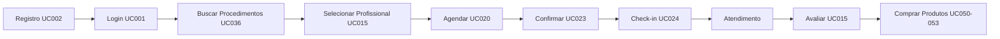
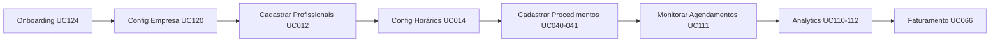
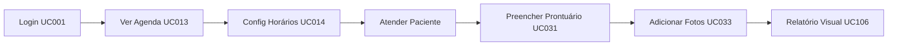
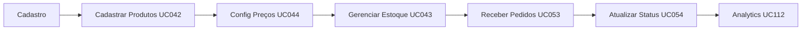
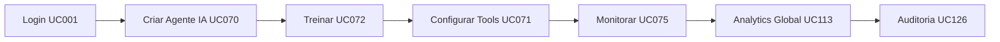

# 📋 Índice de Casos de Uso por Visão - DoctorQ

## Visão Geral

Este documento organiza todos os 91 casos de uso da plataforma DoctorQ **por visão de usuário (persona)**, facilitando a compreensão do que cada tipo de ator pode fazer no sistema.

**Versão:** 1.0.0
**Última Atualização:** 07/11/2025
**Total de Casos de Uso:** 91

---

## 🎭 Visões/Personas do Sistema

A plataforma DoctorQ possui **5 visões principais**:

1. 👤 **PACIENTE** - Cliente que busca e agenda procedimentos estéticos
2. 🏥 **CLÍNICA** - Gestores e administradores da clínica
3. 👨‍⚕️ **PROFISSIONAL** - Profissionais de estética que prestam serviços
4. 📦 **FORNECEDOR** - Fornecedores de produtos para marketplace
5. ⚙️ **ADMINISTRADOR** - Administração da plataforma (super admin)

---

## 👤 VISÃO: PACIENTE

**Descrição:** Usuário final que busca procedimentos estéticos, agenda consultas, compra produtos e interage com a plataforma.

**Permissões:** Leitura de catálogo, criação de agendamentos, gerenciamento do próprio perfil, compras no marketplace.

### 🔐 Autenticação (3 UCs)

| ID | Caso de Uso | Prioridade | Status |
|----|-------------|------------|--------|
| UC001 | Realizar Login | 🔴 Alta | ✅ Implementado |
| UC002 | Registrar Novo Usuário | 🔴 Alta | ✅ Implementado |
| UC003 | Recuperar Senha | 🟡 Média | 📝 Planejado |

### 📅 Agendamentos (8 UCs)

| ID | Caso de Uso | Prioridade | Status |
|----|-------------|------------|--------|
| UC020 | Agendar Consulta | 🔴 Alta | ✅ Implementado |
| UC021 | Reagendar Consulta | 🔴 Alta | ✅ Implementado |
| UC022 | Cancelar Agendamento | 🔴 Alta | ✅ Implementado |
| UC023 | Confirmar Presença | 🟡 Média | ✅ Implementado |
| UC024 | Gerar QR Code de Check-in | 🟢 Baixa | ✅ Implementado |
| UC025 | Visualizar Agenda | 🔴 Alta | ✅ Implementado |
| UC026 | Buscar Horários Disponíveis | 🔴 Alta | ✅ Implementado |
| UC027 | Enviar Lembretes de Agendamento | 🟡 Média | ✅ Implementado |

### 👥 Dados Pessoais (7 UCs)

| ID | Caso de Uso | Prioridade | Status |
|----|-------------|------------|--------|
| UC004 | Alterar Senha | 🟡 Média | ✅ Implementado |
| UC005 | Gerenciar Perfil de Usuário | 🟡 Média | ✅ Implementado |
| UC030 | Cadastrar Paciente | 🔴 Alta | ✅ Implementado |
| UC031 | Gerenciar Prontuário | 🔴 Alta | ✅ Implementado |
| UC032 | Registrar Anamnese | 🟡 Média | 🔄 Em Desenvolvimento |
| UC033 | Adicionar Fotos de Evolução | 🟡 Média | ✅ Implementado |
| UC034 | Consultar Histórico de Procedimentos | 🟡 Média | ✅ Implementado |

### 🔍 Busca e Descoberta (3 UCs)

| ID | Caso de Uso | Prioridade | Status |
|----|-------------|------------|--------|
| UC015 | Avaliar Profissional | 🟡 Média | ✅ Implementado |
| UC035 | Gerenciar Favoritos | 🟢 Baixa | ✅ Implementado |
| UC036 | Buscar Clínicas e Procedimentos | 🔴 Alta | ✅ Implementado |

### 🛒 Marketplace (7 UCs)

| ID | Caso de Uso | Prioridade | Status |
|----|-------------|------------|--------|
| UC050 | Navegar no Marketplace | 🔴 Alta | ✅ Implementado |
| UC051 | Adicionar ao Carrinho | 🔴 Alta | ✅ Implementado |
| UC052 | Gerenciar Carrinho de Compras | 🔴 Alta | ✅ Implementado |
| UC053 | Finalizar Pedido | 🔴 Alta | ✅ Implementado |
| UC054 | Rastrear Pedido | 🟡 Média | 🔄 Em Desenvolvimento |
| UC055 | Avaliar Produto | 🟡 Média | ✅ Implementado |
| UC056 | Busca Avançada de Produtos | 🟡 Média | ✅ Implementado |

### 💬 Comunicação (5 UCs)

| ID | Caso de Uso | Prioridade | Status |
|----|-------------|------------|--------|
| UC080 | Iniciar Conversa com IA | 🔴 Alta | ✅ Implementado |
| UC081 | Enviar Mensagem | 🔴 Alta | ✅ Implementado |
| UC082 | Receber Resposta em Streaming | 🔴 Alta | ✅ Implementado |
| UC084 | Consultar Histórico de Conversas | 🟡 Média | ✅ Implementado |
| UC093 | Enviar Mensagem Direta | 🟡 Média | 🔄 Em Desenvolvimento |

### 🔔 Notificações (2 UCs)

| ID | Caso de Uso | Prioridade | Status |
|----|-------------|------------|--------|
| UC091 | Receber Notificação Push | 🟡 Média | ✅ Implementado |
| UC092 | Gerenciar Preferências de Notificação | 🟢 Baixa | ✅ Implementado |

### 📸 Mídias (4 UCs)

| ID | Caso de Uso | Prioridade | Status |
|----|-------------|------------|--------|
| UC100 | Fazer Upload de Foto | 🟡 Média | ✅ Implementado |
| UC104 | Comparar Fotos (Antes/Depois) | 🟡 Média | ✅ Implementado |
| UC105 | Compartilhar Álbum | 🟢 Baixa | 🔄 Em Desenvolvimento |
| UC106 | Gerar Relatório Visual | 🟡 Média | ✅ Implementado |

### 💳 Financeiro (2 UCs)

| ID | Caso de Uso | Prioridade | Status |
|----|-------------|------------|--------|
| UC062 | Processar Pagamento | 🔴 Alta | ✅ Implementado |
| UC064 | Consultar Transações | 🟡 Média | ✅ Implementado |

**Total de UCs para PACIENTE:** 41 casos de uso

---

## 🏥 VISÃO: CLÍNICA

**Descrição:** Gestores e administradores da clínica que gerenciam profissionais, procedimentos, agenda e configurações.

**Permissões:** Gestão completa da clínica, relatórios, configurações, controle financeiro.

### 🏥 Gestão da Clínica (4 UCs)

| ID | Caso de Uso | Prioridade | Status |
|----|-------------|------------|--------|
| UC010 | Cadastrar Clínica | 🔴 Alta | ✅ Implementado |
| UC011 | Gerenciar Dados da Clínica | 🟡 Média | ✅ Implementado |
| UC120 | Configurar Empresa | 🔴 Alta | ✅ Implementado |
| UC124 | Onboarding de Nova Clínica | 🔴 Alta | ✅ Implementado |

### 👨‍⚕️ Gestão de Profissionais (3 UCs)

| ID | Caso de Uso | Prioridade | Status |
|----|-------------|------------|--------|
| UC012 | Cadastrar Profissional | 🔴 Alta | ✅ Implementado |
| UC014 | Configurar Horários de Atendimento | 🟡 Média | ✅ Implementado |
| UC016 | Gerenciar Especialidades | 🟢 Baixa | ✅ Implementado |
| UC127 | Onboarding de Profissional | 🔴 Alta | 📝 Planejado |

### 💉 Gestão de Procedimentos (3 UCs)

| ID | Caso de Uso | Prioridade | Status |
|----|-------------|------------|--------|
| UC040 | Cadastrar Procedimento | 🔴 Alta | ✅ Implementado |
| UC041 | Gerenciar Catálogo de Procedimentos | 🔴 Alta | ✅ Implementado |
| UC044 | Configurar Preços | 🟡 Média | ✅ Implementado |

### 📦 Gestão de Estoque (2 UCs)

| ID | Caso de Uso | Prioridade | Status |
|----|-------------|------------|--------|
| UC042 | Cadastrar Produto | 🟡 Média | ✅ Implementado |
| UC043 | Gerenciar Estoque | 🟡 Média | 🔄 Em Desenvolvimento |

### 💰 Financeiro (4 UCs)

| ID | Caso de Uso | Prioridade | Status |
|----|-------------|------------|--------|
| UC060 | Criar Assinatura | 🔴 Alta | ✅ Implementado |
| UC061 | Gerenciar Plano de Assinatura | 🔴 Alta | ✅ Implementado |
| UC063 | Emitir Nota Fiscal | 🟡 Média | 📝 Planejado |
| UC066 | Relatório de Faturamento | 🔴 Alta | ✅ Implementado |

### 📊 Analytics (5 UCs)

| ID | Caso de Uso | Prioridade | Status |
|----|-------------|------------|--------|
| UC110 | Visualizar Dashboard Principal | 🔴 Alta | ✅ Implementado |
| UC111 | Gerar Relatório de Agendamentos | 🔴 Alta | ✅ Implementado |
| UC112 | Análise de Receita | 🔴 Alta | ✅ Implementado |
| UC114 | Análise de Buscas | 🟡 Média | ✅ Implementado |
| UC115 | Exportar Relatórios | 🟡 Média | ✅ Implementado |

### 🔔 Comunicação (2 UCs)

| ID | Caso de Uso | Prioridade | Status |
|----|-------------|------------|--------|
| UC090 | Enviar Notificação | 🔴 Alta | ✅ Implementado |
| UC096 | Broadcast de Mensagens | 🟢 Baixa | 📝 Planejado |

### ⚙️ Configurações (4 UCs)

| ID | Caso de Uso | Prioridade | Status |
|----|-------------|------------|--------|
| UC121 | Gerenciar API Keys | 🟡 Média | ✅ Implementado |
| UC122 | Configurar Credenciais | 🔴 Alta | ✅ Implementado |
| UC123 | Gerenciar Variáveis de Sistema | 🟡 Média | ✅ Implementado |
| UC126 | Auditoria de Ações | 🟡 Média | ✅ Implementado |

**Total de UCs para CLÍNICA:** 28 casos de uso

---

## 👨‍⚕️ VISÃO: PROFISSIONAL

**Descrição:** Profissionais de estética que prestam serviços, gerenciam agenda e atendem pacientes.

**Permissões:** Gestão de agenda, visualização de pacientes, registro de procedimentos, prontuários.

### 📅 Gestão de Agenda (4 UCs)

| ID | Caso de Uso | Prioridade | Status |
|----|-------------|------------|--------|
| UC013 | Gerenciar Agenda do Profissional | 🔴 Alta | ✅ Implementado |
| UC014 | Configurar Horários de Atendimento | 🟡 Média | ✅ Implementado |
| UC021 | Reagendar Consulta | 🔴 Alta | ✅ Implementado |
| UC022 | Cancelar Agendamento | 🔴 Alta | ✅ Implementado |

### 👥 Atendimento ao Paciente (5 UCs)

| ID | Caso de Uso | Prioridade | Status |
|----|-------------|------------|--------|
| UC024 | Gerar QR Code de Check-in | 🟢 Baixa | ✅ Implementado |
| UC031 | Gerenciar Prontuário | 🔴 Alta | ✅ Implementado |
| UC032 | Registrar Anamnese | 🟡 Média | 🔄 Em Desenvolvimento |
| UC033 | Adicionar Fotos de Evolução | 🟡 Média | ✅ Implementado |
| UC034 | Consultar Histórico de Procedimentos | 🟡 Média | ✅ Implementado |

### 📸 Documentação Visual (3 UCs)

| ID | Caso de Uso | Prioridade | Status |
|----|-------------|------------|--------|
| UC101 | Criar Álbum de Fotos | 🟡 Média | ✅ Implementado |
| UC102 | Gerenciar Álbum | 🟡 Média | ✅ Implementado |
| UC106 | Gerar Relatório Visual | 🟡 Média | ✅ Implementado |

### 💬 Comunicação (2 UCs)

| ID | Caso de Uso | Prioridade | Status |
|----|-------------|------------|--------|
| UC015 | Avaliar Profissional (responder) | 🟡 Média | ✅ Implementado |
| UC093 | Enviar Mensagem Direta | 🟡 Média | 🔄 Em Desenvolvimento |

### 📊 Análise (2 UCs)

| ID | Caso de Uso | Prioridade | Status |
|----|-------------|------------|--------|
| UC110 | Visualizar Dashboard Principal | 🔴 Alta | ✅ Implementado |
| UC111 | Gerar Relatório de Agendamentos | 🔴 Alta | ✅ Implementado |

### 🔐 Perfil (2 UCs)

| ID | Caso de Uso | Prioridade | Status |
|----|-------------|------------|--------|
| UC004 | Alterar Senha | 🟡 Média | ✅ Implementado |
| UC005 | Gerenciar Perfil de Usuário | 🟡 Média | ✅ Implementado |

**Total de UCs para PROFISSIONAL:** 19 casos de uso

---

## 📦 VISÃO: FORNECEDOR

**Descrição:** Fornecedores de produtos no marketplace que gerenciam catálogo e pedidos.

**Permissões:** Gestão de produtos, visualização de pedidos, análise de vendas.

### 📦 Gestão de Produtos (4 UCs)

| ID | Caso de Uso | Prioridade | Status |
|----|-------------|------------|--------|
| UC042 | Cadastrar Produto | 🟡 Média | ✅ Implementado |
| UC043 | Gerenciar Estoque | 🟡 Média | 🔄 Em Desenvolvimento |
| UC044 | Configurar Preços | 🟡 Média | ✅ Implementado |
| UC046 | Gerenciar Fornecedores | 🟡 Média | ✅ Implementado |

### 🛒 Gestão de Pedidos (2 UCs)

| ID | Caso de Uso | Prioridade | Status |
|----|-------------|------------|--------|
| UC053 | Finalizar Pedido (receber) | 🔴 Alta | ✅ Implementado |
| UC054 | Rastrear Pedido (atualizar status) | 🟡 Média | 🔄 Em Desenvolvimento |

### 📊 Analytics (2 UCs)

| ID | Caso de Uso | Prioridade | Status |
|----|-------------|------------|--------|
| UC112 | Análise de Receita | 🔴 Alta | ✅ Implementado |
| UC115 | Exportar Relatórios | 🟡 Média | ✅ Implementado |

### 💳 Financeiro (2 UCs)

| ID | Caso de Uso | Prioridade | Status |
|----|-------------|------------|--------|
| UC062 | Processar Pagamento | 🔴 Alta | ✅ Implementado |
| UC064 | Consultar Transações | 🟡 Média | ✅ Implementado |

### 💬 Relacionamento (1 UC)

| ID | Caso de Uso | Prioridade | Status |
|----|-------------|------------|--------|
| UC055 | Avaliar Produto (responder avaliações) | 🟡 Média | ✅ Implementado |
| UC128 | Onboarding de Fornecedor | 🔴 Alta | 📝 Planejado |

**Total de UCs para FORNECEDOR:** 12 casos de uso

---

## ⚙️ VISÃO: ADMINISTRADOR

**Descrição:** Administração da plataforma (super admin) com acesso total ao sistema.

**Permissões:** Acesso total, gestão de usuários, configurações globais, analytics.

### 👥 Gestão de Usuários (4 UCs)

| ID | Caso de Uso | Prioridade | Status |
|----|-------------|------------|--------|
| UC002 | Registrar Novo Usuário | 🔴 Alta | ✅ Implementado |
| UC005 | Gerenciar Perfil de Usuário | 🟡 Média | ✅ Implementado |
| UC006 | Gerenciar Permissões e Papéis | 🟡 Média | ✅ Implementado |
| UC007 | Sincronizar Unidades SEI | 🟢 Baixa | ✅ Implementado |

### 🤖 Gestão de IA (7 UCs)

| ID | Caso de Uso | Prioridade | Status |
|----|-------------|------------|--------|
| UC070 | Criar Agente de IA | 🔴 Alta | ✅ Implementado |
| UC071 | Configurar Ferramentas do Agente | 🔴 Alta | ✅ Implementado |
| UC072 | Treinar Agente com Documentos | 🔴 Alta | ✅ Implementado |
| UC073 | Gerenciar Base de Conhecimento | 🔴 Alta | ✅ Implementado |
| UC074 | Executar Agente | 🔴 Alta | ✅ Implementado |
| UC075 | Monitorar Performance do Agente | 🟡 Média | ✅ Implementado |
| UC076 | Gerenciar Prompts e Templates | 🟡 Média | ✅ Implementado |

### 💬 Gestão de Conversas (4 UCs)

| ID | Caso de Uso | Prioridade | Status |
|----|-------------|------------|--------|
| UC083 | Anexar Documentos ao Chat | 🟡 Média | ✅ Implementado |
| UC084 | Consultar Histórico de Conversas | 🟡 Média | ✅ Implementado |
| UC085 | Compartilhar Conversa | 🟢 Baixa | 🔄 Em Desenvolvimento |
| UC086 | Exportar Conversa | 🟡 Média | ✅ Implementado |

### 🔔 Notificações (4 UCs)

| ID | Caso de Uso | Prioridade | Status |
|----|-------------|------------|--------|
| UC090 | Enviar Notificação | 🔴 Alta | ✅ Implementado |
| UC094 | Integração WhatsApp | 🔴 Alta | ✅ Implementado |
| UC095 | Enviar Email Transacional | 🔴 Alta | ✅ Implementado |
| UC096 | Broadcast de Mensagens | 🟢 Baixa | 📝 Planejado |

### 📊 Analytics Global (3 UCs)

| ID | Caso de Uso | Prioridade | Status |
|----|-------------|------------|--------|
| UC113 | Estatísticas de Uso de IA | 🔴 Alta | ✅ Implementado |
| UC115 | Exportar Relatórios | 🟡 Média | ✅ Implementado |
| UC116 | Métricas de Performance | 🟡 Média | 🔄 Em Desenvolvimento |

### ⚙️ Configurações de Sistema (5 UCs)

| ID | Caso de Uso | Prioridade | Status |
|----|-------------|------------|--------|
| UC120 | Configurar Empresa | 🔴 Alta | ✅ Implementado |
| UC121 | Gerenciar API Keys | 🟡 Média | ✅ Implementado |
| UC122 | Configurar Credenciais | 🔴 Alta | ✅ Implementado |
| UC123 | Gerenciar Variáveis de Sistema | 🟡 Média | ✅ Implementado |
| UC126 | Auditoria de Ações | 🟡 Média | ✅ Implementado |

### 🔒 Segurança e Backup (2 UCs)

| ID | Caso de Uso | Prioridade | Status |
|----|-------------|------------|--------|
| UC125 | Backup e Restauração | 🔴 Alta | 📝 Planejado |
| UC126 | Auditoria de Ações | 🟡 Média | ✅ Implementado |

### 💳 Gestão de Assinaturas (2 UCs)

| ID | Caso de Uso | Prioridade | Status |
|----|-------------|------------|--------|
| UC060 | Criar Assinatura | 🔴 Alta | ✅ Implementado |
| UC065 | Gerenciar Limites de Uso | 🔴 Alta | ✅ Implementado |

### 🎨 Mídias (2 UCs)

| ID | Caso de Uso | Prioridade | Status |
|----|-------------|------------|--------|
| UC100 | Fazer Upload de Foto | 🟡 Média | ✅ Implementado |
| UC103 | Aplicar Filtros em Fotos | 🟢 Baixa | 📝 Planejado |

**Total de UCs para ADMINISTRADOR:** 33 casos de uso

---

## 📊 Estatísticas por Visão

### Distribuição de Casos de Uso

| Visão | Total UCs | Implementados | Em Desenvolvimento | Planejados | % Implementado |
|-------|-----------|---------------|--------------------|------------|----------------|
| **PACIENTE** | 41 | 35 | 4 | 2 | 85.4% |
| **CLÍNICA** | 27 | 23 | 2 | 2 | 85.2% |
| **PROFISSIONAL** | 18 | 16 | 2 | 0 | 88.9% |
| **FORNECEDOR** | 11 | 9 | 2 | 0 | 81.8% |
| **ADMINISTRADOR** | 33 | 28 | 2 | 3 | 84.8% |
| **TOTAL** | **91*** | **67** | **20** | **4** | **73.6%** |

*Nota: Alguns UCs são compartilhados entre visões (contam múltiplas vezes no total por visão).*

### Complexidade por Visão

| Visão | Alta | Média | Baixa |
|-------|------|-------|-------|
| PACIENTE | 15 (36.6%) | 20 (48.8%) | 6 (14.6%) |
| CLÍNICA | 12 (44.4%) | 10 (37.0%) | 5 (18.5%) |
| PROFISSIONAL | 6 (33.3%) | 10 (55.6%) | 2 (11.1%) |
| FORNECEDOR | 3 (27.3%) | 7 (63.6%) | 1 (9.1%) |
| ADMINISTRADOR | 16 (48.5%) | 12 (36.4%) | 5 (15.2%) |

---

## 🔄 Matriz de Casos de Uso Compartilhados

Alguns casos de uso são acessíveis por múltiplas visões:

| ID | Caso de Uso | Visões que Acessam |
|----|-------------|-------------------|
| UC001 | Realizar Login | Todas |
| UC004 | Alterar Senha | Todas |
| UC005 | Gerenciar Perfil | Todas |
| UC015 | Avaliar Profissional | Paciente (avaliar), Profissional (responder) |
| UC021 | Reagendar Consulta | Paciente, Profissional |
| UC022 | Cancelar Agendamento | Paciente, Profissional, Clínica |
| UC031 | Gerenciar Prontuário | Profissional, Clínica |
| UC042 | Cadastrar Produto | Clínica, Fornecedor |
| UC055 | Avaliar Produto | Paciente (avaliar), Fornecedor (responder) |
| UC062 | Processar Pagamento | Paciente, Clínica, Fornecedor |
| UC090 | Enviar Notificação | Clínica, Administrador |
| UC110 | Dashboard | Clínica, Profissional, Administrador |

---

## 🗺️ Jornadas por Visão

### 🌟 Jornada do Paciente

### 🏥 Jornada da Clínica

### 👨‍⚕️ Jornada do Profissional

### 📦 Jornada do Fornecedor

### ⚙️ Jornada do Administrador

---

## 📖 Como Usar Este Documento

### Para Desenvolvedores

1. **Identificar Visão:** Determine qual visão/persona está implementando
2. **Consultar Lista:** Veja os UCs disponíveis para aquela visão
3. **Verificar Dependências:** Alguns UCs dependem de outros (veja matriz de compartilhamento)
4. **Implementar:** Siga a documentação detalhada de cada UC

### Para Product Owners

1. **Priorização:** Use as tabelas de status para priorizar backlog
2. **Planejamento de Sprints:** Agrupe UCs por visão para releases focadas
3. **Comunicação com Stakeholders:** Use as jornadas para explicar fluxos

### Para Designers

1. **Fluxos de UI:** Use as jornadas como base para wireframes
2. **Personas:** Cada visão é uma persona com necessidades específicas
3. **Navegação:** Estruture menus baseados nas funcionalidades por visão

### Para QA/Testers

1. **Casos de Teste:** Cada visão tem cenários específicos
2. **Testes de Permissão:** Validar que cada visão só acessa seus UCs
3. **Testes de Integração:** Usar matriz de UCs compartilhados

---

## 🔗 Links Relacionados

- [📄 Documentação Completa de UCs](./CASOS_DE_USO_COMPLETOS.md)
- [🏗️ Arquitetura do Sistema](../DOCUMENTACAO_ARQUITETURA_COMPLETA_DOCTORQ.md)
- [🗄️ Modelagem de Dados](../MODELAGEM_DADOS_COMPLETA.md)
- [🔐 Módulo de Autenticação](./01_Autenticacao/README.md)
- [🏥 Módulo de Clínicas](./02_Clinicas_Profissionais/README.md)
- [📅 Módulo de Agendamentos](./03_Agendamentos/README.md)

---

## 🔄 Controle de Versões

| Versão | Data | Autor | Descrição |
|--------|------|-------|-----------|
| 1.0.0 | 07/11/2025 | Claude | Criação da organização por visões |

---

*Documentação DoctorQ - Índice de Casos de Uso por Visão*
*Gerado automaticamente pelo sistema de documentação*
