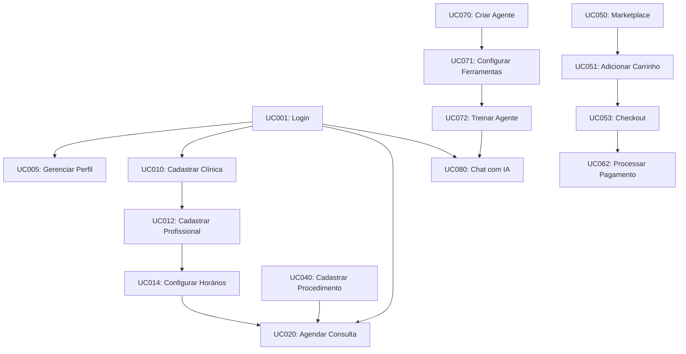

# 📋 Casos de Uso - Plataforma DoctorQ

## Visão Geral

Este diretório contém a documentação completa de todos os casos de uso da plataforma DoctorQ, uma solução SaaS para gestão de clínicas de estética com recursos avançados de IA.

**Versão:** 1.0.0
**Última Atualização:** 07/11/2025
**Status:** Em Desenvolvimento

---

## 🎯 Formas de Visualização

A documentação de casos de uso pode ser consultada de duas maneiras:

### 📊 Por Visão/Persona (RECOMENDADO)
Organização dos casos de uso por tipo de usuário (PACIENTE, CLÍNICA, PROFISSIONAL, FORNECEDOR, ADMINISTRADOR).

**Ideal para:**
- Entender o que cada tipo de usuário pode fazer
- Product Owners e Stakeholders
- Planejamento de features por persona
- Designers criando fluxos de UX

[🎭 **Ver Índice por Visão/Persona**](./INDICE_POR_VISAO.md)

### 📦 Por Módulo Funcional
Organização tradicional em 13 módulos funcionais do sistema.

**Ideal para:**
- Desenvolvedores implementando funcionalidades
- Documentação técnica detalhada
- Arquitetura do sistema

[📁 **Ver Organização por Módulos abaixo**](#📁-estrutura-de-documentação)

---

## 📁 Estrutura de Documentação

A documentação está organizada em 13 módulos funcionais:

### 01. 🔐 Autenticação e Usuários
- **UC001** - Realizar Login (OAuth + Local)
- **UC002** - Registrar Novo Usuário
- **UC003** - Recuperar Senha
- **UC004** - Alterar Senha
- **UC005** - Gerenciar Perfil de Usuário
- **UC006** - Gerenciar Permissões e Papéis
- **UC007** - Sincronizar Unidades SEI

[📄 Ver Documentação Completa](./01_Autenticacao/README.md)

### 02. 🏥 Clínicas e Profissionais
- **UC010** - Cadastrar Clínica
- **UC011** - Gerenciar Dados da Clínica
- **UC012** - Cadastrar Profissional
- **UC013** - Gerenciar Agenda do Profissional
- **UC014** - Configurar Horários de Atendimento
- **UC015** - Avaliar Profissional
- **UC016** - Gerenciar Especialidades

[📄 Ver Documentação Completa](./02_Clinicas_Profissionais/README.md)

### 03. 📅 Agendamentos
- **UC020** - Agendar Consulta
- **UC021** - Reagendar Consulta
- **UC022** - Cancelar Agendamento
- **UC023** - Confirmar Presença
- **UC024** - Gerar QR Code de Check-in
- **UC025** - Visualizar Agenda
- **UC026** - Buscar Horários Disponíveis
- **UC027** - Enviar Lembretes de Agendamento

[📄 Ver Documentação Completa](./03_Agendamentos/README.md)

### 04. 👤 Pacientes
- **UC030** - Cadastrar Paciente
- **UC031** - Gerenciar Prontuário
- **UC032** - Registrar Anamnese
- **UC033** - Adicionar Fotos de Evolução
- **UC034** - Consultar Histórico de Procedimentos
- **UC035** - Gerenciar Favoritos
- **UC036** - Buscar Clínicas e Procedimentos

[📄 Ver Documentação Completa](./04_Pacientes/README.md)

### 05. 💉 Procedimentos e Produtos
- **UC040** - Cadastrar Procedimento
- **UC041** - Gerenciar Catálogo de Procedimentos
- **UC042** - Cadastrar Produto
- **UC043** - Gerenciar Estoque
- **UC044** - Configurar Preços
- **UC045** - Aplicar Cupons de Desconto
- **UC046** - Gerenciar Fornecedores

[📄 Ver Documentação Completa](./05_Procedimentos_Produtos/README.md)

### 06. 🛒 Marketplace
- **UC050** - Navegar no Marketplace
- **UC051** - Adicionar ao Carrinho
- **UC052** - Gerenciar Carrinho de Compras
- **UC053** - Finalizar Pedido
- **UC054** - Rastrear Pedido
- **UC055** - Avaliar Produto
- **UC056** - Busca Avançada de Produtos

[📄 Ver Documentação Completa](./06_Marketplace/README.md)

### 07. 💳 Billing e Assinaturas
- **UC060** - Criar Assinatura
- **UC061** - Gerenciar Plano de Assinatura
- **UC062** - Processar Pagamento
- **UC063** - Emitir Nota Fiscal
- **UC064** - Consultar Transações
- **UC065** - Gerenciar Limites de Uso
- **UC066** - Relatório de Faturamento

[📄 Ver Documentação Completa](./07_Billing/README.md)

### 08. 🤖 IA e Agentes
- **UC070** - Criar Agente de IA
- **UC071** - Configurar Ferramentas do Agente
- **UC072** - Treinar Agente com Documentos
- **UC073** - Gerenciar Base de Conhecimento
- **UC074** - Executar Agente
- **UC075** - Monitorar Performance do Agente
- **UC076** - Gerenciar Prompts e Templates

[📄 Ver Documentação Completa](./08_IA_Agentes/README.md)

### 09. 💬 Chat e Conversas
- **UC080** - Iniciar Conversa com IA
- **UC081** - Enviar Mensagem
- **UC082** - Receber Resposta em Streaming
- **UC083** - Anexar Documentos ao Chat
- **UC084** - Consultar Histórico de Conversas
- **UC085** - Compartilhar Conversa
- **UC086** - Exportar Conversa

[📄 Ver Documentação Completa](./09_Chat/README.md)

### 10. 🔔 Notificações e Mensagens
- **UC090** - Enviar Notificação
- **UC091** - Receber Notificação Push
- **UC092** - Gerenciar Preferências de Notificação
- **UC093** - Enviar Mensagem Direta
- **UC094** - Integração WhatsApp
- **UC095** - Enviar Email Transacional
- **UC096** - Broadcast de Mensagens

[📄 Ver Documentação Completa](./10_Notificacoes/README.md)

### 11. 📸 Mídias e Álbuns
- **UC100** - Fazer Upload de Foto
- **UC101** - Criar Álbum de Fotos
- **UC102** - Gerenciar Álbum
- **UC103** - Aplicar Filtros em Fotos
- **UC104** - Comparar Fotos (Antes/Depois)
- **UC105** - Compartilhar Álbum
- **UC106** - Gerar Relatório Visual

[📄 Ver Documentação Completa](./11_Midias/README.md)

### 12. 📊 Analytics e Relatórios
- **UC110** - Visualizar Dashboard Principal
- **UC111** - Gerar Relatório de Agendamentos
- **UC112** - Análise de Receita
- **UC113** - Estatísticas de Uso de IA
- **UC114** - Análise de Buscas
- **UC115** - Exportar Relatórios
- **UC116** - Métricas de Performance

[📄 Ver Documentação Completa](./12_Analytics/README.md)

### 13. ⚙️ Configurações e Administração
- **UC120** - Configurar Empresa
- **UC121** - Gerenciar API Keys
- **UC122** - Configurar Credenciais
- **UC123** - Gerenciar Variáveis de Sistema
- **UC124** - Onboarding de Nova Clínica
- **UC127** - Onboarding de Profissional
- **UC128** - Onboarding de Fornecedor
- **UC125** - Backup e Restauração
- **UC126** - Auditoria de Ações

[📄 Ver Documentação Completa](./13_Configuracoes/README.md)

---

## 📐 Padrão de Documentação

Cada caso de uso segue o seguinte padrão:

### Estrutura de Documento

```markdown
# UC-XXX: [Nome do Caso de Uso]

## 📋 Informações Gerais
- **ID:** UC-XXX
- **Módulo:** [Nome do Módulo]
- **Prioridade:** [Alta/Média/Baixa]
- **Complexidade:** [Alta/Média/Baixa]
- **Status:** [Implementado/Em Desenvolvimento/Planejado]

## 🎯 Descrição
[Descrição detalhada do caso de uso]

## 👥 Atores
- **Ator Principal:** [Nome do ator]
- **Atores Secundários:** [Lista de atores]

## 📝 Pré-condições
- [Lista de condições que devem ser verdadeiras antes da execução]

## 📊 Fluxo Principal
1. [Passo 1]
2. [Passo 2]
...

## 🔀 Fluxos Alternativos
### FA1: [Nome do Fluxo]
1. [Passos do fluxo alternativo]

## ❌ Fluxos de Exceção
### FE1: [Nome da Exceção]
1. [Passos do fluxo de exceção]

## ✅ Pós-condições
- [Lista de estados do sistema após execução bem-sucedida]

## 📋 Regras de Negócio
- **RN-XXX:** [Descrição da regra]

## 🔒 Requisitos Não-Funcionais
- **Segurança:** [Requisitos de segurança]
- **Performance:** [Requisitos de performance]
- **Usabilidade:** [Requisitos de usabilidade]

## 🔗 Integrações
- [Lista de sistemas/APIs integradas]

## 📊 Dados de Entrada/Saída
### Entrada
- [Campos e tipos de dados de entrada]

### Saída
- [Campos e tipos de dados de saída]

## 🧪 Cenários de Teste
### CT-XXX: [Nome do Cenário]
- **Pré-condição:** [Estado inicial]
- **Ação:** [Ação executada]
- **Resultado Esperado:** [Resultado esperado]

## 🎨 Wireframes/Mockups
[Link para designs ou descrição da interface]

## 📝 Notas e Observações
[Informações adicionais relevantes]
```

---

## 📊 Estatísticas Gerais

| Módulo | Casos de Uso | Implementados | Em Desenvolvimento | Planejados |
|--------|--------------|---------------|-------------------|------------|
| Autenticação | 7 | 7 | 0 | 0 |
| Clínicas | 7 | 6 | 1 | 0 |
| Agendamentos | 8 | 5 | 2 | 1 |
| Pacientes | 7 | 4 | 2 | 1 |
| Procedimentos | 7 | 5 | 2 | 0 |
| Marketplace | 7 | 4 | 2 | 1 |
| Billing | 7 | 5 | 2 | 0 |
| IA e Agentes | 7 | 6 | 1 | 0 |
| Chat | 7 | 6 | 1 | 0 |
| Notificações | 7 | 4 | 2 | 1 |
| Mídias | 7 | 5 | 2 | 0 |
| Analytics | 7 | 4 | 2 | 1 |
| Configurações | 7 | 6 | 1 | 0 |
| **TOTAL** | **91** | **67** | **20** | **4** |

**Taxa de Implementação:** 73.6%

---

## 🎭 Atores do Sistema

### Atores Humanos

#### 1. Paciente
- Usuário final que busca e agenda procedimentos estéticos
- Acessa marketplace, avaliações e chat com IA
- **Permissões:** Leitura de catálogo, criação de agendamentos, gerenciamento do próprio perfil

#### 2. Profissional de Estética
- Prestador de serviços estéticos
- Gerencia agenda, atendimentos e prontuários
- **Permissões:** Gestão de agenda, visualização de pacientes, registro de procedimentos

#### 3. Administrador de Clínica
- Gerencia a clínica e seus recursos
- Controla profissionais, procedimentos e configurações
- **Permissões:** Gestão completa da clínica, relatórios, configurações

#### 4. Administrador da Plataforma (Super Admin)
- Gerencia toda a plataforma multi-tenant
- Acesso a analytics globais e configurações de sistema
- **Permissões:** Acesso total ao sistema

#### 5. Parceiro/Fornecedor
- Fornecedor de produtos no marketplace
- Gerencia catálogo e pedidos
- **Permissões:** Gestão de produtos, visualização de pedidos

### Atores Não-Humanos

#### 6. Sistema de IA (Agente Inteligente)
- Processa conversas e fornece assistência automatizada
- Executa tarefas baseadas em prompts
- **Funções:** Chat, análise de documentos, sugestões

#### 7. Sistema de Pagamento (Gateway)
- Processa transações financeiras
- **Integração:** API de pagamento (Stripe, PagSeguro, etc.)

#### 8. Sistema de Notificações
- Envia notificações push, email e WhatsApp
- **Integração:** Firebase, SendGrid, Twilio

#### 9. Sistema SEI (Externo)
- Sistema de gestão governamental
- **Integração:** API SOAP do SEI

#### 10. Sistema de Armazenamento (MinIO/S3)
- Armazena arquivos e mídias
- **Integração:** API S3-compatible

---

## 🔄 Fluxos de Processo Principais

### 1. Jornada do Paciente

```
Registro → Login → Busca de Procedimentos → Seleção de Clínica/Profissional
  → Agendamento → Confirmação → Atendimento → Avaliação → Histórico
```

### 2. Jornada da Clínica

```
Onboarding → Configuração → Cadastro de Profissionais → Cadastro de Procedimentos
  → Gestão de Agenda → Atendimentos → Faturamento → Analytics
```

### 3. Jornada do Marketplace

```
Navegação → Seleção de Produtos → Carrinho → Checkout → Pagamento
  → Confirmação → Rastreamento → Recebimento → Avaliação
```

### 4. Jornada de IA

```
Configuração de Agente → Upload de Documentos → Treinamento → Teste
  → Publicação → Monitoramento → Otimização
```

---

## 🔗 Dependências entre Casos de Uso

### Dependências Críticas

- **UC001 (Login)** é pré-requisito para a maioria dos casos de uso
- **UC010 (Cadastrar Clínica)** é necessário antes de **UC012 (Cadastrar Profissional)**
- **UC012 (Cadastrar Profissional)** é necessário antes de **UC014 (Configurar Horários)**
- **UC040 (Cadastrar Procedimento)** é necessário antes de **UC020 (Agendar Consulta)**
- **UC070 (Criar Agente)** é necessário antes de **UC080 (Iniciar Conversa)**

### Diagrama de Dependências



---

## 📐 Matriz de Rastreabilidade

### Requisitos Funcionais vs Casos de Uso

| Requisito Funcional | Casos de Uso Relacionados |
|---------------------|---------------------------|
| RF-001: Sistema deve permitir autenticação multi-provedor | UC001, UC002 |
| RF-002: Sistema deve gerenciar agendamentos | UC020-UC027 |
| RF-003: Sistema deve processar pagamentos | UC062, UC063 |
| RF-004: Sistema deve fornecer assistente IA | UC070-UC086 |
| RF-005: Sistema deve gerenciar marketplace | UC050-UC056 |
| RF-006: Sistema deve enviar notificações | UC090-UC096 |
| RF-007: Sistema deve gerar relatórios | UC110-UC116 |

### Requisitos Não-Funcionais vs Casos de Uso

| Requisito Não-Funcional | Casos de Uso Afetados |
|-------------------------|----------------------|
| RNF-001: Tempo de resposta < 2s | Todos os UC de consulta |
| RNF-002: Disponibilidade 99.9% | Todos os UC |
| RNF-003: Suporte a 10.000 usuários simultâneos | UC020, UC080 |
| RNF-004: Dados criptografados em repouso | UC002, UC031, UC062 |
| RNF-005: Compliance LGPD | UC002, UC031, UC034 |
| RNF-006: Interface responsiva | Todos os UC de frontend |

---

## 🎨 Convenções e Glossário

### Convenções de Nomenclatura

- **UC-XXX:** Identificador único do caso de uso (3 dígitos)
- **RN-XXX:** Regra de negócio
- **RF-XXX:** Requisito funcional
- **RNF-XXX:** Requisito não-funcional
- **CT-XXX:** Caso de teste
- **FA-X:** Fluxo alternativo
- **FE-X:** Fluxo de exceção

### Glossário de Termos

| Termo | Definição |
|-------|-----------|
| **Agendamento** | Reserva de horário para atendimento em clínica |
| **Agente** | Sistema de IA configurável para tarefas específicas |
| **Anamnese** | Questionário médico pré-atendimento |
| **Embedding** | Representação vetorial de texto para busca semântica |
| **LLM** | Large Language Model (Modelo de Linguagem Grande) |
| **Multi-tenant** | Arquitetura que suporta múltiplas organizações |
| **Procedimento** | Serviço estético oferecido pela clínica |
| **Prontuário** | Registro médico do paciente |
| **RAG** | Retrieval Augmented Generation (IA com busca) |
| **SSE** | Server-Sent Events (streaming de dados) |
| **Tenant** | Instância isolada de organização/empresa |

---

## 📚 Referências

### Documentos Relacionados

- [🎭 Índice por Visão/Persona](./INDICE_POR_VISAO.md) - **RECOMENDADO** - Organização por tipo de usuário
- [📋 Casos de Uso Completos](./CASOS_DE_USO_COMPLETOS.md) - Todos os 91 UCs detalhados
- [📁 Índice de Módulos](./README_MODULOS.md) - Status de documentação por módulo
- [🏗️ Arquitetura do Sistema](../DOCUMENTACAO_ARQUITETURA_COMPLETA_DOCTORQ.md)
- [🗄️ Modelagem de Dados](../MODELAGEM_DADOS_COMPLETA.md)
- [📝 Análise de Código](../ANALISE_CODIGO_BOAS_PRATICAS_MELHORIAS.md)
- [🔌 API Pública](../../estetiQ-api/DOCUMENTACAO_API_PUBLICA.md)

### Padrões Utilizados

- **UML 2.5** - Unified Modeling Language
- **BPMN 2.0** - Business Process Model and Notation
- **IEEE 830** - Software Requirements Specification

### Ferramentas Recomendadas

- **Diagramação:** Draw.io, Lucidchart, PlantUML
- **Prototipagem:** Figma, Adobe XD
- **Gestão:** Jira, Linear, GitHub Projects

---

## 🔄 Controle de Versões

| Versão | Data | Autor | Descrição |
|--------|------|-------|-----------|
| 1.0.0 | 07/11/2025 | Equipe DoctorQ | Versão inicial da documentação |

---

## 📞 Contato

Para dúvidas ou sugestões sobre os casos de uso:

- **Email:** devs@doctorq.app
- **Documentação:** /DOC_Arquitetura
- **Issues:** GitHub Issues

---

*Documento gerado automaticamente pela equipe de desenvolvimento DoctorQ*
