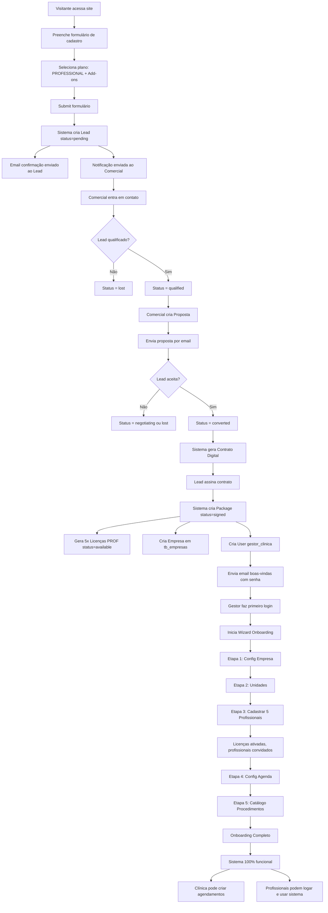
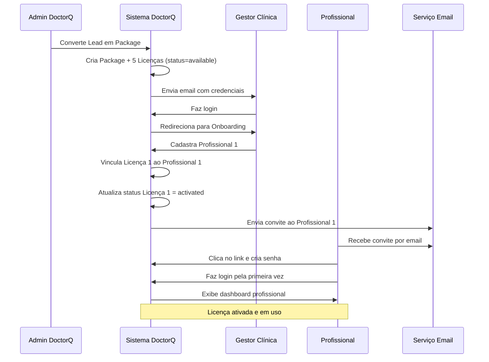
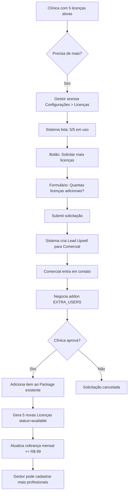

# 🤝 CASO DE USO: SISTEMA DE PARCERIAS DOCTORQ

**Data:** 10/11/2025
**Versão:** 1.1.0
**Status:** Especificação Completa para Teste e Validação
**Módulo:** Programa de Parcerias B2B2C

**Changelog (v1.1.0 - 10/11/2025):**
- ✅ Adicionado campo `tp_partner` (tipo de parceiro: clinica, profissional, fornecedor, universal)
- ✅ Adicionado campo `qt_max_licenses` (quantidade máxima de usuários/licenças por plano)
- ✅ Implementado filtro de planos por tipo de parceiro no frontend
- ✅ Implementado campo condicional para máximo de licenças (apenas para plano_base)
- ✅ Adicionadas regras de negócio RN-PARC-058 a RN-PARC-065
- ✅ Atualizado banco de dados (migration_032)
- ✅ Atualizado backend (models, services, schemas Pydantic)
- ✅ Atualizado frontend (PartnerPlansManager.tsx)

---

## 📋 ÍNDICE

1. [Visão Geral](#1-visão-geral)
2. [Atores do Sistema](#2-atores-do-sistema)
3. [Modelo de Negócio](#3-modelo-de-negócio)
4. [Estrutura do Banco de Dados](#4-estrutura-do-banco-de-dados)
5. [Casos de Uso Detalhados](#5-casos-de-uso-detalhados)
6. [Fluxos de Processos](#6-fluxos-de-processos)
7. [Regras de Negócio](#7-regras-de-negócio)
8. [Requisitos Técnicos](#8-requisitos-técnicos)
9. [Cenários de Teste](#9-cenários-de-teste)
10. [Validação e Aceitação](#10-validação-e-aceitação)

---

## 1. VISÃO GERAL

### 1.1 Objetivo

O **Sistema de Parcerias DoctorQ** é um programa B2B2C que permite que:
- **Clínicas** contratem licenças da plataforma
- **Profissionais Autônomos** utilizem o sistema individualmente
- **Fornecedores** gerenciem seu catálogo e marketplace

O sistema gerencia todo o ciclo desde a **captação de leads** até a **ativação de licenças**, incluindo contratos, faturamento e onboarding.

### 1.2 Escopo

```
┌─────────────────────────────────────────────────────────────┐
│              SISTEMA DE PARCERIAS DOCTORQ                   │
├─────────────────────────────────────────────────────────────┤
│                                                              │
│  1. Catálogo de Serviços/Planos                            │
│     - Planos Base (Starter, Professional, Enterprise)       │
│     - Add-ons (WhatsApp, IA, Analytics, etc.)              │
│                                                              │
│  2. Gestão de Leads                                         │
│     - Cadastro de interessados                              │
│     - Qualificação e conversão                              │
│     - Acompanhamento de pipeline                            │
│                                                              │
│  3. Pacotes e Contratos                                     │
│     - Montagem de pacotes personalizados                    │
│     - Contratos digitais                                    │
│     - Ciclos de cobrança                                    │
│                                                              │
│  4. Licenciamento                                           │
│     - Geração de licenças individuais                       │
│     - Ativação de chaves                                    │
│     - Controle de expiração                                 │
│                                                              │
│  5. Onboarding por Perfil                                   │
│     - Clínica: Configuração completa                        │
│     - Profissional: Setup de agenda e serviços             │
│     - Fornecedor: Catálogo e logística                      │
│                                                              │
│  6. Dashboard e Relatórios                                  │
│     - Métricas de conversão                                 │
│     - Performance de vendas                                 │
│     - Uso de licenças                                       │
│                                                              │
└─────────────────────────────────────────────────────────────┘
```

### 1.3 Benefícios

**Para Clínicas:**
- Gestão completa de agendamentos, pacientes e procedimentos
- Sistema de prontuário eletrônico
- IA para atendimento automatizado
- Marketplace integrado
- Relatórios gerenciais

**Para Profissionais:**
- Agenda online profissional
- Perfil público no marketplace
- Sistema de avaliações
- Gestão financeira simplificada
- Portfolio de trabalhos

**Para Fornecedores:**
- Vitrine no marketplace B2B
- Gestão de catálogo
- Pedidos automatizados
- Integração logística
- CRM para leads de clínicas

---

## 2. ATORES DO SISTEMA

### 2.1 Tipos de Parceiros

```sql
-- Enum de tipos de parceiros
CREATE TYPE enum_partner_type AS ENUM (
    'clinica',           -- Clínicas estéticas
    'profissional',      -- Profissionais autônomos
    'fornecedor'         -- Fornecedores de produtos/equipamentos
);
```

#### 2.1.1 Clínica (clinica)

**Descrição:** Estabelecimento físico que oferece serviços estéticos.

**Características:**
- Possui CNPJ obrigatório
- Pode ter múltiplos profissionais vinculados
- Necessita de várias licenças (uma por profissional)
- Requer configuração de unidades/endereços
- Gerencia estoque de produtos

**Perfis Associados:**
- `gestor_clinica` - Administrador da clínica
- `medico` - Profissionais médicos (CRM obrigatório)
- `esteticista` - Profissionais estéticos (CRBM/outros)
- `secretaria` - Recepcionistas e atendentes
- `financeiro` - Gestão financeira

**Dados Obrigatórios no Cadastro:**
```json
{
  "partner_type": "clinica",
  "contact_name": "Dr. João Silva",
  "contact_email": "contato@clinicaxyz.com.br",
  "contact_phone": "+55 11 98765-4321",
  "company_name": "Clínica XYZ Estética Avançada",
  "cnpj": "12.345.678/0001-99",
  "address": {
    "street": "Rua das Flores",
    "number": "123",
    "complement": "Sala 45",
    "neighborhood": "Centro",
    "city": "São Paulo",
    "state": "SP",
    "zip_code": "01234-567"
  },
  "selected_services": [
    {
      "service_code": "PLAN_PROFESSIONAL",
      "quantity": 5
    },
    {
      "service_code": "ADDON_WHATSAPP",
      "quantity": 1
    }
  ],
  "metadata": {
    "num_professionals": 5,
    "specialties": ["dermatologia", "harmonização facial"],
    "estimated_procedures_month": 150
  }
}
```

**Validações Específicas:**
- CNPJ válido e único no sistema
- Endereço completo obrigatório
- Ao menos 1 serviço selecionado
- Quantidade de licenças ≥ número de profissionais informado

#### 2.1.2 Profissional (profissional)

**Descrição:** Profissional autônomo da área estética.

**Características:**
- Pode ter CNPJ ou CPF
- Opera individualmente (1 licença)
- Perfil público no marketplace
- Pode atender em múltiplos locais
- Sistema de avaliações e reviews

**Perfis Associados:**
- `profissional_autonomo` - Perfil único com todas permissões

**Dados Obrigatórios no Cadastro:**
```json
{
  "partner_type": "profissional",
  "contact_name": "Dra. Maria Santos",
  "contact_email": "maria@email.com",
  "contact_phone": "+55 11 91234-5678",
  "company_name": "Maria Santos - Estética",
  "cnpj": "123.456.789-01",  // ou CPF
  "address": {
    "city": "São Paulo",
    "state": "SP",
    "zip_code": "01310-100"
  },
  "selected_services": [
    {
      "service_code": "PLAN_STARTER",
      "quantity": 1
    }
  ],
  "metadata": {
    "crm": "12345/SP",  // ou CRBM, ou outro registro profissional
    "specialty": "Biomedicina Estética",
    "years_experience": 8,
    "services_offered": ["Botox", "Preenchimento", "Bioestimuladores"],
    "working_locations": ["Clínica ABC", "Atendimento domiciliar"]
  }
}
```

**Validações Específicas:**
- CPF ou CNPJ obrigatório
- Registro profissional recomendado (CRM, CRBM, etc.)
- Apenas 1 licença permitida no plano inicial
- Ao menos 1 serviço/procedimento informado

#### 2.1.3 Fornecedor (fornecedor)

**Descrição:** Empresa que fornece produtos/equipamentos para clínicas.

**Características:**
- CNPJ obrigatório
- Catálogo de produtos no marketplace B2B
- Gestão de pedidos e logística
- CRM para leads de clínicas
- Sistema de comissionamento

**Perfis Associados:**
- `gestor_fornecedor` - Administrador
- `vendedor` - Equipe comercial
- `marketing` - Gestão de conteúdo e campanhas
- `logistica` - Controle de pedidos e entregas

**Dados Obrigatórios no Cadastro:**
```json
{
  "partner_type": "fornecedor",
  "contact_name": "Carlos Oliveira",
  "contact_email": "comercial@fornecedorxyz.com.br",
  "contact_phone": "+55 11 3456-7890",
  "company_name": "XYZ Dermocosméticos Ltda",
  "cnpj": "98.765.432/0001-11",
  "address": {
    "street": "Av. Paulista",
    "number": "1000",
    "neighborhood": "Bela Vista",
    "city": "São Paulo",
    "state": "SP",
    "zip_code": "01310-100"
  },
  "selected_services": [
    {
      "service_code": "PLAN_SUPPLIER_BASIC",
      "quantity": 1
    }
  ],
  "metadata": {
    "product_categories": ["Dermocosméticos", "Equipamentos"],
    "brands_represented": ["Marca A", "Marca B"],
    "delivery_coverage": ["SP", "RJ", "MG"],
    "average_delivery_days": 7,
    "payment_methods": ["boleto", "pix", "cartao"],
    "minimum_order_value": 500.00
  }
}
```

**Validações Específicas:**
- CNPJ obrigatório e válido
- Ao menos 1 categoria de produto
- Cobertura de entrega definida
- Políticas comerciais (prazo, valor mínimo, etc.)

### 2.2 Administradores do Sistema

**Admin DoctorQ:**
- Gerencia catálogo de serviços/planos
- Aprova/rejeita leads
- Cria pacotes e gera licenças
- Monitora conversões e métricas

**Gestor Comercial:**
- Acompanha pipeline de leads
- Negocia propostas customizadas
- Faz follow-up de leads

---

## 3. MODELO DE NEGÓCIO

### 3.1 Catálogo de Serviços Personalizáveis

O sistema DoctorQ utiliza um **modelo de planos específicos por tipo de parceiro**, permitindo que cada categoria (Clínica, Profissional, Fornecedor) tenha planos adequados às suas necessidades.

#### 3.1.1 Estrutura de Categorias de Planos

```sql
-- Enum de categorias de planos
CREATE TYPE enum_plan_category AS ENUM (
    'clinica',           -- Planos exclusivos para clínicas
    'profissional',      -- Planos exclusivos para profissionais autônomos
    'fornecedor',        -- Planos exclusivos para fornecedores
    'addon'              -- Complementos aplicáveis a qualquer tipo
);
```

**Regras de Vinculação:**
- Planos de categoria `clinica` só podem ser contratados por parceiros tipo `clinica`
- Planos de categoria `profissional` só podem ser contratados por parceiros tipo `profissional`
- Planos de categoria `fornecedor` só podem ser contratados por parceiros tipo `fornecedor`
- Add-ons (categoria `addon`) podem ser contratados por qualquer tipo, desde que tenham um plano base ativo

#### 3.1.2 Planos para Clínicas

Planos específicos para estabelecimentos físicos com múltiplos profissionais:

```sql
-- Planos para Clínicas
INSERT INTO tb_partner_service_definitions (
    cd_service,
    nm_service,
    ds_resumo,
    ds_descricao_completa,
    vl_preco_base,
    tp_categoria,
    fg_is_addon,
    ds_features,
    ds_metadata
) VALUES
(
    'PLAN_CLINIC_BASIC',
    'Clínica Básico',
    'Ideal para clínicas pequenas com até 5 profissionais',
    'Plano completo para gestão de clínicas com até 5 profissionais, incluindo agenda online, prontuário eletrônico, gestão de pacientes e procedimentos.',
    299.00,
    'clinica',
    FALSE,
    '["Até 5 profissionais/usuários", "200 agendamentos/mês", "150 pacientes ativos", "10 GB armazenamento", "100 consultas IA/mês", "Prontuário eletrônico", "Agenda online", "Marketplace integrado", "Relatórios básicos", "Suporte por email"]'::jsonb,
    '{"max_professionals": 5, "max_appointments_month": 200, "max_active_patients": 150, "storage_gb": 10, "ai_queries_month": 100, "support_level": "email"}'::jsonb
),
(
    'PLAN_CLINIC_INTERMEDIATE',
    'Clínica Intermediário',
    'Para clínicas médias com até 15 profissionais',
    'Solução intermediária com recursos avançados para clínicas em crescimento, incluindo analytics avançado, múltiplas unidades e integrações.',
    599.00,
    'clinica',
    FALSE,
    '["Até 15 profissionais/usuários", "750 agendamentos/mês", "500 pacientes ativos", "50 GB armazenamento", "300 consultas IA/mês", "Múltiplas unidades", "Analytics avançado", "Prontuário eletrônico", "Integração WhatsApp", "Relatórios gerenciais", "Campanhas de marketing", "Suporte telefônico"]'::jsonb,
    '{"max_professionals": 15, "max_appointments_month": 750, "max_active_patients": 500, "storage_gb": 50, "ai_queries_month": 300, "multi_unit": true, "support_level": "phone"}'::jsonb
),
(
    'PLAN_CLINIC_ADVANCED',
    'Clínica Avançado',
    'Para redes de clínicas com até 30 profissionais',
    'Plano avançado para redes de clínicas com funcionalidades enterprise, API access, white label e suporte dedicado.',
    1199.00,
    'clinica',
    FALSE,
    '["Até 30 profissionais/usuários", "2000 agendamentos/mês", "1500 pacientes ativos", "200 GB armazenamento", "800 consultas IA/mês", "Rede de clínicas (multi-unidade)", "Analytics avançado + BI", "API access", "White label (marca própria)", "Integração WhatsApp + SMS", "Chatbot IA", "Relatórios personalizados", "Suporte dedicado 24/7"]'::jsonb,
    '{"max_professionals": 30, "max_appointments_month": 2000, "max_active_patients": 1500, "storage_gb": 200, "ai_queries_month": 800, "multi_unit": true, "api_access": true, "white_label": true, "support_level": "dedicated"}'::jsonb
),
(
    'PLAN_CLINIC_CUSTOM',
    'Clínica Personalizado',
    'Plano sob medida para redes grandes (30+ profissionais)',
    'Solução enterprise totalmente personalizável para grandes redes de clínicas, com recursos ilimitados e SLA garantido.',
    0.00,  -- Valor negociado individualmente
    'clinica',
    FALSE,
    '["Profissionais ilimitados", "Agendamentos ilimitados", "Pacientes ilimitados", "Armazenamento customizado", "IA ilimitada", "Recursos sob medida", "SLA garantido", "Suporte premium 24/7", "Treinamento presencial", "Consultoria estratégica"]'::jsonb,
    '{"custom": true, "unlimited": true, "negotiable": true, "sla": "99.9%", "support_level": "premium"}'::jsonb
);
```

**Comparativo de Planos para Clínicas:**

| Feature | Básico | Intermediário | Avançado | Personalizado |
|---------|--------|---------------|----------|---------------|
| **Preço Mensal** | R$ 299 | R$ 599 | R$ 1.199 | Sob consulta |
| **Profissionais/Usuários** | Até 5 | Até 15 | Até 30 | Ilimitado |
| **Agendamentos/mês** | 200 | 750 | 2.000 | Ilimitado |
| **Pacientes Ativos** | 150 | 500 | 1.500 | Ilimitado |
| **Armazenamento** | 10 GB | 50 GB | 200 GB | Customizado |
| **IA - Consultas/mês** | 100 | 300 | 800 | Ilimitado |
| **Múltiplas Unidades** | ❌ | ✅ | ✅ | ✅ |
| **Prontuário Eletrônico** | ✅ | ✅ | ✅ | ✅ |
| **Marketplace** | ✅ | ✅ | ✅ | ✅ |
| **Analytics Básico** | ✅ | ✅ | ✅ | ✅ |
| **Analytics Avançado + BI** | ❌ | ✅ | ✅ | ✅ |
| **WhatsApp Integração** | Addon | ✅ Incluso | ✅ Incluso | ✅ Incluso |
| **SMS Marketing** | ❌ | Addon | ✅ Incluso | ✅ Incluso |
| **Chatbot IA** | ❌ | Addon | ✅ Incluso | ✅ Incluso |
| **API Access** | ❌ | ❌ | ✅ | ✅ |
| **White Label** | ❌ | ❌ | ✅ | ✅ |
| **Suporte** | Email | Telefone | Dedicado 24/7 | Premium 24/7 |
| **SLA Garantido** | ❌ | ❌ | 99.5% | 99.9% |
| **Treinamento** | Vídeos | Online | Online + Webinars | Presencial |

#### 3.1.3 Planos para Profissionais Autônomos

Planos específicos para profissionais que atuam individualmente:

```sql
-- Planos para Profissionais Autônomos
INSERT INTO tb_partner_service_definitions (
    cd_service,
    nm_service,
    ds_resumo,
    ds_descricao_completa,
    vl_preco_base,
    tp_categoria,
    fg_is_addon,
    ds_features,
    ds_metadata
) VALUES
(
    'PLAN_PROF_SOLO',
    'Profissional Solo',
    'Perfeito para profissionais autônomos iniciantes',
    'Plano individual com agenda online, perfil público no marketplace e ferramentas essenciais para gestão de atendimentos.',
    99.00,
    'profissional',
    FALSE,
    '["1 profissional", "50 agendamentos/mês", "30 pacientes ativos", "2 GB armazenamento", "Agenda online", "Perfil público no marketplace", "Sistema de avaliações", "Galeria de fotos (antes/depois)", "Notificações automáticas", "Suporte por email"]'::jsonb,
    '{"max_professionals": 1, "max_appointments_month": 50, "max_active_patients": 30, "storage_gb": 2, "support_level": "email"}'::jsonb
),
(
    'PLAN_PROF_PLUS',
    'Profissional Plus',
    'Para profissionais estabelecidos com alta demanda',
    'Plano completo para profissionais com volume maior de atendimentos, incluindo prontuário eletrônico, IA e múltiplos locais de atendimento.',
    199.00,
    'profissional',
    FALSE,
    '["1 profissional", "150 agendamentos/mês", "100 pacientes ativos", "10 GB armazenamento", "50 consultas IA/mês", "Agenda online avançada", "Perfil destacado no marketplace", "Prontuário eletrônico", "Múltiplos locais de atendimento", "WhatsApp integração", "Campanhas de marketing", "Relatórios de desempenho", "Suporte prioritário"]'::jsonb,
    '{"max_professionals": 1, "max_appointments_month": 150, "max_active_patients": 100, "storage_gb": 10, "ai_queries_month": 50, "multi_location": true, "featured_profile": true, "support_level": "priority"}'::jsonb
),
(
    'PLAN_PROF_PREMIUM',
    'Profissional Premium',
    'Para profissionais referência no mercado',
    'Solução premium com recursos avançados de marketing, IA, e ferramentas para consolidar sua marca pessoal.',
    349.00,
    'profissional',
    FALSE,
    '["1 profissional", "Agendamentos ilimitados", "Pacientes ilimitados", "50 GB armazenamento", "200 consultas IA/mês", "Perfil premium (topo das buscas)", "Prontuário eletrônico", "Site profissional personalizado", "Blog integrado", "WhatsApp + SMS", "Chatbot IA", "CRM de pacientes", "Analytics avançado", "Marketing automation", "Suporte dedicado"]'::jsonb,
    '{"max_professionals": 1, "max_appointments_month": -1, "max_active_patients": -1, "storage_gb": 50, "ai_queries_month": 200, "personal_website": true, "blog": true, "crm": true, "support_level": "dedicated"}'::jsonb
);
```

**Comparativo de Planos para Profissionais:**

| Feature | Solo | Plus | Premium |
|---------|------|------|---------|
| **Preço Mensal** | R$ 99 | R$ 199 | R$ 349 |
| **Profissionais** | 1 | 1 | 1 |
| **Agendamentos/mês** | 50 | 150 | Ilimitado |
| **Pacientes Ativos** | 30 | 100 | Ilimitado |
| **Armazenamento** | 2 GB | 10 GB | 50 GB |
| **IA - Consultas/mês** | ❌ | 50 | 200 |
| **Agenda Online** | ✅ | ✅ Avançada | ✅ Avançada |
| **Perfil Marketplace** | ✅ Básico | ✅ Destacado | ✅ Premium (topo) |
| **Prontuário Eletrônico** | ❌ | ✅ | ✅ |
| **Múltiplos Locais** | ❌ | ✅ | ✅ |
| **Galeria Fotos** | ✅ | ✅ | ✅ |
| **WhatsApp** | Addon | ✅ Incluso | ✅ Incluso |
| **SMS** | ❌ | Addon | ✅ Incluso |
| **Chatbot IA** | ❌ | ❌ | ✅ |
| **Site Personalizado** | ❌ | ❌ | ✅ |
| **Blog** | ❌ | ❌ | ✅ |
| **CRM Pacientes** | ❌ | ❌ | ✅ |
| **Marketing Automation** | ❌ | ❌ | ✅ |
| **Campanhas Marketing** | ❌ | ✅ | ✅ |
| **Analytics** | Básico | Intermediário | Avançado |
| **Suporte** | Email | Prioritário | Dedicado |

#### 3.1.4 Planos para Fornecedores

Planos específicos para fornecedores de produtos/equipamentos:

```sql
-- Planos para Fornecedores
INSERT INTO tb_partner_service_definitions (
    cd_service,
    nm_service,
    ds_resumo,
    ds_descricao_completa,
    vl_preco_base,
    tp_categoria,
    fg_is_addon,
    ds_features,
    ds_metadata
) VALUES
(
    'PLAN_SUPPLIER_STARTER',
    'Fornecedor Starter',
    'Vitrine básica para iniciar vendas B2B',
    'Plano inicial para fornecedores que desejam começar a vender no marketplace B2B do DoctorQ, com vitrine básica e ferramentas essenciais.',
    199.00,
    'fornecedor',
    FALSE,
    '["Até 50 produtos no catálogo", "Vitrine básica no marketplace", "Gestão de pedidos", "Até 20 pedidos/mês", "Relatórios básicos", "Chat com clientes", "Suporte por email"]'::jsonb,
    '{"max_products": 50, "max_orders_month": 20, "storefront_type": "basic", "support_level": "email"}'::jsonb
),
(
    'PLAN_SUPPLIER_BUSINESS',
    'Fornecedor Business',
    'Solução completa para fornecedores estabelecidos',
    'Plano intermediário com vitrine destacada, CRM de leads, analytics e ferramentas avançadas de gestão comercial.',
    499.00,
    'fornecedor',
    FALSE,
    '["Até 200 produtos no catálogo", "Vitrine destacada (maior visibilidade)", "Gestão de pedidos avançada", "Até 100 pedidos/mês", "CRM de leads de clínicas", "Integração de estoque (API)", "Campanhas promocionais", "Analytics de vendas", "Relatórios gerenciais", "Chat + Email marketing", "Suporte telefônico"]'::jsonb,
    '{"max_products": 200, "max_orders_month": 100, "storefront_type": "featured", "crm": true, "api_integration": true, "campaigns": true, "support_level": "phone"}'::jsonb
),
(
    'PLAN_SUPPLIER_ENTERPRISE',
    'Fornecedor Enterprise',
    'Solução enterprise para grandes fornecedores',
    'Plano completo para fornecedores de grande porte, com catálogo ilimitado, múltiplas lojas, API completa e suporte dedicado.',
    999.00,
    'fornecedor',
    FALSE,
    '["Produtos ilimitados no catálogo", "Pedidos ilimitados", "Vitrine premium (posição prioritária)", "Múltiplas lojas/marcas", "CRM avançado + automação", "API completa (estoque + pedidos)", "Integração ERP", "Catálogo por distribuidor regional", "BI e analytics avançado", "Relatórios personalizados", "Marketing automation", "Comissionamento de vendedores", "White label (marca própria)", "Suporte dedicado 24/7"]'::jsonb,
    '{"max_products": -1, "max_orders_month": -1, "storefront_type": "premium", "multi_store": true, "crm_advanced": true, "api_full": true, "erp_integration": true, "white_label": true, "support_level": "dedicated"}'::jsonb
);
```

**Comparativo de Planos para Fornecedores:**

| Feature | Starter | Business | Enterprise |
|---------|---------|----------|------------|
| **Preço Mensal** | R$ 199 | R$ 499 | R$ 999 |
| **Produtos no Catálogo** | Até 50 | Até 200 | Ilimitado |
| **Pedidos/mês** | Até 20 | Até 100 | Ilimitado |
| **Tipo de Vitrine** | Básica | Destacada | Premium (prioridade) |
| **Múltiplas Lojas/Marcas** | ❌ | ❌ | ✅ |
| **Gestão de Pedidos** | Básica | Avançada | Avançada + Automação |
| **CRM de Leads** | ❌ | ✅ Básico | ✅ Avançado + Automação |
| **Integração Estoque (API)** | ❌ | ✅ | ✅ Completa |
| **Integração ERP** | ❌ | ❌ | ✅ |
| **Campanhas Promocionais** | ❌ | ✅ | ✅ |
| **Marketing Automation** | ❌ | ❌ | ✅ |
| **Analytics de Vendas** | Básico | ✅ Completo | ✅ BI Avançado |
| **Relatórios** | Básicos | Gerenciais | Personalizados |
| **Comissionamento Vendedores** | ❌ | ❌ | ✅ |
| **Catálogo por Região** | ❌ | ❌ | ✅ |
| **White Label** | ❌ | ❌ | ✅ |
| **Suporte** | Email | Telefone | Dedicado 24/7 |

#### 3.1.5 Add-ons (Complementos Universais)

Add-ons podem ser contratados por qualquer tipo de parceiro que possua um plano base ativo:

```sql
-- Add-ons Universais
INSERT INTO tb_partner_service_definitions (
    cd_service,
    nm_service,
    ds_resumo,
    ds_descricao_completa,
    vl_preco_base,
    tp_categoria,
    fg_is_addon,
    ds_features,
    ds_metadata
) VALUES
(
    'ADDON_EXTRA_USERS',
    'Usuários Adicionais',
    'Pacote de 5 usuários/licenças extras',
    'Adicione mais 5 usuários/profissionais ao seu plano atual (aplicável apenas para clínicas).',
    99.00,
    'addon',
    TRUE,
    '["5 licenças adicionais", "Válido para qualquer plano de clínica"]'::jsonb,
    '{"quantity": 5, "applicable_to": ["clinica"]}'::jsonb
),
(
    'ADDON_WHATSAPP',
    'Integração WhatsApp Business',
    'Notificações e lembretes via WhatsApp',
    'Envie notificações automáticas de agendamentos, lembretes e confirmações via WhatsApp Business API.',
    149.00,
    'addon',
    TRUE,
    '["Notificações automáticas", "Lembretes de consulta", "Confirmações", "Templates personalizados", "Relatório de entregas"]'::jsonb,
    '{"applicable_to": ["clinica", "profissional"]}'::jsonb
),
(
    'ADDON_SMS',
    'SMS Marketing',
    'Envio de SMS em lote para campanhas',
    'Ferramenta para envio de SMS em massa para campanhas promocionais e comunicados importantes.',
    99.00,
    'addon',
    TRUE,
    '["500 SMS/mês inclusos", "SMS adicional: R$ 0,15", "Agendamento de envios", "Segmentação de públicos", "Relatórios de entrega"]'::jsonb,
    '{"sms_included": 500, "sms_extra_cost": 0.15, "applicable_to": ["clinica", "profissional", "fornecedor"]}'::jsonb
),
(
    'ADDON_ADVANCED_ANALYTICS',
    'Analytics Avançado',
    'Dashboards personalizados e BI',
    'Relatórios avançados com inteligência de negócios, dashboards customizáveis e exportação de dados.',
    199.00,
    'addon',
    TRUE,
    '["Dashboards personalizados", "Exportação de relatórios", "BI integrado", "Métricas avançadas", "Comparativos temporais", "Gráficos interativos"]'::jsonb,
    '{"applicable_to": ["clinica", "profissional", "fornecedor"]}'::jsonb
),
(
    'ADDON_AI_CHATBOT',
    'Chatbot com IA',
    'Assistente virtual 24/7 com inteligência artificial',
    'Chatbot inteligente para atendimento automatizado de clientes, agendamento de consultas e FAQs.',
    249.00,
    'addon',
    TRUE,
    '["Atendimento 24/7", "Agendamento automático", "FAQs inteligentes", "Integração WhatsApp", "Aprendizado contínuo", "Análise de sentimento"]'::jsonb,
    '{"applicable_to": ["clinica", "profissional"]}'::jsonb
),
(
    'ADDON_API_ACCESS',
    'Acesso à API',
    'API REST completa para integrações',
    'Acesso programático à API DoctorQ para integrações com sistemas externos (ERPs, CRMs, etc.).',
    299.00,
    'addon',
    TRUE,
    '["API REST completa", "Documentação Swagger", "Webhooks", "Rate limit: 10.000 req/dia", "Suporte técnico para integração"]'::jsonb,
    '{"api_rate_limit": 10000, "applicable_to": ["clinica", "fornecedor"]}'::jsonb
),
(
    'ADDON_WHITE_LABEL',
    'White Label',
    'Plataforma com sua marca',
    'Remova a marca DoctorQ e utilize a plataforma com sua própria identidade visual e domínio personalizado.',
    499.00,
    'addon',
    TRUE,
    '["Domínio personalizado", "Logo e cores da sua marca", "Emails personalizados", "Remoção da marca DoctorQ", "SSL incluído"]'::jsonb,
    '{"applicable_to": ["clinica", "fornecedor"]}'::jsonb
);
```

**Regras de Compatibilidade de Add-ons:**

| Add-on | Clínicas | Profissionais | Fornecedores |
|--------|----------|---------------|--------------|
| Usuários Adicionais | ✅ | ❌ | ❌ |
| WhatsApp Business | ✅ | ✅ | ❌ |
| SMS Marketing | ✅ | ✅ | ✅ |
| Analytics Avançado | ✅ | ✅ | ✅ |
| Chatbot IA | ✅ | ✅ | ❌ |
| API Access | ✅ | ❌ | ✅ |
| White Label | ✅ | ❌ | ✅ |

### 3.2 Ciclos de Cobrança

```sql
CREATE TYPE enum_billing_cycle AS ENUM (
    'monthly',     -- Mensal
    'quarterly',   -- Trimestral (5% desconto)
    'biannual',    -- Semestral (10% desconto)
    'annual'       -- Anual (15% desconto)
);
```

**Descontos por Antecipação:**
- Mensal: 0% desconto
- Trimestral: 5% desconto
- Semestral: 10% desconto
- Anual: 15% desconto

### 3.3 Modelo de Múltiplas Unidades (Clínicas)

O sistema DoctorQ permite que uma **empresa** (entidade jurídica com CNPJ) possua **múltiplas unidades/clínicas** (estabelecimentos físicos).

#### 3.3.1 Estrutura Hierárquica

```
┌─────────────────────────────────────────────────────────────┐
│                        tb_empresas                          │
│                  (Entidade Jurídica - CNPJ)                 │
│                                                              │
│  • Razão Social: "Clínica Estética XYZ Ltda"               │
│  • CNPJ: 12.345.678/0001-99                                 │
│  • Contrato/Pacote de Licenciamento                         │
│                                                              │
└─────────────────────────────────────────────────────────────┘
                            │
                            │ 1:N
                            ▼
┌─────────────────────────────────────────────────────────────┐
│                        tb_clinicas                          │
│                  (Unidades/Estabelecimentos)                │
│                                                              │
│  ┌─────────────────┐  ┌─────────────────┐  ┌────────────┐ │
│  │ Unidade Centro  │  │ Unidade Jardins │  │ Unidade SP │ │
│  ├─────────────────┤  ├─────────────────┤  ├────────────┤ │
│  │ Endereço: ...   │  │ Endereço: ...   │  │ Endereço...│ │
│  │ Telefone: ...   │  │ Telefone: ...   │  │ Telefone...│ │
│  │ Horário: ...    │  │ Horário: ...    │  │ Horário... │ │
│  └─────────────────┘  └─────────────────┘  └────────────┘ │
│                                                              │
└─────────────────────────────────────────────────────────────┘
                            │
                            │ N:N
                            ▼
┌─────────────────────────────────────────────────────────────┐
│                     tb_profissionais                        │
│               (Profissionais/Colaboradores)                 │
│                                                              │
│  • Um profissional pode atender em múltiplas unidades       │
│  • Cada profissional consome 1 licença do pacote           │
│  • Licença vinculada à empresa, não à unidade específica   │
│                                                              │
└─────────────────────────────────────────────────────────────┘
```

#### 3.3.2 Regras de Licenciamento por Unidade

**Regras Importantes:**

1. **Licenças são da Empresa, não da Unidade**
   - O pacote de licenças pertence à **empresa** (CNPJ)
   - Profissionais consomem licenças da **pool central da empresa**
   - Um profissional pode atender em **múltiplas unidades** consumindo apenas **1 licença**

2. **Escalabilidade de Unidades**
   - Empresa pode adicionar quantas unidades quiser **sem custo adicional**
   - Custos adicionais apenas por:
     - Aumento no limite de profissionais (mais licenças)
     - Upgrade de plano (recursos adicionais)
     - Add-ons extras

3. **Exemplo Prático:**
   ```
   Empresa: Clínica ABC Ltda (CNPJ: 12.345.678/0001-99)
   Plano: Clínica Intermediário (até 15 profissionais)

   Unidades:
   ├── Unidade Centro (3 profissionais)
   ├── Unidade Jardins (5 profissionais)
   ├── Unidade Moema (4 profissionais)
   └── Unidade Online (3 profissionais atendimento remoto)

   Total Profissionais: 15 (alguns podem atender em múltiplas unidades)
   Licenças Consumidas: 15 de 15
   Status: Pode adicionar mais unidades, mas precisa de mais licenças para novos profissionais
   ```

#### 3.3.3 Gestão de Unidades vs Licenças

**Cenários de Expansão:**

| Situação | Ação | Custo Adicional |
|----------|------|----------------|
| Abrir nova unidade | Cadastrar em `tb_clinicas` | ❌ Gratuito |
| Adicionar profissional na mesma unidade | Vincular profissional existente | ❌ Gratuito (se licença disponível) |
| Adicionar novo profissional (sem licenças) | Comprar ADDON_EXTRA_USERS | ✅ R$ 99/mês (5 licenças) |
| Profissional atender em 2 unidades | Vincular mesma licença a 2 clínicas | ❌ Gratuito (1 licença serve N unidades) |
| Upgrade de plano | Migrar de Intermediário → Avançado | ✅ Diferença pro-rata |

#### 3.3.4 Limites por Plano (Clínicas)

| Plano | Max Profissionais | Max Unidades | Observação |
|-------|------------------|--------------|------------|
| **Básico** | 5 | Ilimitado | Ideal para 1-2 unidades pequenas |
| **Intermediário** | 15 | Ilimitado | Suporta bem 3-5 unidades |
| **Avançado** | 30 | Ilimitado | Redes com 5-10 unidades |
| **Personalizado** | Ilimitado | Ilimitado | Grandes redes (10+ unidades) |

**Notas:**
- ✅ Não há limite técnico de unidades em nenhum plano
- ✅ Limite é sempre de **profissionais/usuários**, não de unidades
- ✅ Sistema gerencia automaticamente alocação de profissionais por unidade

### 3.4 Sistema de Expansão de Licenciamento

O sistema permite que parceiros **expandam suas licenças a qualquer momento**, sem necessidade de criar novo contrato.

#### 3.4.1 Tipos de Expansão

**1. Upgrade de Plano (Vertical Scaling)**
- Migrar de um plano inferior para superior da mesma categoria
- Exemplos:
  - Clínica Básico → Clínica Intermediário
  - Profissional Solo → Profissional Plus
  - Fornecedor Starter → Fornecedor Business

**Regras de Upgrade:**
- ✅ Upgrade disponível a qualquer momento
- ✅ Diferença de valor cobrada **pro-rata** no ciclo atual
- ✅ Todos os recursos do plano superior ativados imediatamente
- ✅ Licenças adicionais geradas automaticamente
- ✅ Histórico de plano mantido para auditoria

**Exemplo de Cálculo Pro-rata:**
```
Plano Atual: Clínica Básico (R$ 299/mês)
Plano Desejado: Clínica Intermediário (R$ 599/mês)
Data do Upgrade: Dia 15 do mês
Dias restantes no mês: 15 dias

Cálculo:
- Valor pago Básico: R$ 299 (já pago no início do mês)
- Valor proporcional Intermediário (15 dias): (R$ 599 / 30) * 15 = R$ 299,50
- Crédito proporcional Básico (15 dias): (R$ 299 / 30) * 15 = R$ 149,50
- Valor a pagar no upgrade: R$ 299,50 - R$ 149,50 = R$ 150,00

Próximo mês: Cobrança de R$ 599/mês (valor cheio do novo plano)
```

**2. Adição de Licenças (Horizontal Scaling)**
- Adicionar mais licenças **sem mudar de plano**
- Via add-on `ADDON_EXTRA_USERS`
- Exemplos:
  - Clínica Intermediário (15 usuários) + 1 pacote extra (5 usuários) = 20 usuários
  - Pode adicionar múltiplos pacotes: 15 + 5 + 5 + 5 = 30 usuários

**Regras de Add-ons:**
- ✅ Adicionar quantos pacotes forem necessários
- ✅ Custo incremental: R$ 99/mês por pacote de 5 usuários
- ✅ Ativação imediata
- ✅ Pode remover add-ons (com aviso prévio de 30 dias)

**3. Adição de Add-ons Funcionais**
- Adicionar recursos extras ao plano atual
- Exemplos: WhatsApp, Chatbot IA, Analytics Avançado
- Sem limite de quantidade (exceto por incompatibilidade)

**4. Downgrade de Plano (Opcional)**
- Migrar de plano superior para inferior
- **Restrições:**
  - ❌ Downgrade só efetivado no fim do ciclo de cobrança atual
  - ⚠️ Dados podem ser limitados (ex: fotos, relatórios)
  - ⚠️ Funcionalidades desativadas (ex: API access, white label)
  - ⚠️ Licenças excedentes precisam ser liberadas antes

**Exemplo de Downgrade:**
```
Situação:
- Plano Atual: Clínica Avançado (30 usuários)
- Profissionais ativos: 18 usuários
- Plano Desejado: Clínica Intermediário (15 usuários)

Fluxo:
1. Gestor solicita downgrade no dia 10 do mês
2. Sistema valida: 18 usuários > 15 (limite do Intermediário)
3. Sistema bloqueia downgrade: "Libere 3 licenças antes de fazer downgrade"
4. Gestor desativa 3 profissionais (ou move para outra empresa)
5. Sistema permite downgrade
6. Downgrade agendado para início do próximo mês
7. Dia 1 do próximo mês: Plano migrado, cobrança reduzida para R$ 599
```

#### 3.4.2 Fluxo de Expansão Self-Service

**Interface do Gestor:**
```
┌──────────────────────────────────────────────────────────┐
│  Meu Plano Atual: Clínica Intermediário                 │
│  15 profissionais | 750 agendamentos/mês                │
│  Valor: R$ 599/mês                                       │
│                                                           │
│  Uso Atual:                                              │
│  ├─ Profissionais: 14 de 15 (93%)                       │
│  ├─ Agendamentos: 620 de 750 (83%)                      │
│  └─ Armazenamento: 38 GB de 50 GB (76%)                 │
│                                                           │
│  ┌─────────────────────┐  ┌─────────────────────┐       │
│  │ Adicionar Licenças  │  │ Fazer Upgrade       │       │
│  │ +5 usuários         │  │ Clínica Avançado    │       │
│  │ + R$ 99/mês         │  │ 30 usuários         │       │
│  └─────────────────────┘  │ + R$ 600/mês        │       │
│                            └─────────────────────┘       │
│                                                           │
│  Add-ons Disponíveis:                                    │
│  ☐ WhatsApp (R$ 149/mês) - Já incluso no plano         │
│  ☐ Chatbot IA (R$ 249/mês)                              │
│  ☐ API Access (R$ 299/mês)                              │
│                                                           │
└──────────────────────────────────────────────────────────┘
```

#### 3.4.3 Tabela de Transições de Planos Permitidas

**Clínicas:**

| De | Para | Tipo | Quando | Custo |
|----|------|------|--------|-------|
| Básico | Intermediário | Upgrade | Imediato | Pro-rata + diferença |
| Básico | Avançado | Upgrade | Imediato | Pro-rata + diferença |
| Básico | Personalizado | Upgrade | Negociação | Customizado |
| Intermediário | Avançado | Upgrade | Imediato | Pro-rata + diferença |
| Intermediário | Personalizado | Upgrade | Negociação | Customizado |
| Avançado | Personalizado | Upgrade | Negociação | Customizado |
| Intermediário | Básico | Downgrade | Fim do ciclo | Crédito não reembolsável |
| Avançado | Intermediário | Downgrade | Fim do ciclo | Crédito não reembolsável |
| Avançado | Básico | Downgrade | Fim do ciclo | Crédito não reembolsável |

**Profissionais:**

| De | Para | Tipo | Quando | Custo |
|----|------|------|--------|-------|
| Solo | Plus | Upgrade | Imediato | Pro-rata + diferença |
| Solo | Premium | Upgrade | Imediato | Pro-rata + diferença |
| Plus | Premium | Upgrade | Imediato | Pro-rata + diferença |
| Plus | Solo | Downgrade | Fim do ciclo | Crédito não reembolsável |
| Premium | Plus | Downgrade | Fim do ciclo | Crédito não reembolsável |
| Premium | Solo | Downgrade | Fim do ciclo | Crédito não reembolsável |

**Fornecedores:**

| De | Para | Tipo | Quando | Custo |
|----|------|------|--------|-------|
| Starter | Business | Upgrade | Imediato | Pro-rata + diferença |
| Starter | Enterprise | Upgrade | Imediato | Pro-rata + diferença |
| Business | Enterprise | Upgrade | Imediato | Pro-rata + diferença |
| Business | Starter | Downgrade | Fim do ciclo | Crédito não reembolsável |
| Enterprise | Business | Downgrade | Fim do ciclo | Crédito não reembolsável |
| Enterprise | Starter | Downgrade | Fim do ciclo | Crédito não reembolsável |

---

## 4. ESTRUTURA DO BANCO DE DADOS

### 4.1 Diagrama ER

```
┌──────────────────────────────┐
│ tb_partner_service_          │
│ definitions                  │
├──────────────────────────────┤
│ id_service (PK)             │
│ cd_service (UNIQUE)         │
│ nm_service                  │
│ vl_preco_base               │
│ tp_categoria                │
│ fg_is_addon                 │
└──────────────────────────────┘
         ▲
         │
         │ FK (1:N)
         │
┌────────┴──────────────────────┐
│ tb_partner_lead_services     │
├──────────────────────────────┤
│ id_partner_lead_service (PK)│
│ id_partner_lead (FK)        │
│ id_service (FK)             │
│ qt_quantity                 │
└──────────────────────────────┘
         ▲
         │
         │ FK (N:1)
         │
┌────────┴──────────────────────┐         ┌──────────────────────────┐
│ tb_partner_leads             │────────▶│ tb_empresas              │
├──────────────────────────────┤  FK     ├──────────────────────────┤
│ id_partner_lead (PK)        │  (0:1)  │ id_empresa (PK)         │
│ tp_partner                  │         │ nm_razao_social         │
│ nm_contato                  │         │ nr_cnpj                 │
│ nm_email                    │         └──────────────────────────┘
│ nm_empresa                  │
│ nr_cnpj                     │         ┌──────────────────────────┐
│ nm_status                   │────────▶│ tb_users                 │
│ id_empresa (FK, nullable)   │  FK     ├──────────────────────────┤
│ id_user (FK, nullable)      │  (0:1)  │ id_user (PK)            │
└──────────────────────────────┘         │ nm_email                │
         │                                │ nm_completo             │
         │ FK (1:N)                       └──────────────────────────┘
         │
         ▼
┌──────────────────────────────┐
│ tb_partner_packages          │
├──────────────────────────────┤
│ id_partner_package (PK)     │
│ id_partner_lead (FK)        │
│ cd_package (UNIQUE)         │
│ nm_billing_cycle            │
│ vl_total                    │
│ nm_status                   │
└──────────────────────────────┘
         │
         │ FK (1:N)
         │
         ▼
┌──────────────────────────────┐
│ tb_partner_package_items     │
├──────────────────────────────┤
│ id_partner_package_item (PK)│
│ id_partner_package (FK)     │
│ id_service (FK)             │
│ qt_licenses                 │
│ vl_unitario                 │
│ nm_status                   │
└──────────────────────────────┘
         │
         │ FK (1:N)
         │
         ▼
┌──────────────────────────────┐
│ tb_partner_licenses          │
├──────────────────────────────┤
│ id_partner_license (PK)     │
│ id_partner_package_item (FK)│
│ cd_license (UNIQUE)         │
│ nm_assigned_to              │
│ nm_status                   │
│ dt_ativacao                 │
│ dt_expiracao                │
└──────────────────────────────┘
```

### 4.2 Tabelas Detalhadas

#### 4.2.1 tb_partner_service_definitions

**Descrição:** Catálogo de serviços/planos disponíveis para contratação.

**IMPORTANTE:** A partir da versão 1.1.0 (10/11/2025), esta tabela foi atualizada para incluir:
- **tp_partner**: Tipo de parceiro ao qual o plano se destina (clinica, profissional, fornecedor, universal)
- **qt_max_licenses**: Quantidade máxima de licenças/usuários permitidos no plano

```sql
CREATE TABLE tb_partner_service_definitions (
    id_service UUID PRIMARY KEY DEFAULT gen_random_uuid(),
    cd_service VARCHAR(64) NOT NULL UNIQUE,
    nm_service VARCHAR(255) NOT NULL,
    ds_resumo TEXT,
    ds_descricao_completa TEXT,
    vl_preco_base NUMERIC(12, 2),
    nm_currency VARCHAR(8) NOT NULL DEFAULT 'BRL',
    ds_features JSONB NOT NULL DEFAULT '[]'::jsonb,
    tp_categoria VARCHAR(32) NOT NULL DEFAULT 'plano_base',  -- Categoria: plano_base, oferta, diferencial, addon
    tp_partner VARCHAR(32) NOT NULL DEFAULT 'universal',     -- NOVO: Tipo de parceiro (clinica, profissional, fornecedor, universal)
    qt_max_licenses INTEGER,                                 -- NOVO: Quantidade máxima de licenças (NULL = ilimitado)
    fg_is_addon BOOLEAN NOT NULL DEFAULT FALSE,
    ds_metadata JSONB,
    dt_criacao TIMESTAMP WITH TIME ZONE NOT NULL DEFAULT now(),
    dt_atualizacao TIMESTAMP WITH TIME ZONE NOT NULL DEFAULT now(),
    st_ativo BOOLEAN NOT NULL DEFAULT TRUE
);
```

**Índices:**
```sql
CREATE INDEX idx_partner_service_definitions_code ON tb_partner_service_definitions(cd_service);
CREATE INDEX idx_partner_service_definitions_category ON tb_partner_service_definitions(tp_categoria);
CREATE INDEX idx_partner_service_definitions_active ON tb_partner_service_definitions(st_ativo);
CREATE INDEX idx_partner_service_definitions_partner_type ON tb_partner_service_definitions(tp_partner);  -- NOVO
```

**Distinção entre tp_categoria e tp_partner:**

- **tp_categoria**: Define o tipo de produto/serviço
  - `plano_base`: Planos principais (Starter, Professional, Enterprise)
  - `oferta`: Ofertas promocionais ou temporárias
  - `diferencial`: Recursos diferenciados
  - `addon`: Complementos e add-ons

- **tp_partner**: Define o público-alvo do plano
  - `clinica`: Planos específicos para clínicas (ex: PLAN_CLINIC_BASIC)
  - `profissional`: Planos para profissionais autônomos (ex: PLAN_PROF_SOLO)
  - `fornecedor`: Planos para fornecedores B2B (ex: PLAN_SUPPLIER_STARTER)
  - `universal`: Planos que servem para qualquer tipo de parceiro

**Exemplo de ds_features (JSONB):**
```json
[
  "Até 5 profissionais",
  "500 agendamentos/mês",
  "300 pacientes ativos",
  "20 GB armazenamento",
  "200 consultas IA/mês",
  "Analytics avançado",
  "Suporte telefônico"
]
```

#### 4.2.2 tb_partner_leads

**Descrição:** Leads de potenciais parceiros interessados em contratar a plataforma.

```sql
CREATE TABLE tb_partner_leads (
    id_partner_lead UUID PRIMARY KEY DEFAULT gen_random_uuid(),
    tp_partner VARCHAR(32) NOT NULL,  -- clinica, profissional, fornecedor
    nm_contato VARCHAR(255) NOT NULL,
    nm_email VARCHAR(255) NOT NULL,
    nm_telefone VARCHAR(32),
    nm_empresa VARCHAR(255) NOT NULL,
    nr_cnpj VARCHAR(32),
    ds_endereco TEXT,
    nm_status VARCHAR(32) NOT NULL DEFAULT 'pending',
    ds_notes TEXT,
    ds_metadata JSONB,
    id_empresa UUID,
    id_user UUID,
    dt_criacao TIMESTAMP WITH TIME ZONE NOT NULL DEFAULT now(),
    dt_atualizacao TIMESTAMP WITH TIME ZONE NOT NULL DEFAULT now(),
    dt_converted TIMESTAMP WITH TIME ZONE,
    dt_contacted TIMESTAMP WITH TIME ZONE,

    CONSTRAINT fk_partner_lead_empresa FOREIGN KEY (id_empresa)
        REFERENCES tb_empresas(id_empresa) ON DELETE SET NULL,
    CONSTRAINT fk_partner_lead_user FOREIGN KEY (id_user)
        REFERENCES tb_users(id_user) ON DELETE SET NULL
);
```

**Status possíveis (nm_status):**
- `pending` - Aguardando contato
- `contacted` - Contato realizado
- `qualified` - Lead qualificado
- `proposal_sent` - Proposta enviada
- `negotiating` - Em negociação
- `converted` - Convertido em cliente
- `lost` - Perdido
- `archived` - Arquivado

**Índices:**
```sql
CREATE INDEX idx_partner_leads_email ON tb_partner_leads(nm_email);
CREATE INDEX idx_partner_leads_cnpj ON tb_partner_leads(nr_cnpj);
CREATE INDEX idx_partner_leads_status ON tb_partner_leads(nm_status);
CREATE INDEX idx_partner_leads_partner_type ON tb_partner_leads(tp_partner);
CREATE INDEX idx_partner_leads_empresa ON tb_partner_leads(id_empresa);
```

#### 4.2.3 tb_partner_lead_services

**Descrição:** Serviços solicitados por cada lead.

```sql
CREATE TABLE tb_partner_lead_services (
    id_partner_lead_service UUID PRIMARY KEY DEFAULT gen_random_uuid(),
    id_partner_lead UUID NOT NULL,
    id_service UUID NOT NULL,
    qt_quantity INTEGER NOT NULL DEFAULT 1,
    ds_metadata JSONB,
    dt_criacao TIMESTAMP WITH TIME ZONE NOT NULL DEFAULT now(),

    CONSTRAINT fk_partner_lead_service_lead FOREIGN KEY (id_partner_lead)
        REFERENCES tb_partner_leads(id_partner_lead) ON DELETE CASCADE,
    CONSTRAINT fk_partner_lead_service_service FOREIGN KEY (id_service)
        REFERENCES tb_partner_service_definitions(id_service) ON DELETE RESTRICT,
    CONSTRAINT uq_partner_lead_service UNIQUE (id_partner_lead, id_service)
);
```

#### 4.2.4 tb_partner_packages

**Descrição:** Pacotes/contratos criados após conversão do lead.

```sql
CREATE TABLE tb_partner_packages (
    id_partner_package UUID PRIMARY KEY DEFAULT gen_random_uuid(),
    id_partner_lead UUID,
    cd_package VARCHAR(64) NOT NULL UNIQUE,
    nm_package VARCHAR(255) NOT NULL,
    nm_status VARCHAR(32) NOT NULL DEFAULT 'pending',
    nm_billing_cycle VARCHAR(32) NOT NULL DEFAULT 'monthly',
    vl_total NUMERIC(12, 2),
    nm_currency VARCHAR(8) NOT NULL DEFAULT 'BRL',
    ds_contract_url VARCHAR(500),
    ds_notes TEXT,
    ds_metadata JSONB,
    dt_criacao TIMESTAMP WITH TIME ZONE NOT NULL DEFAULT now(),
    dt_atualizacao TIMESTAMP WITH TIME ZONE NOT NULL DEFAULT now(),
    dt_ativacao TIMESTAMP WITH TIME ZONE,
    dt_expiracao TIMESTAMP WITH TIME ZONE,

    CONSTRAINT fk_partner_package_lead FOREIGN KEY (id_partner_lead)
        REFERENCES tb_partner_leads(id_partner_lead) ON DELETE SET NULL
);
```

**Status possíveis (nm_status):**
- `pending` - Aguardando assinatura
- `signed` - Contrato assinado
- `active` - Ativo
- `suspended` - Suspenso (inadimplência)
- `expired` - Expirado
- `cancelled` - Cancelado

#### 4.2.5 tb_partner_package_items

**Descrição:** Itens (serviços) incluídos em cada pacote.

```sql
CREATE TABLE tb_partner_package_items (
    id_partner_package_item UUID PRIMARY KEY DEFAULT gen_random_uuid(),
    id_partner_package UUID NOT NULL,
    id_service UUID NOT NULL,
    qt_licenses INTEGER NOT NULL DEFAULT 1,
    vl_unitario NUMERIC(12, 2),
    ds_preco_label VARCHAR(255),
    nm_status VARCHAR(32) NOT NULL DEFAULT 'pending',
    ds_metadata JSONB,
    dt_criacao TIMESTAMP WITH TIME ZONE NOT NULL DEFAULT now(),

    CONSTRAINT fk_partner_package_item_package FOREIGN KEY (id_partner_package)
        REFERENCES tb_partner_packages(id_partner_package) ON DELETE CASCADE,
    CONSTRAINT fk_partner_package_item_service FOREIGN KEY (id_service)
        REFERENCES tb_partner_service_definitions(id_service) ON DELETE RESTRICT,
    CONSTRAINT uq_partner_package_item UNIQUE (id_partner_package, id_service)
);
```

#### 4.2.6 tb_partner_licenses

**Descrição:** Licenças individuais geradas para cada serviço contratado.

```sql
CREATE TABLE tb_partner_licenses (
    id_partner_license UUID PRIMARY KEY DEFAULT gen_random_uuid(),
    id_partner_package_item UUID NOT NULL,
    cd_license VARCHAR(128) NOT NULL UNIQUE,
    nm_assigned_to VARCHAR(255),
    nm_assigned_email VARCHAR(255),
    nm_status VARCHAR(32) NOT NULL DEFAULT 'available',
    ds_metadata JSONB,
    dt_criacao TIMESTAMP WITH TIME ZONE NOT NULL DEFAULT now(),
    dt_ativacao TIMESTAMP WITH TIME ZONE,
    dt_revogacao TIMESTAMP WITH TIME ZONE,

    CONSTRAINT fk_partner_license_package_item FOREIGN KEY (id_partner_package_item)
        REFERENCES tb_partner_package_items(id_partner_package_item) ON DELETE CASCADE
);
```

**Status possíveis (nm_status):**
- `available` - Disponível para ativação
- `activated` - Ativada e em uso
- `suspended` - Suspensa temporariamente
- `revoked` - Revogada permanentemente
- `expired` - Expirada

**Formato da chave de licença (cd_license):**
```
DOCTORQ-{TIPO}-{RANDOM}-{CHECKSUM}

Exemplos:
DOCTORQ-PROF-A8F3-E9D2-12C4
DOCTORQ-ENT-B7G4-F1E3-89A5
```

---

## 5. CASOS DE USO DETALHADOS

### UC-PARC-001: Cadastrar Lead de Parceiro

**Ator Principal:** Visitante do site / Potencial parceiro

**Pré-condições:**
- Visitante acessa página de cadastro de parceiros
- Formulário disponível em `/parceiros/cadastro`

**Fluxo Principal:**

1. **Visitante acessa o formulário de cadastro**
   - Sistema exibe formulário com campos obrigatórios
   - Campos variam conforme tipo de parceiro selecionado

2. **Visitante preenche dados pessoais**
   - Nome completo
   - Email (único, validado)
   - Telefone (formato: +55 XX XXXXX-XXXX)

3. **Visitante seleciona tipo de parceiro**
   - Sistema apresenta opções: Clínica, Profissional, Fornecedor
   - Ao selecionar, formulário adapta campos obrigatórios

4. **Visitante preenche dados da empresa/atuação**
   - **Se Clínica:**
     - Razão social
     - CNPJ (validação de formato e dígitos verificadores)
     - Endereço completo
     - Número de profissionais
     - Especialidades atendidas
   - **Se Profissional:**
     - Nome profissional
     - CPF ou CNPJ
     - Registro profissional (CRM, CRBM, etc.) - opcional
     - Especialidade
     - Cidade/estado de atuação
   - **Se Fornecedor:**
     - Razão social
     - CNPJ
     - Categorias de produtos
     - Área de cobertura de entregas

5. **Visitante seleciona serviços/planos desejados**
   - Sistema exibe catálogo de serviços disponíveis
   - Visitante marca checkboxes dos serviços
   - Para clínicas, define quantidade de licenças

6. **Sistema calcula valor estimado**
   - Soma valor dos serviços selecionados
   - Aplica descontos de acordo com ciclo de cobrança
   - Exibe breakdown de custos

7. **Visitante submete formulário**
   - Sistema valida todos os campos
   - Verifica se email/CNPJ já não existem como lead ativo
   - Cria registro em `tb_partner_leads`
   - Associa serviços em `tb_partner_lead_services`

8. **Sistema confirma cadastro**
   - Exibe mensagem de sucesso
   - Envia email de confirmação para o lead
   - Notifica equipe comercial via Slack/email

**Fluxos Alternativos:**

**A1: Email já cadastrado como lead ativo**
- Sistema exibe: "Já existe um cadastro com este email. Nossa equipe entrará em contato em breve."
- Não cria novo lead
- Envia notificação ao gestor comercial

**A2: CNPJ já cadastrado como empresa ativa**
- Sistema exibe: "Esta empresa já possui conta ativa. Faça login para adicionar mais licenças."
- Redireciona para página de login

**A3: Validação de dados falha**
- Sistema destaca campos inválidos em vermelho
- Exibe mensagem de erro específica para cada campo
- Mantém dados preenchidos

**Pós-condições:**
- Lead criado com status `pending`
- Email de confirmação enviado
- Notificação enviada à equipe comercial
- Lead aparece no dashboard administrativo

**Regras de Negócio:**

| Código | Regra |
|--------|-------|
| RN-PARC-001 | Email deve ser único entre leads ativos (status != 'lost', 'archived') |
| RN-PARC-002 | CNPJ válido obrigatório para Clínicas e Fornecedores |
| RN-PARC-003 | CPF ou CNPJ obrigatório para Profissionais |
| RN-PARC-004 | Ao menos 1 serviço deve ser selecionado |
| RN-PARC-005 | Quantidade de licenças para clínicas ≥ 1 |
| RN-PARC-006 | Telefone deve seguir formato E.164 (+55...) |

---

### UC-PARC-002: Qualificar e Aprovar Lead

**Ator Principal:** Gestor Comercial / Admin

**Pré-condições:**
- Lead cadastrado no sistema
- Usuário autenticado com perfil adequado

**Fluxo Principal:**

1. **Admin acessa dashboard de leads**
   - Sistema lista leads com filtros:
     - Status
     - Tipo de parceiro
     - Data de cadastro
     - Valor estimado

2. **Admin seleciona lead para qualificação**
   - Sistema exibe detalhes completos:
     - Dados de contato
     - Empresa/atuação
     - Serviços solicitados
     - Valor estimado
     - Timeline de interações

3. **Admin realiza contato com o lead**
   - Telefone, email ou WhatsApp
   - Sistema permite registrar notas do contato:
     - Data/hora
     - Canal utilizado
     - Resumo da conversa
     - Próximos passos

4. **Admin atualiza status do lead**
   - Opções disponíveis:
     - `contacted` - Contato realizado
     - `qualified` - Lead qualificado (demonstrou interesse real)
     - `proposal_sent` - Proposta customizada enviada
     - `negotiating` - Em negociação
     - `lost` - Lead perdido (com motivo)

5. **Se lead qualificado, admin cria proposta**
   - Sistema abre wizard de criação de proposta:
     - **Passo 1:** Revisar serviços solicitados
     - **Passo 2:** Ajustar quantidades/preços se houver negociação
     - **Passo 3:** Definir ciclo de cobrança
     - **Passo 4:** Aplicar descontos personalizados (se autorizado)
     - **Passo 5:** Gerar documento de proposta (PDF)

6. **Admin envia proposta ao lead**
   - Sistema envia email com:
     - Proposta em PDF anexada
     - Link para aceite online
     - Prazo de validade (padrão: 15 dias)

7. **Lead recebe e avalia proposta**
   - Acessa link no email
   - Visualiza proposta formatada
   - Pode:
     - Aceitar proposta → avança para UC-PARC-003
     - Solicitar ajustes → volta para negociação
     - Recusar → lead marcado como 'lost'

**Fluxos Alternativos:**

**A1: Lead não responde após múltiplos contatos**
- Admin registra tentativas de contato (3x mínimo)
- Após 30 dias sem resposta, sistema sugere arquivamento
- Admin pode arquivar (status = 'archived') ou manter ativo

**A2: Lead solicita customização não padrão**
- Admin escala para gerente comercial
- Gerente avalia viabilidade
- Se aprovado, cria proposta customizada
- Se negado, explica limitações e oferece alternativas

**A3: Proposta expira sem aceite**
- Sistema notifica admin automaticamente
- Admin decide:
  - Enviar nova proposta (renovar validade)
  - Fazer follow-up telefônico
  - Marcar como 'lost'

**Pós-condições:**
- Status do lead atualizado
- Histórico de interações registrado
- Proposta gerada e armazenada (se aplicável)
- Métricas de conversão atualizadas

**Regras de Negócio:**

| Código | Regra |
|--------|-------|
| RN-PARC-007 | Proposta tem validade padrão de 15 dias (configurável) |
| RN-PARC-008 | Desconto personalizado requer aprovação de gerente (>10%) |
| RN-PARC-009 | Lead só pode ser convertido após status 'qualified' |
| RN-PARC-010 | Histórico de interações deve ter data/hora/responsável sempre registrados |

---

### UC-PARC-003: Converter Lead em Pacote/Contrato

**Ator Principal:** Admin / Sistema Automatizado

**Pré-condições:**
- Lead com status `qualified` ou `negotiating`
- Proposta aceita pelo lead (manual ou via link)

**Fluxo Principal:**

1. **Lead aceita proposta**
   - Via link enviado por email, clica em "Aceitar Proposta"
   - Sistema valida que proposta ainda está válida
   - Redireciona para assinatura de contrato digital

2. **Sistema gera contrato digital**
   - Template pré-configurado com dados do lead
   - Inclui:
     - Identificação das partes
     - Serviços contratados (descrição + valores)
     - Ciclo de cobrança e data da primeira cobrança
     - Termos de uso da plataforma
     - Política de cancelamento
     - Assinaturas digitais (via DocuSign, Clicksign ou similar)

3. **Lead assina contrato digitalmente**
   - Envia código de verificação por email/SMS
   - Lead confirma assinatura
   - Sistema valida assinatura e armazena contrato

4. **Sistema cria Pacote (Package)**
   - Cria registro em `tb_partner_packages`:
     ```sql
     INSERT INTO tb_partner_packages (
         id_partner_lead,
         cd_package,
         nm_package,
         nm_status,
         nm_billing_cycle,
         vl_total,
         dt_ativacao
     ) VALUES (
         '...',  -- UUID do lead
         'PKG-2025-001234',  -- código único
         'Pacote Professional - Clínica XYZ',
         'signed',
         'monthly',
         599.00,
         NOW()
     );
     ```

5. **Sistema cria itens do pacote**
   - Para cada serviço da proposta, cria registro em `tb_partner_package_items`
   - Exemplo:
     ```sql
     INSERT INTO tb_partner_package_items (
         id_partner_package,
         id_service,
         qt_licenses,
         vl_unitario,
         nm_status
     ) VALUES (
         '...',  -- UUID do package
         '...',  -- UUID do serviço (PLAN_PROFESSIONAL)
         5,      -- 5 licenças
         599.00,
         'pending'
     );
     ```

6. **Sistema gera licenças individuais**
   - Para cada item, cria `qt_licenses` registros em `tb_partner_licenses`
   - Gera chaves únicas de ativação
   - Exemplo:
     ```sql
     INSERT INTO tb_partner_licenses (
         id_partner_package_item,
         cd_license,
         nm_status
     ) VALUES
         ('...', 'DOCTORQ-PROF-A8F3-E9D2-12C4', 'available'),
         ('...', 'DOCTORQ-PROF-B9G5-F2E4-23D6', 'available'),
         ('...', 'DOCTORQ-PROF-C1H6-G3F5-34E7', 'available'),
         ('...', 'DOCTORQ-PROF-D2I7-H4G6-45F8', 'available'),
         ('...', 'DOCTORQ-PROF-E3J8-I5H7-56G9', 'available');
     ```

7. **Sistema cria Empresa no DoctorQ**
   - Se `tp_partner = 'clinica'` ou `tp_partner = 'fornecedor'`:
     - Cria registro em `tb_empresas`
     - Copia dados do lead (razão social, CNPJ, etc.)
     - Status inicial: `ativo`
     - Associa `id_empresa` ao lead

8. **Sistema cria Usuário Admin da Empresa**
   - Cria registro em `tb_users`:
     - Email do contato do lead
     - Senha temporária gerada aleatoriamente
     - Perfil: `gestor_clinica` ou `gestor_fornecedor`
     - `id_empresa` vinculado

9. **Sistema atualiza status do lead**
   - Atualiza `tb_partner_leads`:
     - `nm_status = 'converted'`
     - `dt_converted = NOW()`
     - `id_empresa` preenchido
     - `id_user` preenchido

10. **Sistema envia email de boas-vindas**
    - Para o contato do lead
    - Inclui:
      - Credenciais de acesso (senha temporária)
      - Link para primeiro login
      - Lista de licenças geradas
      - Próximos passos do onboarding

11. **Sistema notifica equipe de Customer Success**
    - Novo cliente para onboarding
    - Tipo de parceiro e plano contratado
    - Contato e empresa

**Fluxos Alternativos:**

**A1: Lead já possui empresa no sistema**
- Sistema detecta CNPJ duplicado em `tb_empresas`
- Não cria nova empresa
- Adiciona pacote à empresa existente
- Gera licenças adicionais

**A2: Falha na geração de licenças**
- Sistema tenta novamente (retry 3x)
- Se falhar, notifica admin
- Pacote criado mas marcado como `status = 'pending'`
- Admin deve intervir manualmente

**A3: Email do contato já existe como usuário**
- Sistema detecta duplicação
- Envia email ao usuário existente informando novas licenças
- Não cria novo usuário
- Associa licenças à conta existente

**Pós-condições:**
- Lead convertido (status = 'converted')
- Pacote criado e ativo
- Licenças geradas e disponíveis
- Empresa e usuário criados (se novos)
- Email de boas-vindas enviado
- Onboarding iniciado

**Regras de Negócio:**

| Código | Regra |
|--------|-------|
| RN-PARC-011 | Pacote só pode ser criado após assinatura digital do contrato |
| RN-PARC-012 | Código do pacote deve ser único e sequencial: `PKG-{ANO}-{SEQUENCIAL}` |
| RN-PARC-013 | Licenças geradas devem ser únicas e seguir formato `DOCTORQ-{TIPO}-{RANDOM}` |
| RN-PARC-014 | Empresa criada automaticamente para tipos 'clinica' e 'fornecedor' |
| RN-PARC-015 | Profissional autônomo não cria empresa, apenas usuário individual |
| RN-PARC-016 | Senha temporária deve ter 12 caracteres (letras, números, símbolos) |
| RN-PARC-017 | Senha temporária expira em 7 dias se não alterada |

---

### UC-PARC-004: Onboarding de Clínica

**Ator Principal:** Gestor da Clínica (novo usuário)

**Pré-condições:**
- Pacote ativo para clínica
- Usuário criado com credenciais recebidas por email
- Licenças disponíveis para ativação

**Fluxo Principal:**

1. **Gestor acessa plataforma pela primeira vez**
   - Faz login com credenciais temporárias
   - Sistema detecta primeiro acesso
   - Redireciona para fluxo de onboarding obrigatório

2. **Sistema inicia Wizard de Onboarding**
   - **Tela de Boas-Vindas:**
     - Mensagem personalizada com nome da clínica
     - Overview do que será configurado (5 etapas)
     - Tempo estimado: 15-20 minutos
     - Opção "Salvar e continuar depois"

3. **Etapa 1: Configuração da Empresa**
   - Revisar dados cadastrados:
     - Logo da clínica (upload)
     - Razão social
     - CNPJ
     - Telefone principal
     - Email de contato
     - Site (opcional)
     - Redes sociais (opcional)
   - Configurar cores da marca (tema personalizado)
   - Definir horário de funcionamento padrão

4. **Etapa 2: Cadastro de Unidades/Endereços**
   - Sistema pergunta: "Sua clínica tem múltiplas unidades?"
   - **Se SIM:**
     - Adicionar cada unidade com:
       - Nome da unidade
       - Endereço completo
       - Telefone específico
       - Horário de funcionamento
   - **Se NÃO:**
     - Confirmar endereço principal já cadastrado
   - Resultado: Registros em `tb_clinicas`

5. **Etapa 3: Cadastro de Profissionais**
   - Sistema lista licenças disponíveis (5x PLAN_PROFESSIONAL)
   - Para cada licença, gestor adiciona profissional:
     - Nome completo
     - Email (será login)
     - CPF
     - Registro profissional (CRM, CRBM, etc.)
     - Especialidade
     - Upload de foto
     - Bio profissional (texto livre)
     - Unidade(s) onde atua (se múltiplas)
   - Sistema:
     - Cria registro em `tb_profissionais`
     - Cria usuário em `tb_users` com perfil `profissional`
     - Ativa licença vinculando ao profissional
     - Envia email de convite ao profissional

6. **Etapa 4: Configuração de Agenda**
   - Para cada profissional, definir:
     - Horários disponíveis por dia da semana
     - Duração padrão de consultas
     - Intervalo entre consultas
     - Horário de almoço
     - Dias de folga recorrentes
   - Resultado: Registros em `tb_disponibilidade`

7. **Etapa 5: Catálogo de Procedimentos**
   - Sistema oferece templates prontos:
     - Harmonização Facial
     - Preenchimento Labial
     - Botox
     - Peeling
     - Limpeza de Pele
     - (+ 50 procedimentos comuns)
   - Gestor pode:
     - Marcar procedimentos oferecidos
     - Editar preços sugeridos
     - Adicionar procedimentos customizados
   - Para cada procedimento, definir:
     - Nome
     - Categoria
     - Descrição
     - Duração
     - Valor
     - Profissionais habilitados
   - Resultado: Registros em `tb_procedimentos` e `tb_procedimentos_profissionais`

8. **Etapa 6: Configurações de Pagamento (Opcional)**
   - Conectar gateway de pagamento:
     - Mercado Pago
     - PagSeguro
     - Stripe
   - Informar dados bancários para repasses

9. **Onboarding Concluído**
   - Sistema exibe tela de conclusão:
     - ✅ Empresa configurada
     - ✅ X profissionais cadastrados
     - ✅ Y procedimentos adicionados
     - ✅ Agenda configurada
   - Call-to-action:
     - "Criar Primeiro Agendamento"
     - "Convidar Pacientes"
     - "Explorar Painel de Controle"
   - Sistema marca onboarding como completo
   - Libera acesso total à plataforma

**Fluxos Alternativos:**

**A1: Gestor quer pausar onboarding**
- Sistema salva progresso atual
- Gestor pode retomar depois no menu "Concluir Configuração"
- Notificação exibida no dashboard até conclusão

**A2: Gestor pula etapas opcionais**
- Procedimentos: Sistema adiciona 5 procedimentos genéricos
- Pagamento: Pode configurar depois em "Configurações"
- Profissionais: Gestor pode cadastrar depois, mas ao menos 1 é obrigatório

**A3: Email de profissional já existe no sistema**
- Sistema detecta duplicação
- Oferece opções:
  - Convidar profissional para vincular à clínica
  - Usar outro email

**Pós-condições:**
- Clínica totalmente configurada
- Profissionais cadastrados e licenças ativadas
- Agenda funcional
- Catálogo de procedimentos criado
- Sistema pronto para uso

**Regras de Negócio:**

| Código | Regra |
|--------|-------|
| RN-PARC-018 | Ao menos 1 profissional deve ser cadastrado para concluir onboarding |
| RN-PARC-019 | Ao menos 1 procedimento deve ser cadastrado |
| RN-PARC-020 | Horário de funcionamento não pode ter conflitos (ex: início > fim) |
| RN-PARC-021 | Licença só é ativada quando profissional é vinculado |
| RN-PARC-022 | Email de profissional deve ser único no sistema |

---

### UC-PARC-005: Onboarding de Profissional Autônomo

**Ator Principal:** Profissional Autônomo (novo usuário)

**Pré-condições:**
- Pacote ativo para profissional
- Usuário criado com 1 licença individual

**Fluxo Principal:**

1. **Profissional faz primeiro login**
   - Sistema detecta perfil `profissional_autonomo`
   - Redireciona para onboarding simplificado

2. **Etapa 1: Completar Perfil Profissional**
   - Dados pessoais:
     - Nome completo (já preenchido)
     - CPF ou CNPJ
     - Registro profissional (CRM, CRBM, etc.)
     - Especialidade principal
   - Foto de perfil (upload)
   - Bio profissional (máx 500 caracteres)
   - Formação acadêmica
   - Certificações/cursos

3. **Etapa 2: Configurar Locais de Atendimento**
   - Sistema pergunta: "Onde você atende?"
   - Opções (múltipla escolha):
     - [ ] Consultório próprio
     - [ ] Clínica parceira
     - [ ] Atendimento domiciliar
     - [ ] Atendimento online (telemedicina)
   - Para cada local, preencher:
     - Nome/descrição
     - Endereço (se físico)
     - Telefone de contato
     - Área de cobertura (se domiciliar)

4. **Etapa 3: Definir Disponibilidade**
   - Calendário semanal para marcar horários disponíveis
   - Por dia da semana:
     - Hora início
     - Hora fim
     - Intervalos (almoço, etc.)
   - Duração padrão de consultas (30, 45, 60 min)
   - Intervalo entre consultas

5. **Etapa 4: Cadastrar Procedimentos/Serviços**
   - Marcar serviços oferecidos de lista padrão
   - Ou adicionar customizados com:
     - Nome do procedimento
     - Descrição
     - Duração aproximada
     - Valor cobrado
     - Requisitos/contraindicações

6. **Etapa 5: Configurar Métodos de Pagamento**
   - Como receber pagamentos:
     - PIX
     - Dinheiro
     - Cartão (via gateway)
     - Transferência bancária
   - Dados bancários (PIX ou conta)

7. **Etapa 6: Ativar Perfil Público**
   - Sistema mostra preview do perfil público
   - Profissional visualiza como aparecerá no marketplace
   - Pode editar antes de publicar
   - Clica em "Ativar Meu Perfil"

8. **Onboarding Concluído**
   - Perfil público ativo
   - Agenda configurada
   - Sistema exibe próximos passos:
     - Compartilhar link do perfil nas redes sociais
     - Criar primeiro agendamento
     - Adicionar portfólio (fotos antes/depois)

**Fluxos Alternativos:**

**A1: Profissional não tem registro profissional**
- Sistema permite continuar mas marca perfil como "não verificado"
- Limita certas funcionalidades (ex: não aparece em buscas destacadas)
- Pode enviar documentação depois para verificação

**A2: Profissional quer perfil privado inicialmente**
- Pode desmarcar "Ativar Perfil Público"
- Usa sistema apenas para gestão interna de agendamentos
- Pode ativar perfil público depois

**Pós-condições:**
- Perfil profissional completo
- Agenda funcional
- Serviços cadastrados
- Perfil público ativo (ou privado, se escolher)
- Licença ativada

**Regras de Negócio:**

| Código | Regra |
|--------|-------|
| RN-PARC-023 | Profissional autônomo tem apenas 1 licença |
| RN-PARC-024 | Perfil público requer foto, bio e ao menos 1 procedimento cadastrado |
| RN-PARC-025 | Registro profissional é fortemente recomendado mas não obrigatório inicialmente |
| RN-PARC-026 | Ao menos 1 local de atendimento deve ser definido |

---

### UC-PARC-006: Onboarding de Fornecedor

**Ator Principal:** Gestor do Fornecedor (novo usuário)

**Pré-condições:**
- Pacote ativo para fornecedor
- Usuário criado com perfil `gestor_fornecedor`

**Fluxo Principal:**

1. **Gestor faz primeiro login**
   - Sistema detecta perfil `fornecedor`
   - Redireciona para onboarding específico de marketplace B2B

2. **Etapa 1: Dados Fiscais e Jurídicos**
   - Revisar dados:
     - Razão social
     - Nome fantasia
     - CNPJ
     - Inscrição estadual
     - Endereço da sede
   - Upload de documentos:
     - Contrato social
     - Comprovante de endereço
     - Cópia de CNPJ
     - Certidões negativas (opcional)

3. **Etapa 2: Configurar Catálogo de Produtos**
   - Sistema oferece duas opções:
     - **Upload em Lote:** Planilha Excel/CSV com produtos
     - **Cadastro Manual:** Adicionar um por um

   **Template de planilha:**
   | SKU | Nome | Categoria | Marca | Preço | Estoque | Descrição |
   |-----|------|-----------|-------|-------|---------|-----------|
   | PROD-001 | Serum Vitamina C | Skincare | Marca X | 89.90 | 100 | ... |

   - Campos obrigatórios por produto:
     - SKU (único)
     - Nome
     - Categoria (Dermocosméticos, Equipamentos, etc.)
     - Marca
     - Preço
     - Estoque disponível
     - Fotos (ao menos 1)
     - Descrição detalhada

4. **Etapa 3: Política Logística**
   - Área de cobertura de entregas:
     - Estados atendidos (checkboxes)
     - Prazo de entrega por região (dias úteis)
     - Custo de frete:
       - Tabela fixa por região
       - Cálculo via API (Correios, transportadora)
       - Frete grátis acima de X valor
   - Opções de entrega:
     - Correios (PAC, SEDEX)
     - Transportadora própria
     - Retirada local

5. **Etapa 4: Políticas Comerciais**
   - Formas de pagamento aceitas:
     - [ ] Boleto (prazo)
     - [ ] PIX
     - [ ] Cartão de crédito (parcelamento)
     - [ ] Duplicata (para empresas)
   - Prazos:
     - Prazo de pagamento padrão
     - Prazo de entrega após aprovação
   - Valor mínimo de pedido
   - Política de devolução:
     - Prazo (ex: 7 dias)
     - Condições (produto intacto, etc.)
     - Responsável pelo frete de devolução

6. **Etapa 5: Integração de Estoque (Opcional)**
   - Sistema oferece integração via API:
     - Webhook para notificar vendas
     - Endpoint para atualizar estoque automaticamente
   - Ou atualização manual via dashboard

7. **Etapa 6: Equipe e Permissões**
   - Adicionar usuários da equipe:
     - Vendedor (acesso a CRM, leads)
     - Marketing (gerenciar produtos, banners)
     - Logística (processar pedidos)
   - Definir permissões por usuário

8. **Etapa 7: Preview da Vitrine**
   - Sistema mostra preview de como vitrine aparecerá
   - Fornecedor pode ajustar:
     - Banner de capa
     - Descrição da empresa
     - Produtos em destaque
   - Publicar vitrine

9. **Onboarding Concluído**
   - Vitrine ativa no marketplace B2B
   - Catálogo visível para clínicas
   - CRM de leads ativado
   - Sistema exibe próximos passos:
     - Promover vitrine para clínicas parceiras
     - Acompanhar pedidos no dashboard
     - Configurar campanhas promocionais

**Fluxos Alternativos:**

**A1: Fornecedor tem poucos produtos inicialmente**
- Pode cadastrar 5-10 produtos para começar
- Complementa catálogo depois
- Sistema recomenda ao menos 20 produtos para melhor exposição

**A2: Fornecedor não tem integração técnica**
- Usa dashboard manual para gerenciar estoque
- Recebe notificações de novos pedidos por email
- Atualiza status manualmente

**Pós-condições:**
- Vitrine ativa no marketplace
- Catálogo de produtos cadastrado
- Políticas comerciais definidas
- Equipe configurada (se aplicável)
- Sistema pronto para receber pedidos

**Regras de Negócio:**

| Código | Regra |
|--------|-------|
| RN-PARC-027 | Fornecedor deve ter ao menos 5 produtos cadastrados para ativar vitrine |
| RN-PARC-028 | Produtos sem foto não aparecem em buscas |
| RN-PARC-029 | Estoque zerado desativa produto automaticamente |
| RN-PARC-030 | Área de cobertura deve ter ao menos 1 estado |
| RN-PARC-031 | Valor mínimo de pedido recomendado: R$ 200 |

---

### UC-PARC-007: Adicionar Nova Unidade/Clínica

**Ator Principal:** Gestor da Clínica (empresa existente)

**Pré-condições:**
- Empresa já possui pacote ativo
- Usuário autenticado com perfil `gestor_clinica`
- Ao menos 1 unidade já cadastrada

**Fluxo Principal:**

1. **Gestor acessa menu de Unidades**
   - Navega para `/admin/unidades`
   - Sistema lista unidades existentes da empresa

2. **Gestor clica em "Adicionar Nova Unidade"**
   - Sistema exibe formulário de cadastro

3. **Gestor preenche dados da nova unidade**
   - **Nome da Unidade:** "Clínica XYZ - Shopping Center"
   - **Endereço Completo:**
     - Logradouro
     - Número
     - Complemento (opcional)
     - Bairro
     - Cidade
     - Estado
     - CEP
   - **Telefone Principal:** (11) 3456-7890
   - **Email da Unidade:** centro@clinicaxyz.com.br (opcional)
   - **Horário de Funcionamento:**
     - Segunda a Sexta: 8h às 19h
     - Sábado: 9h às 14h
     - Domingo: Fechado
   - **Capacidade/Salas:** 3 salas de atendimento
   - **Responsável da Unidade:** Nome do gerente local

4. **Sistema valida dados**
   - Verifica se endereço está completo
   - Valida formato de telefone e email
   - Verifica se CEP é válido

5. **Sistema cria nova unidade**
   - Insere registro em `tb_clinicas`:
     ```sql
     INSERT INTO tb_clinicas (
         id_clinica,
         id_empresa,
         nm_clinica,
         ds_endereco,
         nr_telefone,
         nm_email,
         ds_horario_funcionamento,
         qt_capacidade_salas,
         nm_responsavel,
         fg_ativo
     ) VALUES (
         gen_random_uuid(),
         '<ID_EMPRESA>',
         'Clínica XYZ - Shopping Center',
         '{"street": "Av. Paulista", "number": "1000", ...}'::jsonb,
         '+5511934567890',
         'centro@clinicaxyz.com.br',
         '{"seg_sex": "8h-19h", "sab": "9h-14h", "dom": "fechado"}'::jsonb,
         3,
         'Maria Silva',
         TRUE
     );
     ```

6. **Sistema permite vincular profissionais existentes**
   - Exibe lista de profissionais da empresa
   - Gestor seleciona quais profissionais atenderão nesta unidade:
     - ☑ Dr. João (já atende Unidade Jardins)
     - ☑ Dra. Maria (nova unidade)
     - ☐ Dr. Carlos (somente Unidade Jardins)

7. **Sistema atualiza vínculos**
   - Cria/atualiza registros em tabela de relacionamento:
     ```sql
     -- Tabela N:N entre profissionais e clinicas
     INSERT INTO tb_profissionais_clinicas (id_profissional, id_clinica)
     VALUES
         ('<ID_JOAO>', '<ID_NOVA_UNIDADE>'),
         ('<ID_MARIA>', '<ID_NOVA_UNIDADE>');
     ```

8. **Sistema confirma criação**
   - Exibe mensagem: "Unidade criada com sucesso!"
   - Mostra resumo:
     - ✅ Unidade cadastrada
     - ✅ 2 profissionais vinculados
     - ✅ Horários configurados
   - Oferece próximos passos:
     - "Configurar Agenda desta Unidade"
     - "Adicionar Procedimentos Específicos"
     - "Cadastrar Mais Profissionais"

**Fluxos Alternativos:**

**A1: Endereço duplicado (mesma empresa)**
- Sistema detecta endereço muito similar
- Exibe aviso: "Já existe unidade cadastrada próxima a este endereço"
- Pergunta: "Deseja continuar mesmo assim?"
- Se sim, cria normalmente
- Se não, volta ao formulário

**A2: Nenhum profissional disponível**
- Gestor não vincula nenhum profissional inicialmente
- Sistema permite: "Unidade criada sem profissionais. Adicione depois."
- Unidade fica inativa até ter ao menos 1 profissional

**A3: Limite de licenças atingido ao vincular novos profissionais**
- Gestor tenta vincular 3 profissionais, mas só há 1 licença disponível
- Sistema bloqueia: "Você tem apenas 1 licença disponível. Compre mais licenças ou desvincule profissionais de outras unidades."
- Oferece botão: "Adicionar Licenças (+5 por R$ 99/mês)"

**Pós-condições:**
- Nova unidade criada em `tb_clinicas`
- Vínculos de profissionais atualizados
- Unidade aparece em seleção de agenda
- Pacientes podem agendar nesta unidade
- **Nenhum custo adicional** (unidades ilimitadas)

**Regras de Negócio:**

| Código | Regra |
|--------|-------|
| RN-PARC-044 | Empresa pode criar unidades ilimitadas sem custo adicional |
| RN-PARC-045 | Profissional pode atender em múltiplas unidades consumindo apenas 1 licença |
| RN-PARC-046 | Unidade deve ter ao menos 1 profissional vinculado para ficar ativa |
| RN-PARC-047 | Endereço completo obrigatório para cada unidade |
| RN-PARC-048 | Horário de funcionamento pode ser diferente por unidade |

---

### UC-PARC-008: Fazer Upgrade de Plano (Self-Service)

**Ator Principal:** Gestor da Clínica/Profissional/Fornecedor

**Pré-condições:**
- Parceiro com pacote ativo
- Usuário autenticado como gestor
- Pagamento em dia (sem inadimplência)

**Fluxo Principal:**

1. **Gestor acessa página de Gerenciamento de Plano**
   - Navega para `/admin/meu-plano` ou `/configuracoes/assinatura`
   - Sistema exibe informações do plano atual:
     ```
     ┌──────────────────────────────────────────────────┐
     │ Seu Plano Atual: Clínica Básico                 │
     │ Contratado em: 15/01/2025                        │
     │ Próxima cobrança: 15/12/2025 (R$ 299,00)       │
     │                                                   │
     │ Uso Atual:                                       │
     │ ├─ Profissionais: 5 de 5 (100%) ⚠️              │
     │ ├─ Agendamentos: 180 de 200 (90%) ⚠️            │
     │ └─ Armazenamento: 8 GB de 10 GB (80%)          │
     │                                                   │
     │ ⚠️ Você está próximo dos limites do seu plano   │
     │                                                   │
     └──────────────────────────────────────────────────┘
     ```

2. **Sistema exibe opções de upgrade**
   - Compara planos disponíveis lado a lado:

   | Feature | **Seu Plano** (Básico) | Intermediário | Avançado |
   |---------|----------------------|---------------|----------|
   | Profissionais | 5 ✅ | **15** ⬆️ | **30** ⬆️⬆️ |
   | Agendamentos/mês | 200 ✅ | **750** ⬆️ | **2.000** ⬆️⬆️ |
   | Armazenamento | 10 GB ✅ | **50 GB** ⬆️ | **200 GB** ⬆️⬆️ |
   | WhatsApp | Addon | **Incluso** ✅ | **Incluso** ✅ |
   | Múltiplas Unidades | ❌ | ✅ | ✅ |
   | API Access | ❌ | ❌ | ✅ |
   | **Preço Mensal** | **R$ 299** | **R$ 599** | **R$ 1.199** |
   | **Diferença** | - | **+R$ 300** | **+R$ 900** |

3. **Gestor seleciona plano desejado**
   - Clica em botão "Fazer Upgrade para Intermediário"
   - Sistema exibe modal de confirmação

4. **Sistema calcula valor pro-rata**
   - Data atual: 20/11/2025
   - Dias restantes no ciclo: 25 dias (até 15/12)
   - Cálculo:
     ```
     Plano Atual: Clínica Básico (R$ 299/mês)
     Plano Novo: Clínica Intermediário (R$ 599/mês)

     Valor Proporcional Intermediário (25 dias):
     (R$ 599 / 30) * 25 = R$ 499,17

     Crédito Proporcional Básico (25 dias):
     (R$ 299 / 30) * 25 = R$ 249,17

     Valor a Pagar Hoje: R$ 499,17 - R$ 249,17 = R$ 250,00

     Próxima Cobrança (15/12): R$ 599,00 (valor cheio)
     ```

5. **Sistema exibe resumo do upgrade**
   ```
   ┌────────────────────────────────────────────────────┐
   │ Resumo do Upgrade                                  │
   ├────────────────────────────────────────────────────┤
   │ De: Clínica Básico (R$ 299/mês)                  │
   │ Para: Clínica Intermediário (R$ 599/mês)         │
   │                                                     │
   │ Benefícios Imediatos:                              │
   │ ✅ Limite de profissionais: 5 → 15                │
   │ ✅ Agendamentos/mês: 200 → 750                    │
   │ ✅ Armazenamento: 10 GB → 50 GB                   │
   │ ✅ WhatsApp Business incluído                     │
   │ ✅ Suporte telefônico                              │
   │                                                     │
   │ Valor a Pagar Hoje (pro-rata): R$ 250,00         │
   │ Próxima cobrança (15/12): R$ 599,00               │
   │                                                     │
   │ [ Cancelar ]  [ Confirmar Upgrade ] ←─           │
   └────────────────────────────────────────────────────┘
   ```

6. **Gestor confirma upgrade**
   - Clica em "Confirmar Upgrade"
   - Sistema redireciona para pagamento (cartão salvo ou novo)

7. **Sistema processa pagamento**
   - Cobra R$ 250,00 no cartão de crédito
   - Aguarda confirmação do gateway
   - Se aprovado, continua

8. **Sistema executa upgrade**
   - Atualiza registro em `tb_partner_packages`:
     ```sql
     -- Registra histórico do plano anterior
     INSERT INTO tb_partner_package_history (
         id_partner_package,
         id_service_old,
         id_service_new,
         dt_change,
         vl_prorata_charged,
         ds_reason
     ) VALUES (
         '<PACKAGE_ID>',
         '<ID_PLAN_BASIC>',
         '<ID_PLAN_INTERMEDIATE>',
         NOW(),
         250.00,
         'Upgrade voluntário via self-service'
     );

     -- Atualiza pacote para novo plano
     UPDATE tb_partner_packages
     SET nm_status = 'active',
         vl_total = 599.00,  -- novo valor mensal
         dt_atualizacao = NOW()
     WHERE id_partner_package = '<PACKAGE_ID>';

     -- Remove item do plano antigo
     UPDATE tb_partner_package_items
     SET nm_status = 'superseded'
     WHERE id_partner_package = '<PACKAGE_ID>'
       AND id_service = '<ID_PLAN_BASIC>';

     -- Adiciona item do novo plano
     INSERT INTO tb_partner_package_items (
         id_partner_package,
         id_service,
         qt_licenses,
         vl_unitario,
         nm_status
     ) VALUES (
         '<PACKAGE_ID>',
         '<ID_PLAN_INTERMEDIATE>',
         15,  -- novo limite de profissionais
         599.00,
         'active'
     );
     ```

9. **Sistema gera licenças adicionais**
   - Plano Básico: 5 licenças
   - Plano Intermediário: 15 licenças
   - Gerar: 10 licenças novas (15 - 5)
   - Criar registros em `tb_partner_licenses` com status `available`

10. **Sistema ativa novos recursos**
    - Habilita funcionalidades do novo plano:
      - ✅ Múltiplas unidades (se não havia)
      - ✅ WhatsApp Business
      - ✅ Analytics avançado
      - ✅ Campanhas de marketing
    - Atualiza limites em cache/configuração

11. **Sistema envia confirmação**
    - Email para gestor:
      ```
      Assunto: Upgrade Realizado - Clínica Intermediário

      Olá, João!

      Seu upgrade foi concluído com sucesso! 🎉

      Novo Plano: Clínica Intermediário
      Benefícios:
      - 15 profissionais (antes: 5)
      - 750 agendamentos/mês (antes: 200)
      - 50 GB armazenamento (antes: 10 GB)
      - WhatsApp Business incluído
      - Suporte telefônico

      Valor cobrado hoje: R$ 250,00
      Próxima cobrança: 15/12/2025 - R$ 599,00

      Aproveite os novos recursos!

      Equipe DoctorQ
      ```

12. **Sistema exibe tela de sucesso**
    ```
    ┌────────────────────────────────────────────────────┐
    │ 🎉 Upgrade Realizado com Sucesso!                 │
    ├────────────────────────────────────────────────────┤
    │ Seu plano foi atualizado para:                    │
    │ Clínica Intermediário                             │
    │                                                     │
    │ Novos Recursos Disponíveis:                       │
    │ ✅ 10 licenças adicionais geradas                 │
    │ ✅ WhatsApp Business ativado                      │
    │ ✅ Múltiplas unidades habilitadas                 │
    │ ✅ Analytics avançado ativado                     │
    │                                                     │
    │ Próximos Passos:                                  │
    │ • Adicionar mais profissionais                    │
    │ • Criar novas unidades                            │
    │ • Configurar WhatsApp Business                    │
    │                                                     │
    │ [ Explorar Novos Recursos ] [ Voltar ao Dashboard ]│
    └────────────────────────────────────────────────────┘
    ```

**Fluxos Alternativos:**

**A1: Pagamento recusado**
- Gateway retorna erro (cartão sem limite, bloqueado, etc.)
- Sistema exibe: "Pagamento não aprovado. Verifique seus dados de pagamento."
- Oferece opções:
  - Tentar outro cartão
  - Boleto bancário (aguardar compensação)
  - PIX (pagamento instantâneo)
- Upgrade só efetivado após confirmação de pagamento

**A2: Gestor tenta upgrade mas tem inadimplência**
- Sistema detecta pagamento atrasado
- Bloqueia upgrade: "Regularize pagamentos pendentes antes de fazer upgrade"
- Exibe débitos em aberto
- Oferece botão: "Pagar Agora"

**A3: Downgrade ao invés de upgrade**
- Gestor clica em "Mudar para Plano Básico" (downgrade)
- Sistema valida:
  - Usuários ativos: 18
  - Limite do Básico: 5
  - Bloqueio: "Você tem 18 profissionais ativos. O Plano Básico suporta apenas 5. Desative 13 profissionais antes de fazer downgrade."
- Downgrade só permitido se uso atual estiver dentro dos limites do plano inferior

**Pós-condições:**
- Plano atualizado em `tb_partner_packages`
- Licenças adicionais geradas
- Novos recursos ativados imediatamente
- Histórico de upgrade registrado
- Email de confirmação enviado
- Próxima cobrança com novo valor

**Regras de Negócio:**

| Código | Regra |
|--------|-------|
| RN-PARC-049 | Upgrade pode ser feito a qualquer momento (self-service) |
| RN-PARC-050 | Valor pro-rata calculado proporcionalmente aos dias restantes no ciclo |
| RN-PARC-051 | Upgrade só efetivado após confirmação de pagamento |
| RN-PARC-052 | Licenças adicionais geradas automaticamente no upgrade |
| RN-PARC-053 | Recursos do novo plano ativados imediatamente |
| RN-PARC-054 | Histórico de mudanças de plano mantido para auditoria |
| RN-PARC-055 | Downgrade só permitido se uso atual estiver dentro dos limites do plano inferior |
| RN-PARC-056 | Downgrade efetivado apenas no início do próximo ciclo de cobrança |
| RN-PARC-057 | Crédito de downgrade não é reembolsável, apenas aplicado no próximo mês |
| **RN-PARC-058** | **Planos devem ter tp_partner definido (clinica, profissional, fornecedor, universal)** |
| **RN-PARC-059** | **Planos com tp_partner='universal' podem ser contratados por qualquer tipo de parceiro** |
| **RN-PARC-060** | **Planos específicos (tp_partner!='universal') só podem ser contratados pelo tipo correspondente** |
| **RN-PARC-061** | **qt_max_licenses define o limite máximo de usuários/licenças do plano** |
| **RN-PARC-062** | **Se qt_max_licenses for NULL, o plano permite licenças ilimitadas** |
| **RN-PARC-063** | **Campo qt_max_licenses é obrigatório apenas para tp_categoria='plano_base'** |
| **RN-PARC-064** | **Sistema deve validar na ativação se número de licenças solicitadas não excede qt_max_licenses** |
| **RN-PARC-065** | **Upgrade de plano deve respeitar qt_max_licenses do plano destino** |

---

## 6. FLUXOS DE PROCESSOS

### 6.1 Fluxo Completo: Captação ao Ativação (Clínica)



### 6.2 Fluxo de Ativação de Licença



### 6.3 Fluxo de Gestão de Estoque de Licenças



---

## 7. REGRAS DE NEGÓCIO

### 7.1 Validações de Cadastro

| Código | Regra | Tabela | Campo(s) |
|--------|-------|--------|----------|
| RN-PARC-001 | Email deve ser único entre leads ativos | tb_partner_leads | nm_email |
| RN-PARC-002 | CNPJ válido obrigatório para Clínicas e Fornecedores | tb_partner_leads | nr_cnpj |
| RN-PARC-003 | CPF ou CNPJ obrigatório para Profissionais | tb_partner_leads | nr_cnpj |
| RN-PARC-004 | Ao menos 1 serviço deve ser selecionado | tb_partner_lead_services | - |
| RN-PARC-005 | Quantidade de licenças ≥ 1 | tb_partner_lead_services | qt_quantity |
| RN-PARC-006 | Telefone deve seguir formato E.164 | tb_partner_leads | nm_telefone |
| **RN-PARC-037** | **Clínicas só podem contratar planos de categoria 'clinica'** | tb_partner_service_definitions | tp_categoria |
| **RN-PARC-038** | **Profissionais só podem contratar planos de categoria 'profissional'** | tb_partner_service_definitions | tp_categoria |
| **RN-PARC-039** | **Fornecedores só podem contratar planos de categoria 'fornecedor'** | tb_partner_service_definitions | tp_categoria |
| **RN-PARC-040** | **Add-ons só podem ser contratados junto com plano base ativo** | tb_partner_service_definitions | fg_is_addon |
| **RN-PARC-041** | **Add-on deve ser compatível com tipo de parceiro (verificar ds_metadata.applicable_to)** | tb_partner_service_definitions | ds_metadata |
| **RN-PARC-042** | **Planos base (fg_is_addon=FALSE) só podem ter quantity=1** | tb_partner_lead_services | qt_quantity |
| **RN-PARC-043** | **Add-ons podem ter quantity > 1 (ex: múltiplos pacotes de usuários)** | tb_partner_lead_services | qt_quantity |

### 7.2 Conversão e Contratos

| Código | Regra |
|--------|-------|
| RN-PARC-007 | Proposta tem validade padrão de 15 dias (configurável) |
| RN-PARC-008 | Desconto personalizado >10% requer aprovação de gerente |
| RN-PARC-009 | Lead só pode ser convertido após status 'qualified' |
| RN-PARC-010 | Histórico de interações deve ter data/hora/responsável |
| RN-PARC-011 | Pacote só criado após assinatura digital do contrato |
| RN-PARC-012 | Código do pacote único e sequencial: PKG-{ANO}-{SEQ} |
| RN-PARC-013 | Licenças únicas: DOCTORQ-{TIPO}-{RANDOM} |

### 7.3 Criação de Entidades

| Código | Regra |
|--------|-------|
| RN-PARC-014 | Empresa criada automaticamente para 'clinica' e 'fornecedor' |
| RN-PARC-015 | Profissional autônomo não cria empresa, apenas usuário |
| RN-PARC-016 | Senha temporária: 12 caracteres (letras+números+símbolos) |
| RN-PARC-017 | Senha temporária expira em 7 dias se não alterada |

### 7.4 Onboarding

| Código | Regra |
|--------|-------|
| RN-PARC-018 | Clínica: ao menos 1 profissional obrigatório |
| RN-PARC-019 | Clínica: ao menos 1 procedimento obrigatório |
| RN-PARC-020 | Horário funcionamento sem conflitos (início < fim) |
| RN-PARC-021 | Licença ativada quando profissional é vinculado |
| RN-PARC-022 | Email de profissional único no sistema |
| RN-PARC-023 | Profissional autônomo: apenas 1 licença |
| RN-PARC-024 | Perfil público requer: foto + bio + 1 procedimento |
| RN-PARC-025 | Registro profissional recomendado mas não obrigatório |
| RN-PARC-026 | Ao menos 1 local de atendimento definido |

### 7.5 Fornecedores

| Código | Regra |
|--------|-------|
| RN-PARC-027 | Mínimo 5 produtos para ativar vitrine |
| RN-PARC-028 | Produtos sem foto não aparecem em buscas |
| RN-PARC-029 | Estoque zerado desativa produto automaticamente |
| RN-PARC-030 | Cobertura de entrega: ao menos 1 estado |
| RN-PARC-031 | Valor mínimo de pedido recomendado: R$ 200 |

### 7.6 Licenciamento

| Código | Regra |
|--------|-------|
| RN-PARC-032 | Licença disponível (status=available) pode ser atribuída |
| RN-PARC-033 | Licença ativada (status=activated) não pode ser reatribuída sem revogar primeiro |
| RN-PARC-034 | Revogação de licença libera slot para novo profissional |
| RN-PARC-035 | Licença expira se pacote ficar inadimplente >30 dias |
| RN-PARC-036 | Licenças de add-ons dependem de licença base ativa |

---

## 8. REQUISITOS TÉCNICOS

### 8.1 Endpoints da API

#### Gestão de Serviços/Planos

```http
GET    /partner-leads/services
       Lista serviços disponíveis para contratação
       Query: include_inactive (bool)
       Response: [PartnerServiceDefinitionResponse]

POST   /partner-leads/services
       Cria novo serviço/plano
       Body: PartnerServiceDefinitionCreate
       Response: PartnerServiceDefinitionResponse

PUT    /partner-leads/services/{service_id}
       Atualiza serviço existente
       Body: PartnerServiceDefinitionUpdate
       Response: PartnerServiceDefinitionResponse

DELETE /partner-leads/services/{service_id}
       Inativa serviço (soft delete)
       Response: 204 No Content
```

#### Gestão de Leads

```http
POST   /partner-leads/
       Cadastra novo lead de parceiro
       Body: PartnerLeadCreate
       Response: PartnerLeadResponse

GET    /partner-leads/
       Lista leads com filtros e paginação
       Query: page, size, partner_type, status, search
       Response: { items: [PartnerLeadResponse], meta: {...} }

GET    /partner-leads/{lead_id}
       Busca lead específico por ID
       Response: PartnerLeadResponse

PATCH  /partner-leads/{lead_id}/status
       Atualiza status do lead
       Body: { status: PartnerLeadStatus, notes?: string }
       Response: PartnerLeadResponse

POST   /partner-leads/{lead_id}/convert
       Converte lead em pacote/contrato
       Body: (opcional) ajustes de preço, ciclo, etc.
       Response: PartnerPackageResponse
```

#### Gestão de Pacotes

```http
GET    /partner-packages/
       Lista pacotes ativos
       Query: page, size, status, empresa_id
       Response: { items: [PartnerPackageResponse], meta: {...} }

GET    /partner-packages/{package_id}
       Detalhes de um pacote específico
       Response: PartnerPackageResponse

PATCH  /partner-packages/{package_id}/status
       Atualiza status do pacote (suspender, reativar, etc.)
       Body: { status: PackageStatus, reason?: string }
       Response: PartnerPackageResponse

POST   /partner-packages/{package_id}/generate-licenses
       Gera licenças adicionais para o pacote
       Body: { service_code: string, quantity: int }
       Response: [PartnerLicenseResponse]
```

#### Gestão de Licenças

```http
GET    /partner-licenses/
       Lista licenças com filtros
       Query: package_id, status, assigned_email
       Response: { items: [PartnerLicenseResponse], meta: {...} }

GET    /partner-licenses/{license_id}
       Detalhes de uma licença
       Response: PartnerLicenseResponse

POST   /partner-licenses/{license_id}/activate
       Ativa licença e vincula a um usuário
       Body: { user_id: UUID, assigned_to: string, assigned_email: string }
       Response: PartnerLicenseResponse

POST   /partner-licenses/{license_id}/revoke
       Revoga licença (libera slot)
       Body: { reason: string }
       Response: PartnerLicenseResponse
```

### 8.2 Models Pydantic (Schemas)

#### PartnerServiceDefinitionCreate

```python
class PartnerServiceDefinitionCreate(BaseModel):
    service_code: str = Field(..., max_length=64, description="Código único do serviço")
    service_name: str = Field(..., max_length=255, description="Nome do serviço")
    description: Optional[str] = Field(None, description="Descrição resumida")
    price_value: Decimal = Field(..., ge=0, description="Valor base do serviço")
    price_label: Optional[str] = Field("/mês", description="Label do preço")
    features: List[str] = Field(default_factory=list, description="Lista de features")
    category: str = Field("plano_base", description="Categoria: plano_base, addon, fornecedor")
    is_addon: bool = Field(False, description="Se é um complemento")
    recommended: bool = Field(False, description="Se é recomendado (destaque)")
    active: bool = Field(True, description="Se está ativo")
```

#### PartnerLeadCreate

```python
class PartnerLeadCreate(BaseModel):
    partner_type: PartnerType = Field(..., description="clinica, profissional, fornecedor")
    contact_name: str = Field(..., min_length=3, max_length=255)
    contact_email: EmailStr = Field(...)
    contact_phone: Optional[str] = Field(None, regex=r"^\+?[1-9]\d{1,14}$")
    company_name: str = Field(..., max_length=255)
    cnpj: Optional[str] = Field(None, regex=r"^\d{2}\.\d{3}\.\d{3}/\d{4}-\d{2}$")
    address: Optional[str] = Field(None)
    notes: Optional[str] = Field(None)
    metadata: Optional[Dict] = Field(default_factory=dict)
    selected_services: List[PartnerLeadServiceItem] = Field(...)

    @validator('cnpj')
    def validate_cnpj_for_type(cls, v, values):
        partner_type = values.get('partner_type')
        if partner_type in ['clinica', 'fornecedor'] and not v:
            raise ValueError('CNPJ obrigatório para clínicas e fornecedores')
        return v

    @validator('selected_services')
    def validate_at_least_one_service(cls, v):
        if not v or len(v) == 0:
            raise ValueError('Selecione ao menos um serviço')
        return v

    @validator('selected_services')
    def validate_service_compatibility(cls, v, values):
        """
        Valida que os serviços selecionados são compatíveis com o tipo de parceiro.

        Regras:
        - Clínicas só podem contratar planos de categoria 'clinica' + addons compatíveis
        - Profissionais só podem contratar planos de categoria 'profissional' + addons compatíveis
        - Fornecedores só podem contratar planos de categoria 'fornecedor' + addons compatíveis
        """
        partner_type = values.get('partner_type')
        if not partner_type:
            return v

        # Mapeamento de categorias válidas por tipo de parceiro
        valid_categories = {
            'clinica': ['clinica', 'addon'],
            'profissional': ['profissional', 'addon'],
            'fornecedor': ['fornecedor', 'addon']
        }

        # Esta validação deve ser feita no service layer, consultando o banco
        # Aqui apenas documentamos a regra
        # O service layer irá:
        # 1. Buscar cada service_code em tb_partner_service_definitions
        # 2. Verificar se tp_categoria está em valid_categories[partner_type]
        # 3. Se for addon, verificar ds_metadata.applicable_to inclui partner_type

        return v

    @validator('selected_services')
    def validate_plan_quantity(cls, v, values):
        """
        Valida que a quantidade está adequada ao tipo de serviço.

        Regras:
        - Planos base (não addons): quantity deve ser 1
        - Add-ons: quantity pode ser > 1 conforme o addon
        - ADDON_EXTRA_USERS: quantity representa número de pacotes de 5 usuários
        """
        # Esta validação deve ser feita no service layer
        # O service layer irá:
        # 1. Buscar serviço no banco
        # 2. Se fg_is_addon = FALSE, validar quantity = 1
        # 3. Se fg_is_addon = TRUE, permitir quantity > 1

        return v
```

#### PartnerLeadServiceItem

```python
class PartnerLeadServiceItem(BaseModel):
    service_code: str = Field(..., description="Código do serviço")
    quantity: int = Field(1, ge=1, description="Quantidade de licenças")
```

#### PartnerPackageResponse

```python
class PartnerPackageResponse(BaseModel):
    id_partner_package: UUID
    cd_package: str
    nm_package: str
    nm_status: PackageStatus
    nm_billing_cycle: BillingCycle
    vl_total: Decimal
    nm_currency: str
    dt_criacao: datetime
    dt_ativacao: Optional[datetime]
    dt_expiracao: Optional[datetime]
    items: List[PartnerPackageItemResponse]
    lead: Optional[PartnerLeadResponse]
```

### 8.3 Permissões por Perfil

| Perfil | Partner Leads | Partner Services | Packages | Licenses |
|--------|---------------|------------------|----------|----------|
| **admin** | ✅ CRUD completo | ✅ CRUD completo | ✅ CRUD completo | ✅ CRUD completo |
| **gestor_comercial** | ✅ CRUD completo | ❌ Apenas leitura | ✅ Criar/Editar | ❌ Apenas leitura |
| **gestor_clinica** | ❌ Sem acesso | ❌ Apenas leitura (catálogo) | ✅ Ver o próprio | ✅ Gerenciar as próprias |
| **gestor_fornecedor** | ❌ Sem acesso | ❌ Apenas leitura | ✅ Ver o próprio | ✅ Gerenciar as próprias |
| **profissional_autonomo** | ❌ Sem acesso | ❌ Apenas leitura | ✅ Ver o próprio | ✅ Ver a própria |

### 8.4 Integrações Necessárias

1. **Assinatura Digital de Contratos:**
   - DocuSign API ou
   - Clicksign API ou
   - D4Sign API

2. **Gateway de Pagamento:**
   - Mercado Pago (recorrência)
   - PagSeguro
   - Stripe

3. **Email Transacional:**
   - SendGrid
   - Amazon SES
   - Mailgun

4. **Notificações:**
   - Slack (notificar comercial de novos leads)
   - Webhook customizado

5. **CRM (Opcional):**
   - Integração com RD Station, HubSpot ou Pipedrive

---

## 9. CENÁRIOS DE TESTE

### 9.1 CT-PARC-001: Cadastro de Lead - Clínica (Sucesso)

**Pré-condições:**
- API disponível
- Catálogo de serviços populado

**Dados de Entrada:**
```json
{
  "partner_type": "clinica",
  "contact_name": "Dr. João Silva",
  "contact_email": "joao.silva@clinicateste.com.br",
  "contact_phone": "+5511987654321",
  "company_name": "Clínica Teste Estética",
  "cnpj": "12.345.678/0001-99",
  "address": "Rua Teste, 123 - São Paulo/SP",
  "selected_services": [
    { "service_code": "PLAN_PROFESSIONAL", "quantity": 3 },
    { "service_code": "ADDON_WHATSAPP", "quantity": 1 }
  ],
  "metadata": {
    "num_professionals": 3,
    "specialties": ["dermatologia"]
  }
}
```

**Passos:**
1. POST /partner-leads/ com JSON acima
2. Verificar response status 201 Created
3. Verificar que `id_partner_lead` foi gerado
4. Verificar `nm_status = 'pending'`
5. Consultar GET /partner-leads/{id} e confirmar dados salvos
6. Verificar email de confirmação enviado (mock ou log)
7. Verificar notificação ao comercial (mock ou log)

**Resultado Esperado:**
- Lead criado com sucesso
- 2 registros em `tb_partner_lead_services`
- Status `pending`
- Email enviado
- Notificação comercial disparada

---

### 9.2 CT-PARC-002: Cadastro de Lead - Email Duplicado (Erro)

**Pré-condições:**
- Lead já existe com email `joao.silva@clinicateste.com.br` e status `pending`

**Dados de Entrada:**
```json
{
  "partner_type": "clinica",
  "contact_name": "João Silva",
  "contact_email": "joao.silva@clinicateste.com.br",
  "contact_phone": "+5511987654321",
  "company_name": "Outra Clínica",
  "cnpj": "98.765.432/0001-11",
  "address": "Rua Nova, 456",
  "selected_services": [
    { "service_code": "PLAN_STARTER", "quantity": 1 }
  ]
}
```

**Passos:**
1. POST /partner-leads/ com JSON acima
2. Verificar response status 400 Bad Request
3. Verificar mensagem de erro: "Já existe um cadastro com este email"

**Resultado Esperado:**
- Requisição rejeitada
- Nenhum novo lead criado
- Mensagem de erro clara

---

### 9.3 CT-PARC-003: Conversão de Lead em Pacote (Sucesso)

**Pré-condições:**
- Lead criado com `id = {LEAD_UUID}`
- Status do lead = `qualified`
- Proposta aceita

**Dados de Entrada:**
```json
{
  "billing_cycle": "annual",
  "discount_percent": 15,
  "contract_signed": true
}
```

**Passos:**
1. POST /partner-leads/{LEAD_UUID}/convert com JSON acima
2. Verificar response status 201 Created
3. Verificar que `id_partner_package` foi gerado
4. Verificar `nm_status = 'signed'`
5. Consultar GET /partner-packages/{package_id}
6. Verificar que 3 licenças foram geradas (qt_quantity=3 do PLAN_PROFESSIONAL)
7. Verificar que `id_empresa` foi criado em `tb_empresas`
8. Verificar que `id_user` foi criado em `tb_users`
9. Verificar email de boas-vindas enviado

**Resultado Esperado:**
- Pacote criado
- 3 licenças geradas (status=available)
- Empresa criada
- Usuário gestor criado
- Email enviado com credenciais

---

### 9.4 CT-PARC-004: Onboarding - Cadastro de Profissional e Ativação de Licença

**Pré-condições:**
- Gestor logado
- 3 licenças disponíveis (status=available)

**Dados de Entrada (cadastro de profissional):**
```json
{
  "name": "Dra. Maria Santos",
  "email": "maria@clinicateste.com.br",
  "cpf": "123.456.789-01",
  "professional_registration": "CRM 12345/SP",
  "specialty": "Dermatologia",
  "bio": "Especialista em tratamentos estéticos há 10 anos",
  "photo_url": "https://...",
  "unit_ids": ["{UNIT_UUID}"]
}
```

**Passos:**
1. POST /profissionais/ com JSON acima
2. Verificar response status 201 Created
3. Verificar que `id_profissional` foi gerado
4. Consultar GET /partner-licenses/ filtrado por `package_id`
5. Verificar que 1 licença mudou de `available` para `activated`
6. Verificar que `nm_assigned_email = maria@clinicateste.com.br`
7. Verificar que `dt_ativacao` foi preenchido
8. Verificar email de convite enviado para Maria

**Resultado Esperado:**
- Profissional criado
- Usuário criado para Maria
- 1 licença ativada e vinculada
- 2 licenças ainda disponíveis
- Email de convite enviado

---

### 9.5 CT-PARC-005: Tentativa de Cadastrar Profissional sem Licenças Disponíveis (Erro)

**Pré-condições:**
- Gestor logado
- Todas as 3 licenças já ativadas

**Dados de Entrada:**
```json
{
  "name": "Dr. Carlos Oliveira",
  "email": "carlos@clinicateste.com.br",
  ...
}
```

**Passos:**
1. POST /profissionais/ com JSON acima
2. Verificar response status 400 Bad Request
3. Verificar mensagem de erro: "Não há licenças disponíveis. Adquira mais licenças para adicionar profissionais."

**Resultado Esperado:**
- Requisição rejeitada
- Profissional não criado
- Mensagem orientando a comprar mais licenças

---

### 9.6 CT-PARC-006: Revogação de Licença (Liberar Slot)

**Pré-condições:**
- Licença ativada com `id = {LICENSE_UUID}`
- Atribuída ao profissional Maria

**Dados de Entrada:**
```json
{
  "reason": "Profissional não faz mais parte da equipe"
}
```

**Passos:**
1. POST /partner-licenses/{LICENSE_UUID}/revoke com JSON acima
2. Verificar response status 200 OK
3. Verificar que `nm_status = 'revoked'`
4. Verificar que `dt_revogacao` foi preenchido
5. Tentar cadastrar novo profissional
6. Verificar que agora há 1 licença disponível novamente

**Resultado Esperado:**
- Licença revogada
- Slot liberado para reutilização
- Histórico de revogação registrado

---

### 9.7 CT-PARC-007: Onboarding de Profissional Autônomo (Sucesso Completo)

**Pré-condições:**
- Profissional autônomo cadastrado como lead e convertido
- 1 licença gerada
- Usuário criado

**Passos do Onboarding:**

1. **Login inicial:**
   - Fazer login com credenciais temporárias
   - Verificar redirecionamento para `/onboarding`

2. **Etapa 1: Completar Perfil:**
   - Preencher:
     - CPF: 987.654.321-00
     - Registro: CRBM 12345
     - Especialidade: Biomedicina Estética
   - Upload de foto
   - Bio: "Especialista em harmonização facial"

3. **Etapa 2: Locais de Atendimento:**
   - Selecionar: ☑ Consultório próprio
   - Endereço: Rua X, 100 - SP

4. **Etapa 3: Disponibilidade:**
   - Definir horários: Seg-Sex 9h-18h
   - Duração consulta: 60 min

5. **Etapa 4: Procedimentos:**
   - Marcar: Botox, Preenchimento Labial
   - Valor: R$ 350, R$ 500

6. **Etapa 5: Métodos Pagamento:**
   - PIX, Dinheiro, Cartão

7. **Etapa 6: Ativar Perfil Público:**
   - Clicar em "Ativar Meu Perfil"

8. **Concluir Onboarding:**
   - Verificar mensagem de sucesso
   - Verificar perfil público acessível em `/profissionais/{id}`

**Resultado Esperado:**
- Perfil completo
- Agenda configurada
- Perfil público ativo
- Licença marcada como `activated`
- Profissional pode receber agendamentos

---

### 9.8 CT-PARC-008: Cadastro de Fornecedor - Upload de Catálogo em Lote (Sucesso)

**Pré-condições:**
- Fornecedor cadastrado e convertido
- Usuário gestor_fornecedor logado
- Planilha CSV com 20 produtos preparada

**Arquivo CSV:**
```csv
SKU,Nome,Categoria,Marca,Preço,Estoque,Descrição
PROD-001,Serum Vitamina C 30ml,Skincare,Dermage,89.90,150,Serum clareador
PROD-002,Creme Anti-Idade 50ml,Skincare,Dermage,129.90,80,Reduz rugas
...
(20 produtos)
```

**Passos:**
1. Navegar para `/fornecedores/catalogo/upload`
2. Fazer upload do arquivo CSV
3. Sistema valida arquivo
4. Sistema exibe preview dos 20 produtos
5. Clicar em "Importar Todos"
6. Aguardar processamento
7. Verificar mensagem: "20 produtos importados com sucesso"
8. Navegar para `/fornecedores/catalogo`
9. Verificar que os 20 produtos aparecem listados

**Resultado Esperado:**
- 20 produtos criados em `tb_produtos`
- Todos com `id_fornecedor` correto
- Estoque inicial populado
- Produtos visíveis no marketplace (se vitrine ativa)

---

### 9.9 CT-PARC-009: Compra de Add-on (Licenças Extras)

**Pré-condições:**
- Clínica com pacote ativo
- 3 licenças já em uso
- Necessidade de adicionar 2 profissionais

**Passos:**
1. Gestor navega para `/admin/licencas`
2. Sistema exibe: "3/3 licenças em uso"
3. Clicar em "Solicitar Mais Licenças"
4. Selecionar add-on: ADDON_EXTRA_USERS (pacote de 5)
5. Sistema calcula: +R$ 99/mês
6. Confirmar compra
7. Sistema cria novo item no package
8. Gera 5 novas licenças (status=available)
9. Atualiza cobrança recorrente
10. Gestor agora pode cadastrar 2 novos profissionais

**Resultado Esperado:**
- Add-on adicionado ao pacote
- 5 licenças geradas
- Total de licenças: 8 (3 ativadas + 5 disponíveis)
- Cobrança mensal atualizada: R$ 599 + R$ 99 = R$ 698

---

### 9.10 CT-PARC-010: Suspensão de Pacote por Inadimplência

**Pré-condições:**
- Pacote ativo há 2 meses
- Pagamento do 3º mês não realizado há 31 dias

**Passos (automáticos):**
1. Sistema verifica diariamente pacotes com pagamento pendente
2. Identifica pacote inadimplente >30 dias
3. Atualiza status: `active` → `suspended`
4. Atualiza status de todas licenças: `activated` → `suspended`
5. Bloqueia acesso de todos usuários vinculados
6. Envia email de notificação ao gestor
7. Gestor tenta fazer login
8. Sistema exibe: "Conta suspensa por inadimplência. Regularize o pagamento."

**Passos (reativação):**
1. Admin recebe pagamento
2. Admin atualiza status: `suspended` → `active`
3. Licenças voltam para `activated`
4. Usuários podem logar normalmente

**Resultado Esperado:**
- Acesso bloqueado durante suspensão
- Dados preservados
- Reativação imediata após pagamento

---

## 10. VALIDAÇÃO E ACEITAÇÃO

### 10.1 Checklist de Validação Técnica

#### Backend

- [ ] Todas as 6 tabelas criadas corretamente
- [ ] Índices aplicados em todas FKs
- [ ] Constraints (UNIQUE, FK) funcionando
- [ ] Migration 030 aplicada sem erros
- [ ] Seed data (7 serviços) carregado
- [ ] Todos os endpoints testados com Postman/Insomnia
- [ ] Validações Pydantic funcionando
- [ ] Logs estruturados de erros
- [ ] Testes unitários (80%+ coverage)

#### Frontend

- [ ] Formulário de cadastro de lead funcional
- [ ] Validação de campos em tempo real
- [ ] Dashboard de leads para admin
- [ ] Wizard de onboarding (clínica, profissional, fornecedor)
- [ ] Gestão de licenças no painel do gestor
- [ ] Upload de catálogo para fornecedores
- [ ] Perfil público de profissionais
- [ ] Responsividade mobile

#### Integrações

- [ ] Email transacional enviando (SendGrid/SES)
- [ ] Notificação Slack/webhook para novos leads
- [ ] Assinatura digital de contratos (DocuSign/Clicksign)
- [ ] Gateway de pagamento recorrente (Stripe/MercadoPago)

### 10.2 Critérios de Aceitação

| Critério | Descrição | Prioridade |
|----------|-----------|------------|
| **CA-01** | Visitante pode cadastrar lead de qualquer tipo sem erros | 🔴 Alta |
| **CA-02** | Admin pode qualificar e converter lead em pacote | 🔴 Alta |
| **CA-03** | Pacote gera licenças automaticamente | 🔴 Alta |
| **CA-04** | Licença é ativada ao vincular profissional | 🔴 Alta |
| **CA-05** | Onboarding guiado funciona para todos os tipos | 🔴 Alta |
| **CA-06** | Perfil público de profissional autônomo visível | 🟡 Média |
| **CA-07** | Fornecedor pode fazer upload em lote de produtos | 🟡 Média |
| **CA-08** | Sistema envia emails em todos os pontos definidos | 🟡 Média |
| **CA-09** | Suspensão automática por inadimplência funciona | 🟢 Baixa |
| **CA-10** | Métricas de conversão no dashboard admin | 🟢 Baixa |

### 10.3 Métricas de Sucesso

**Métricas de Produto:**
- Taxa de conversão de leads: > 30%
- Tempo médio de onboarding: < 20 min
- Taxa de ativação de licenças: > 90%
- NPS de novos parceiros: > 8/10

**Métricas Técnicas:**
- Tempo de resposta API: < 200ms (P95)
- Uptime: > 99.5%
- Taxa de erros: < 1%
- Cobertura de testes: > 80%

---

## 📌 RESUMO EXECUTIVO

O **Sistema de Parcerias DoctorQ** é uma solução completa B2B2C que gerencia todo o ciclo de vida de parceiros: desde a captação de leads até o onboarding e gestão de licenças. Com suporte a 3 tipos de parceiros (Clínicas, Profissionais Autônomos e Fornecedores), o sistema oferece:

### ✅ Funcionalidades Principais

1. **Catálogo de Serviços:** 7 planos/add-ons pré-configurados
2. **Gestão de Leads:** Pipeline completo com status e qualificação
3. **Conversão Automatizada:** Lead → Pacote → Licenças → Empresa/Usuário
4. **Onboarding Guiado:** Wizards específicos por tipo de parceiro
5. **Licenciamento:** Geração, ativação, revogação e controle de licenças
6. **Marketplace B2B:** Vitrine para fornecedores

### 🎯 Diferenciais

- **Multi-Tenant:** Isolamento completo por empresa
- **Flexível:** Planos e add-ons modulares
- **Automatizado:** Conversão e setup com mínima intervenção manual
- **Escalável:** Arquitetura preparada para milhares de parceiros

### 📊 Banco de Dados

- **6 tabelas** principais
- **100+ índices** otimizados
- **Relacionamentos complexos** entre leads, pacotes, licenças e entidades do core
- **Auditoria completa** com timestamps e metadados JSONB

### 🧪 Cobertura de Testes

- **10 cenários** de teste detalhados
- **36 regras de negócio** documentadas
- **Casos felizes e de erro** contemplados
- **Validação end-to-end** do fluxo completo

---

**Data de Criação:** 10/11/2025
**Autor:** Sistema DoctorQ - Documentação Técnica
**Status:** Pronto para Implementação e Teste
**Próximos Passos:**
1. Validar casos de uso com stakeholders
2. Implementar testes automatizados
3. Desenvolver interfaces de onboarding
4. Integrar com sistemas externos (email, pagamento, assinatura)

---

*Documento gerado para suportar desenvolvimento, teste e validação do Sistema de Parcerias DoctorQ.*
