# Diagramas do Sistema DoctorQ

Este documento contém todos os diagramas visuais do sistema DoctorQ, criados com Mermaid para renderização automática no GitHub/GitBook.

---

## 1. Visão Geral do Sistema

### 1.1 Arquitetura da Plataforma

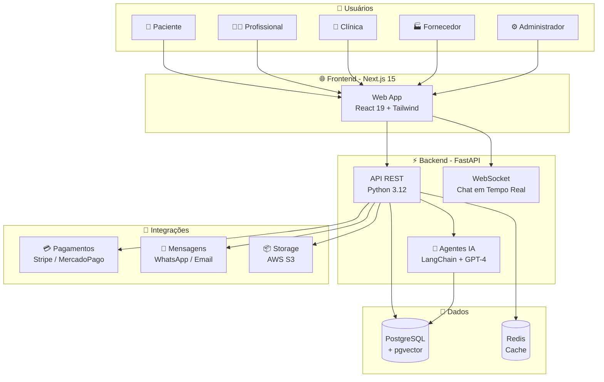

### 1.2 Tipos de Usuário e Permissões

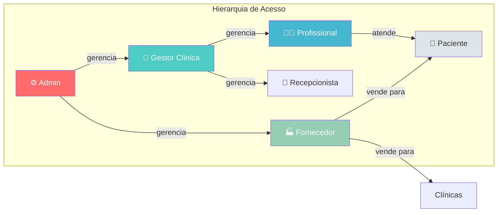

---

## 2. Fluxos do Paciente

### 2.1 Fluxo de Cadastro

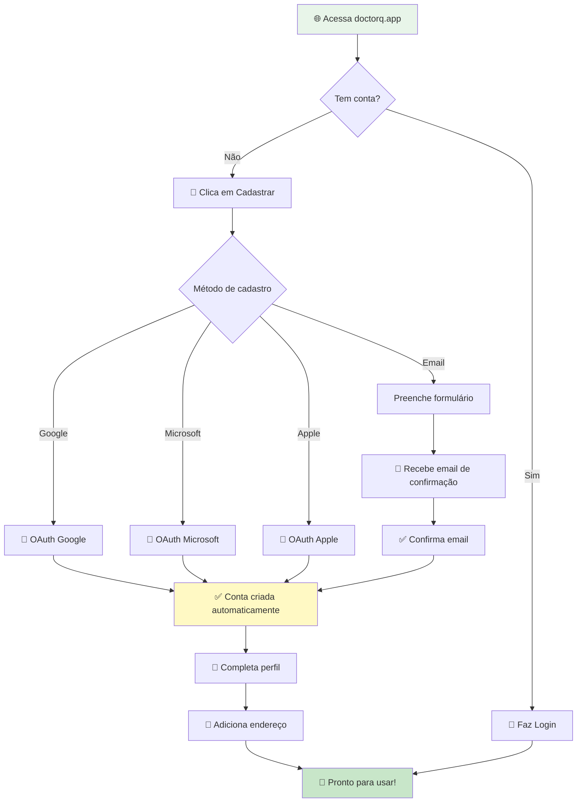

### 2.2 Fluxo de Agendamento

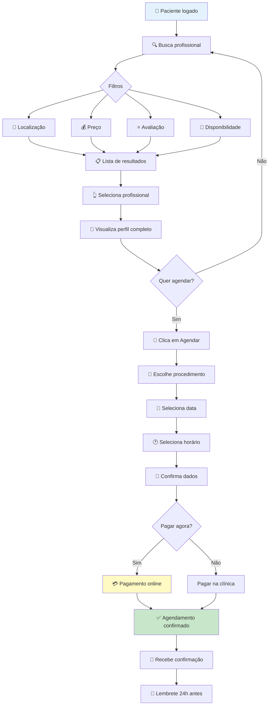

### 2.3 Fluxo de Avaliação

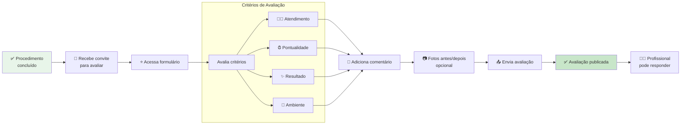

---

## 3. Fluxos do Profissional

### 3.1 Fluxo de Atendimento

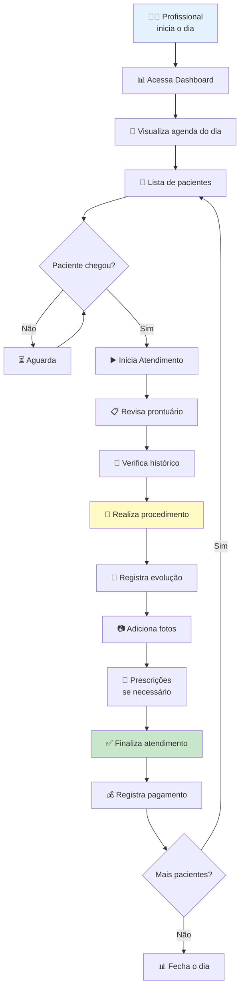

### 3.2 Estrutura do Prontuário

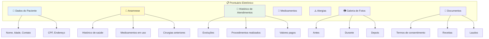

---

## 4. Fluxos da Clínica

### 4.1 Fluxo de Onboarding da Clínica

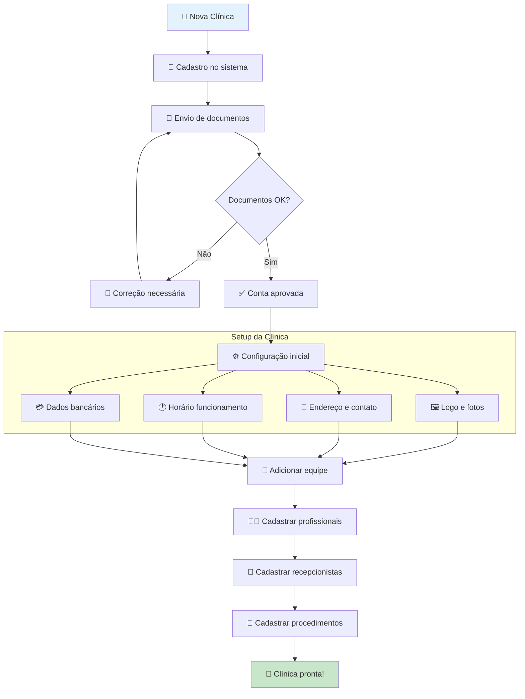

### 4.2 Visão da Agenda Consolidada

```mermaid
gantt
    title Agenda da Clínica - 25/11/2025
    dateFormat HH:mm
    axisFormat %H:%M

    section Dra. Ana
    Maria - Botox           :active, ana1, 09:00, 30m
    João - Preenchimento    :ana2, 10:00, 45m
    Almoço                  :crit, ana3, 12:00, 60m
    Carlos - Limpeza        :ana4, 14:00, 60m

    section Dr. Carlos
    Pedro - Peeling         :carlos1, 09:00, 45m
    Livre                   :carlos2, 10:00, 120m
    Almoço                  :crit, carlos3, 12:00, 60m
    Rita - Botox            :carlos4, 14:00, 30m

    section Dra. Fernanda
    Lucia - Hidratação      :fer1, 09:00, 60m
    Ana - Limpeza           :fer2, 10:30, 60m
    Almoço                  :crit, fer3, 12:00, 60m
    Bruno - Peeling         :fer4, 14:00, 45m
```

### 4.3 Dashboard de Métricas

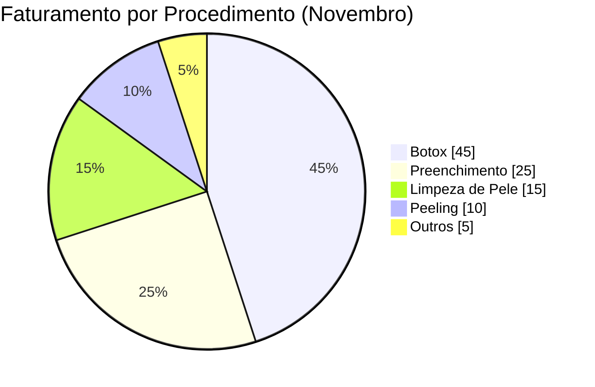

---

## 5. Fluxos do Fornecedor

### 5.1 Fluxo de Venda no Marketplace

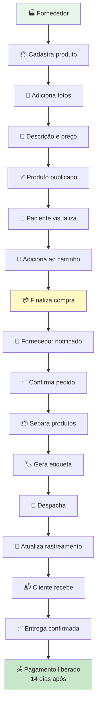

### 5.2 Ciclo de Vida do Pedido

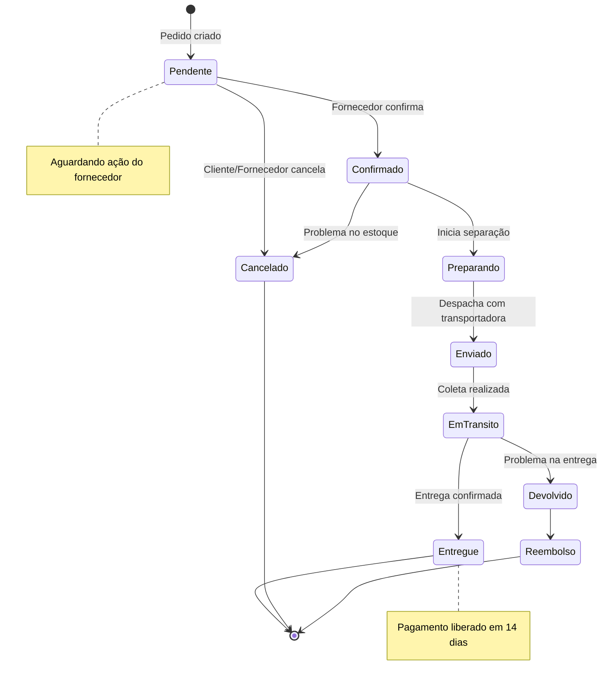

---

## 6. Fluxos do Administrador

### 6.1 Gestão de Usuários

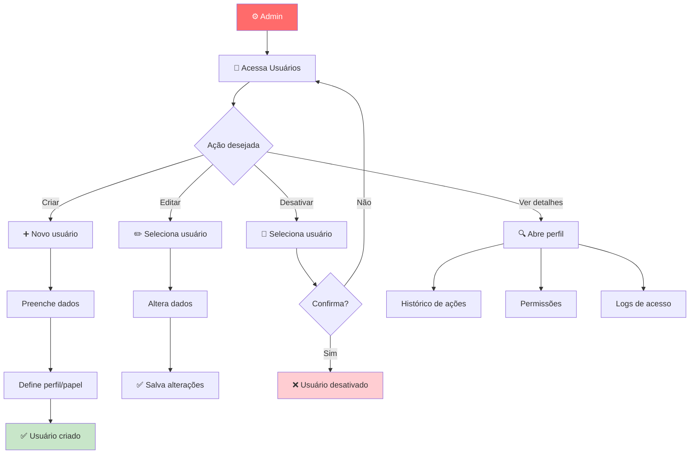

### 6.2 Monitoramento do Sistema

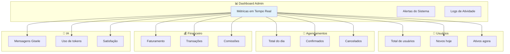

---

## 7. Fluxo de Pagamento

### 7.1 Checkout Online

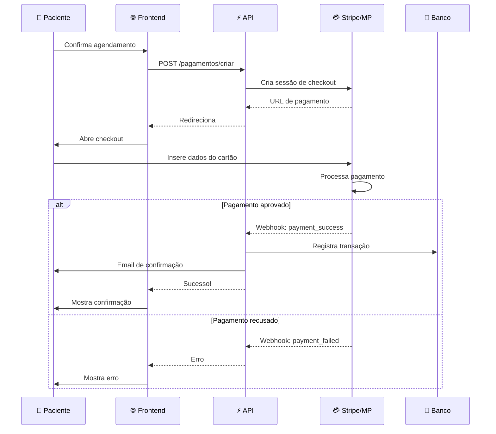

### 7.2 Fluxo de Comissões (Marketplace)

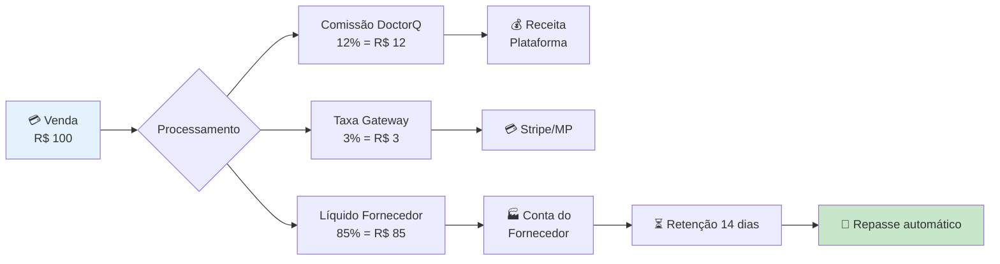

---

## 8. Integrações

### 8.1 Ecossistema de Integrações

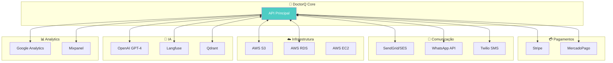

---

## 9. Jornadas de Usuário

### 9.1 Jornada Completa do Paciente

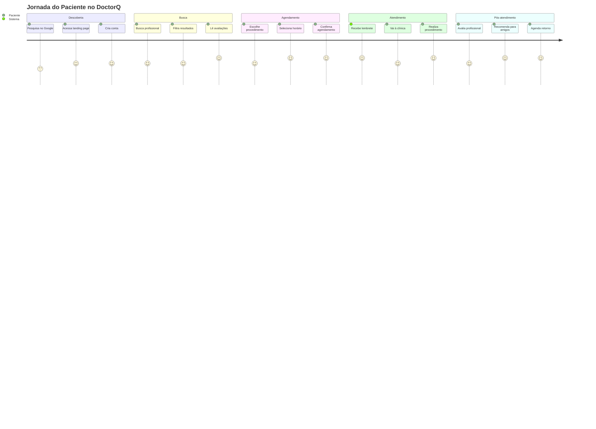

### 9.2 Jornada do Profissional

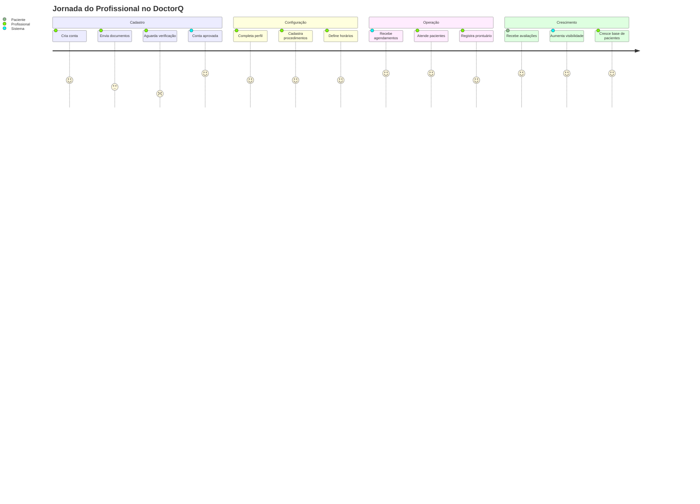

---

## 10. Modelo de Dados Simplificado

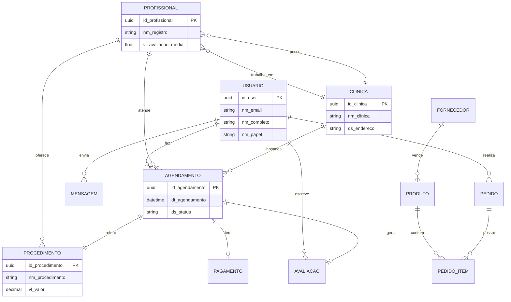

---

## Como Usar Estes Diagramas

### No GitHub
Os diagramas Mermaid são renderizados automaticamente em arquivos `.md` no GitHub.

### No GitBook
GitBook suporta Mermaid nativamente.

### Exportar como Imagem
Use o [Mermaid Live Editor](https://mermaid.live/) para exportar PNG/SVG.

### Em Apresentações
1. Acesse https://mermaid.live/
2. Cole o código do diagrama
3. Exporte como PNG ou SVG
4. Use na sua apresentação

---

*Última atualização: Novembro 2025*
