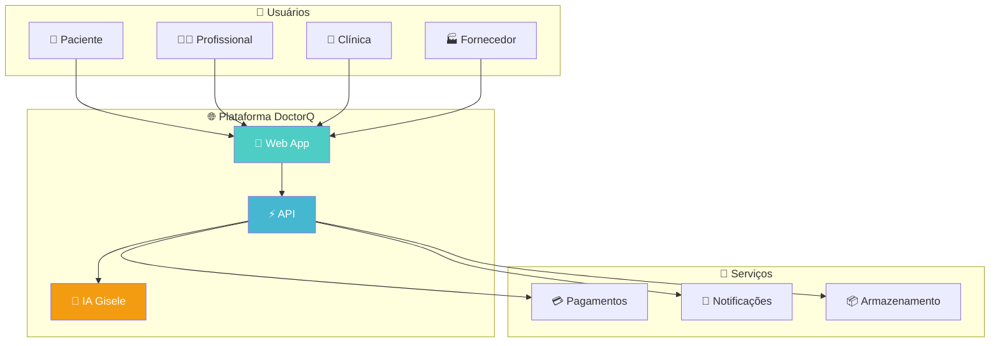
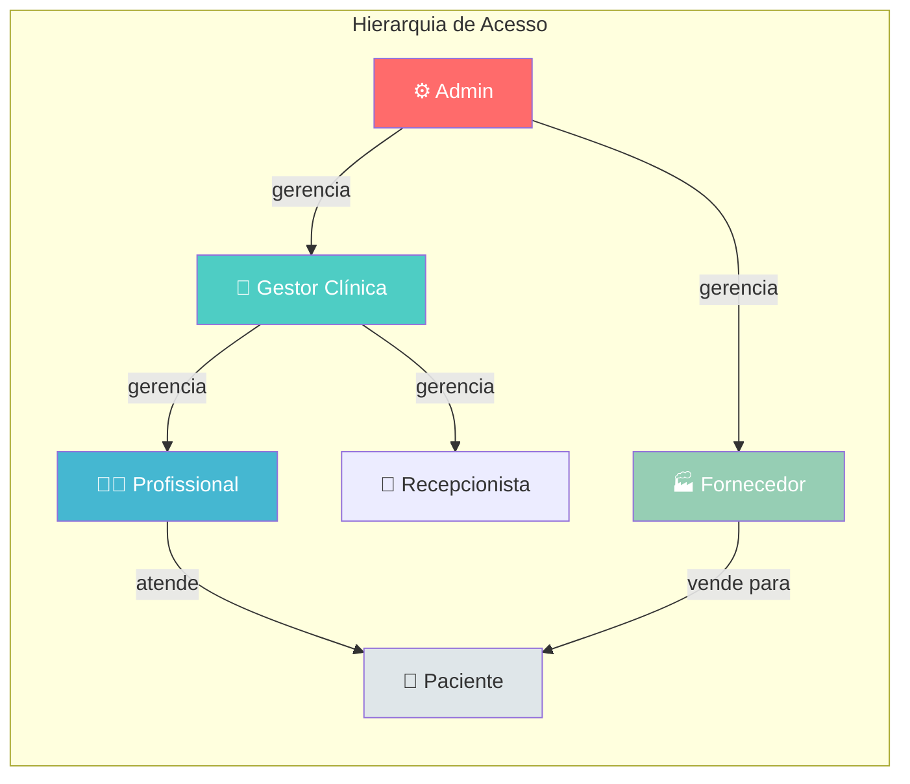
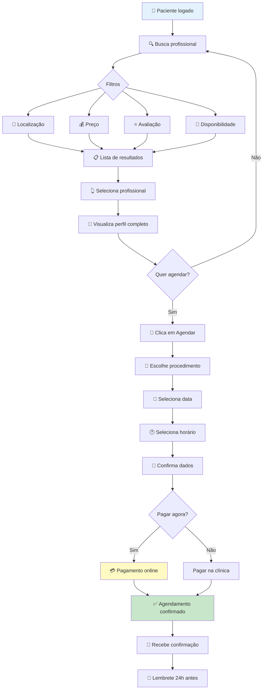
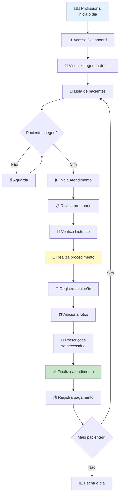
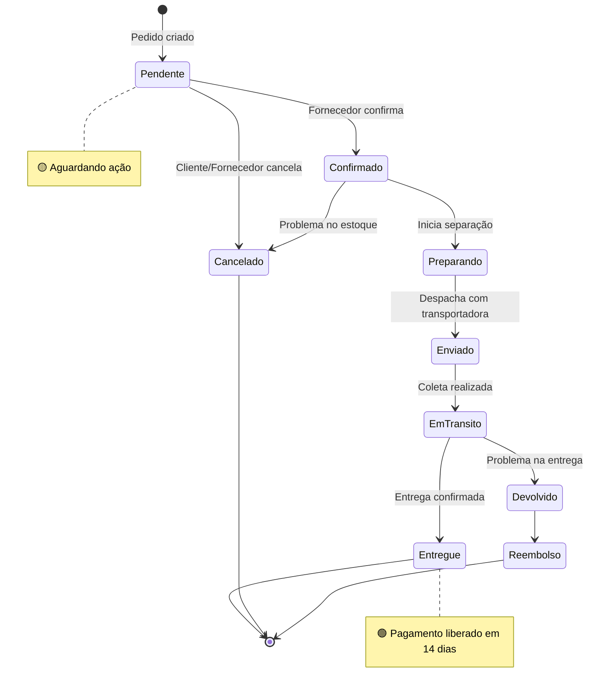

# Manual do Usuário - DoctorQ

<div align="center">


**Plataforma Completa para Gestão de Clínicas de Estética**

*Versão 1.0 | Novembro 2025*

</div>

---

## Índice

1. [Introdução](#1-introdução)
2. [Primeiros Passos](#2-primeiros-passos)
3. [Guia do Paciente/Cliente](#3-guia-do-pacientecliente)
4. [Guia do Profissional](#4-guia-do-profissional)
5. [Guia do Gestor de Clínica](#5-guia-do-gestor-de-clínica)
6. [Guia do Fornecedor](#6-guia-do-fornecedor)
7. [Guia do Administrador](#7-guia-do-administrador)
8. [Funcionalidades Comuns](#8-funcionalidades-comuns)
9. [Perguntas Frequentes (FAQ)](#9-perguntas-frequentes-faq)
10. [Suporte e Contato](#10-suporte-e-contato)

---

## 1. Introdução

### 1.1 O que é o DoctorQ?

O **DoctorQ** é uma plataforma SaaS (Software as a Service) completa para gestão de clínicas de estética, conectando pacientes, profissionais, clínicas e fornecedores em um único ecossistema digital.

### 1.2 Principais Funcionalidades

| Funcionalidade | Descrição |
|----------------|-----------|
| **Agendamento Online** | Marque consultas e procedimentos 24/7 |
| **Prontuário Eletrônico** | Histórico médico digital completo |
| **Marketplace** | Compre produtos de estética |
| **Chat Integrado** | Comunicação direta com profissionais |
| **Pagamentos Online** | PIX, cartão de crédito e débito |
| **IA Assistente (Gisele)** | Chatbot inteligente para dúvidas |

### 1.3 Arquitetura Visual do Sistema



### 1.4 Tipos de Usuários



| Perfil | Permissões Principais |
|--------|----------------------|
| **Administrador** | Acesso total ao sistema |
| **Gestor de Clínica** | Gerencia clínica, equipe e finanças |
| **Profissional** | Atende pacientes, prontuários |
| **Recepcionista** | Agendamentos e cadastros |
| **Fornecedor** | Vende produtos no marketplace |
| **Paciente** | Agenda, compra, avalia |

---

## 2. Primeiros Passos

### 2.1 Criando sua Conta

#### Passo 1: Acesse a Página de Cadastro

Acesse `www.doctorq.app/cadastro` ou clique em **"Criar Conta"** na página inicial.

```
┌─────────────────────────────────────────────────────────────┐
│                     CRIAR CONTA                             │
├─────────────────────────────────────────────────────────────┤
│                                                             │
│   ┌─────────────────────────────────────────────────────┐   │
│   │  📧 E-mail                                          │   │
│   │  ____________________________________________       │   │
│   └─────────────────────────────────────────────────────┘   │
│                                                             │
│   ┌─────────────────────────────────────────────────────┐   │
│   │  🔒 Senha                                           │   │
│   │  ____________________________________________       │   │
│   └─────────────────────────────────────────────────────┘   │
│                                                             │
│   ┌─────────────────────────────────────────────────────┐   │
│   │  👤 Nome Completo                                   │   │
│   │  ____________________________________________       │   │
│   └─────────────────────────────────────────────────────┘   │
│                                                             │
│   [ ] Concordo com os Termos de Uso                        │
│                                                             │
│   ┌─────────────────────────────────────────────────────┐   │
│   │            [ CRIAR MINHA CONTA ]                    │   │
│   └─────────────────────────────────────────────────────┘   │
│                                                             │
│   ─────────────── ou continue com ───────────────          │
│                                                             │
│   [ 🔵 Google ]  [ 🔷 Microsoft ]  [ 🍎 Apple ]            │
│                                                             │
└─────────────────────────────────────────────────────────────┘
```

<!-- SCREENSHOT: Inserir captura da tela de cadastro -->
> **📸 Imagem:** Tela de cadastro do DoctorQ
> **Localização:** `/cadastro`

#### Passo 2: Escolha seu Tipo de Perfil

Após o cadastro, selecione como você usará o DoctorQ:

| Perfil | Descrição | Acesso |
|--------|-----------|--------|
| **Paciente/Cliente** | Buscar profissionais e agendar procedimentos | Gratuito |
| **Profissional** | Atender pacientes e gerenciar agenda | Planos a partir de R$ 99/mês |
| **Gestor de Clínica** | Administrar clínica e equipe | Planos a partir de R$ 299/mês |
| **Fornecedor** | Vender produtos no marketplace | Comissão por venda |

#### Passo 3: Complete seu Perfil

Preencha as informações adicionais para aproveitar todos os recursos:

- **Foto de perfil** (recomendado)
- **Telefone/WhatsApp** para notificações
- **Endereço** para busca por proximidade
- **Preferências** de procedimentos (pacientes)

### 2.2 Fazendo Login

#### Login com E-mail e Senha

```
┌─────────────────────────────────────────────────────────────┐
│                       ENTRAR                                │
├─────────────────────────────────────────────────────────────┤
│                                                             │
│   📧 E-mail: ________________________________________      │
│                                                             │
│   🔒 Senha:  ________________________________________      │
│                                                             │
│   [ ] Lembrar de mim                                       │
│                                                             │
│              [ ENTRAR ]                                     │
│                                                             │
│   Esqueceu a senha? [Recuperar]                            │
│                                                             │
└─────────────────────────────────────────────────────────────┘
```

<!-- SCREENSHOT: Inserir captura da tela de login -->
> **📸 Imagem:** Tela de login
> **Localização:** `/login`

#### Login Social (OAuth)

Você também pode entrar usando:
- **Google** - Recomendado para rapidez
- **Microsoft** - Ideal para empresas
- **Apple** - Disponível em dispositivos Apple

### 2.3 Recuperação de Senha

1. Clique em **"Esqueci minha senha"** na tela de login
2. Digite seu e-mail cadastrado
3. Acesse o link enviado para seu e-mail
4. Crie uma nova senha (mínimo 8 caracteres)

---

## 3. Guia do Paciente/Cliente

### 3.1 Visão Geral do Dashboard

Ao fazer login como paciente, você verá seu painel personalizado:

```
┌─────────────────────────────────────────────────────────────────────────┐
│  🏠 DoctorQ                                    👤 Maria Silva  [Sair]  │
├─────────────────────────────────────────────────────────────────────────┤
│                                                                         │
│  Olá, Maria! 👋                                                        │
│  Bem-vindo ao seu painel de controle.                                  │
│                                                                         │
├─────────────────────────────────────────────────────────────────────────┤
│                                                                         │
│  ┌──────────────┐ ┌──────────────┐ ┌──────────────┐ ┌──────────────┐   │
│  │ 📅 12       │ │ ✅ 8        │ │ ⭐ 6        │ │ ❤️ 5        │   │
│  │ Agendamentos│ │ Realizados  │ │ Avaliações  │ │ Favoritos   │   │
│  └──────────────┘ └──────────────┘ └──────────────┘ └──────────────┘   │
│                                                                         │
├─────────────────────────────────────────────────────────────────────────┤
│  AÇÕES RÁPIDAS                                                         │
│  ┌────────────────────┐ ┌────────────────────┐ ┌────────────────────┐  │
│  │ 🏆 Explorar       │ │ 📅 Agendar        │ │ 🛒 Marketplace    │  │
│  │ Procedimentos     │ │ Consulta          │ │                    │  │
│  └────────────────────┘ └────────────────────┘ └────────────────────┘  │
│                                                                         │
├─────────────────────────────────────────────────────────────────────────┤
│  PRÓXIMOS AGENDAMENTOS                                                 │
│  ┌─────────────────────────────────────────────────────────────────┐   │
│  │ 📅 25/11/2025 - 14:00                              [Agendado]  │   │
│  │ Limpeza de Pele Profunda                                        │   │
│  │ Dra. Ana Costa - Clínica Beleza Total                          │   │
│  │                                          [Ver detalhes]         │   │
│  └─────────────────────────────────────────────────────────────────┘   │
│                                                                         │
└─────────────────────────────────────────────────────────────────────────┘
```

<!-- SCREENSHOT: Inserir captura do dashboard do paciente -->
> **📸 Imagem:** Dashboard do Paciente
> **Localização:** `/paciente/dashboard`

### 3.2 Buscando Profissionais e Procedimentos

#### Busca Inteligente

1. Acesse **"Busca"** no menu ou na página inicial
2. Digite o procedimento desejado ou nome do profissional
3. Use os filtros para refinar sua busca:

```
┌─────────────────────────────────────────────────────────────────────────┐
│  🔍 BUSCAR PROFISSIONAIS                                               │
├─────────────────────────────────────────────────────────────────────────┤
│                                                                         │
│  [🔍 Botox, Limpeza de pele, Dra. Ana...                          ]   │
│                                                                         │
│  ── FILTROS ──────────────────────────────────────────────────────     │
│                                                                         │
│  📍 Localização: [ São Paulo, SP          ▼]                           │
│  📏 Distância:   [ Até 10 km              ▼]                           │
│  💰 Preço:       [ R$ 100 ────●──── R$ 500 ]                           │
│  ⭐ Avaliação:   [ ★★★★☆ ou mais          ▼]                           │
│  📅 Disponível:  [ Esta semana            ▼]                           │
│                                                                         │
│                        [ 🔍 BUSCAR ]                                   │
│                                                                         │
├─────────────────────────────────────────────────────────────────────────┤
│  📊 32 resultados encontrados                                          │
│                                                                         │
│  ┌─────────────────────────────────────────────────────────────────┐   │
│  │ 👩‍⚕️ Dra. Ana Costa                              ⭐ 4.9 (127)   │   │
│  │ Dermatologista • CRM 12345                                      │   │
│  │ 📍 2.3 km • Jardins, São Paulo                                  │   │
│  │ 💰 Botox: a partir de R$ 350                                    │   │
│  │                                                                  │   │
│  │ [❤️ Favoritar]  [💬 Chat]  [📅 Agendar]                        │   │
│  └─────────────────────────────────────────────────────────────────┘   │
│                                                                         │
└─────────────────────────────────────────────────────────────────────────┘
```

<!-- SCREENSHOT: Inserir captura da busca de profissionais -->
> **📸 Imagem:** Tela de busca de profissionais
> **Localização:** `/busca`

#### Filtros Disponíveis

| Filtro | Descrição |
|--------|-----------|
| **Localização** | Busca por cidade, bairro ou CEP |
| **Distância** | Raio de busca (1km a 50km) |
| **Preço** | Faixa de valor do procedimento |
| **Avaliação** | Nota mínima do profissional |
| **Disponibilidade** | Horários disponíveis |
| **Especialidade** | Tipo de procedimento |
| **Gênero** | Preferência de profissional |

### 3.3 Agendando um Procedimento

#### Fluxo Completo de Agendamento



#### Passo 1: Escolha o Profissional

Clique no profissional desejado para ver seu perfil completo:

```
┌─────────────────────────────────────────────────────────────────────────┐
│  👩‍⚕️ PERFIL DO PROFISSIONAL                                            │
├─────────────────────────────────────────────────────────────────────────┤
│                                                                         │
│  ┌────────┐  Dra. Ana Costa                                            │
│  │  FOTO  │  Dermatologista • CRM 12345-SP                             │
│  │        │  ⭐ 4.9 (127 avaliações)                                   │
│  └────────┘  📍 Clínica Beleza Total - Jardins, SP                     │
│                                                                         │
│  ── SOBRE ─────────────────────────────────────────────────────────    │
│  Especialista em procedimentos estéticos faciais com mais de 10        │
│  anos de experiência. Formada pela USP com especialização em           │
│  dermatologia estética.                                                │
│                                                                         │
│  ── PROCEDIMENTOS ─────────────────────────────────────────────────    │
│  • Botox ........................... a partir de R$ 350                │
│  • Preenchimento Labial ............ a partir de R$ 800                │
│  • Limpeza de Pele ................. a partir de R$ 180                │
│  • Peeling Químico ................. a partir de R$ 250                │
│                                                                         │
│  ── AVALIAÇÕES RECENTES ───────────────────────────────────────────    │
│  ⭐⭐⭐⭐⭐ "Excelente profissional!" - Maria, há 2 dias               │
│  ⭐⭐⭐⭐⭐ "Muito atenciosa e resultado incrível" - João, há 5 dias   │
│                                                                         │
│              [ 📅 AGENDAR CONSULTA ]                                   │
│                                                                         │
└─────────────────────────────────────────────────────────────────────────┘
```

<!-- SCREENSHOT: Inserir captura do perfil do profissional -->
> **📸 Imagem:** Perfil do Profissional
> **Localização:** `/profissional/[id]`

#### Passo 2: Selecione Data e Horário

```
┌─────────────────────────────────────────────────────────────────────────┐
│  📅 SELECIONE DATA E HORÁRIO                                           │
├─────────────────────────────────────────────────────────────────────────┤
│                                                                         │
│  ┌─────────────────────────────────────────────────────────────────┐   │
│  │            NOVEMBRO 2025                                        │   │
│  │  Dom  Seg  Ter  Qua  Qui  Sex  Sáb                             │   │
│  │                            1                                    │   │
│  │   2    3    4    5    6    7    8                              │   │
│  │   9   10   11   12   13   14   15                              │   │
│  │  16   17   18   19   20   21   22                              │   │
│  │  23   24  [25]  26   27   28   29                              │   │
│  │  30                                                             │   │
│  └─────────────────────────────────────────────────────────────────┘   │
│                                                                         │
│  HORÁRIOS DISPONÍVEIS - 25/11/2025                                     │
│  ┌────────┐ ┌────────┐ ┌────────┐ ┌────────┐ ┌────────┐               │
│  │ 09:00  │ │ 10:00  │ │ 11:00  │ │[14:00] │ │ 15:00  │               │
│  └────────┘ └────────┘ └────────┘ └────────┘ └────────┘               │
│  ┌────────┐ ┌────────┐                                                 │
│  │ 16:00  │ │ 17:00  │                                                 │
│  └────────┘ └────────┘                                                 │
│                                                                         │
│  Selecionado: 25/11/2025 às 14:00                                      │
│                                                                         │
│              [ CONTINUAR → ]                                           │
│                                                                         │
└─────────────────────────────────────────────────────────────────────────┘
```

<!-- SCREENSHOT: Inserir captura da seleção de data/hora -->
> **📸 Imagem:** Seleção de data e horário
> **Localização:** `/agendamento/[profissional_id]`

#### Passo 3: Confirme o Agendamento

```
┌─────────────────────────────────────────────────────────────────────────┐
│  ✅ CONFIRMAR AGENDAMENTO                                              │
├─────────────────────────────────────────────────────────────────────────┤
│                                                                         │
│  RESUMO DO AGENDAMENTO                                                 │
│  ──────────────────────────────────────────────────────────────────    │
│  📋 Procedimento: Limpeza de Pele Profunda                             │
│  👩‍⚕️ Profissional: Dra. Ana Costa                                      │
│  📍 Local: Clínica Beleza Total - Jardins, SP                          │
│  📅 Data: 25 de Novembro de 2025                                       │
│  🕐 Horário: 14:00                                                     │
│  ⏱️ Duração: 60 minutos                                                │
│  💰 Valor: R$ 180,00                                                   │
│                                                                         │
│  OBSERVAÇÕES (opcional)                                                │
│  ┌─────────────────────────────────────────────────────────────────┐   │
│  │ Tenho pele sensível...                                          │   │
│  └─────────────────────────────────────────────────────────────────┘   │
│                                                                         │
│  [ ] Desejo pagar antecipadamente (5% de desconto)                     │
│                                                                         │
│  ┌─────────────────────┐  ┌─────────────────────┐                      │
│  │    [ VOLTAR ]       │  │ [ ✅ CONFIRMAR ]    │                      │
│  └─────────────────────┘  └─────────────────────┘                      │
│                                                                         │
└─────────────────────────────────────────────────────────────────────────┘
```

<!-- SCREENSHOT: Inserir captura da confirmação de agendamento -->
> **📸 Imagem:** Confirmação de agendamento
> **Localização:** `/agendamento/confirmar`

#### Passo 4: Agendamento Confirmado!

Após confirmar, você receberá:
- **E-mail** de confirmação com todos os detalhes
- **WhatsApp** (se configurado) com lembrete
- **Notificação** no app 24h antes do procedimento

### 3.4 Gerenciando seus Agendamentos

#### Lista de Agendamentos

Acesse **Menu → Agendamentos** para ver todos os seus compromissos:

```
┌─────────────────────────────────────────────────────────────────────────┐
│  📅 MEUS AGENDAMENTOS                                                   │
├─────────────────────────────────────────────────────────────────────────┤
│                                                                         │
│  [Próximos]  [Histórico]  [Cancelados]                                 │
│                                                                         │
│  ┌─────────────────────────────────────────────────────────────────┐   │
│  │ 📅 25/11/2025 - 14:00                              🟡 Agendado │   │
│  │ Limpeza de Pele Profunda                                        │   │
│  │ Dra. Ana Costa • Clínica Beleza Total                          │   │
│  │                                                                  │   │
│  │ [📝 Editar]  [❌ Cancelar]  [💬 Mensagem]                      │   │
│  └─────────────────────────────────────────────────────────────────┘   │
│                                                                         │
│  ┌─────────────────────────────────────────────────────────────────┐   │
│  │ 📅 30/11/2025 - 10:00                           🟢 Confirmado  │   │
│  │ Botox - Região da Testa                                         │   │
│  │ Dr. Carlos Silva • Studio Estética                             │   │
│  │                                                                  │   │
│  │ [📝 Editar]  [❌ Cancelar]  [💬 Mensagem]                      │   │
│  └─────────────────────────────────────────────────────────────────┘   │
│                                                                         │
└─────────────────────────────────────────────────────────────────────────┘
```

<!-- SCREENSHOT: Inserir captura da lista de agendamentos -->
> **📸 Imagem:** Lista de agendamentos do paciente
> **Localização:** `/paciente/agendamentos`

#### Status dos Agendamentos

| Status | Cor | Descrição |
|--------|-----|-----------|
| 🟡 **Agendado** | Amarelo | Aguardando confirmação da clínica |
| 🟢 **Confirmado** | Verde | Confirmado pela clínica |
| 🔵 **Concluído** | Azul | Procedimento realizado |
| 🔴 **Cancelado** | Vermelho | Cancelado por você ou pela clínica |

#### Cancelamento de Agendamento

> ⚠️ **Importante:** Cancelamentos com menos de 24h de antecedência podem estar sujeitos a taxas, conforme política da clínica.

1. Acesse **Meus Agendamentos**
2. Clique em **"Cancelar"** no agendamento desejado
3. Informe o motivo do cancelamento
4. Confirme a ação

### 3.5 Avaliando Profissionais

Após cada procedimento concluído, você pode avaliar o profissional:

```
┌─────────────────────────────────────────────────────────────────────────┐
│  ⭐ AVALIAR ATENDIMENTO                                                │
├─────────────────────────────────────────────────────────────────────────┤
│                                                                         │
│  Como foi sua experiência com Dra. Ana Costa?                          │
│                                                                         │
│  ATENDIMENTO          ☆ ☆ ☆ ☆ ☆                                       │
│  PONTUALIDADE         ☆ ☆ ☆ ☆ ☆                                       │
│  RESULTADO            ☆ ☆ ☆ ☆ ☆                                       │
│  AMBIENTE             ☆ ☆ ☆ ☆ ☆                                       │
│                                                                         │
│  COMENTÁRIO (opcional)                                                 │
│  ┌─────────────────────────────────────────────────────────────────┐   │
│  │ Excelente atendimento! A Dra. Ana foi muito profissional e     │   │
│  │ explicou todo o procedimento detalhadamente...                  │   │
│  └─────────────────────────────────────────────────────────────────┘   │
│                                                                         │
│  📷 Adicionar fotos (antes/depois)                                     │
│  [ + Escolher fotos ]                                                  │
│                                                                         │
│              [ ENVIAR AVALIAÇÃO ]                                      │
│                                                                         │
└─────────────────────────────────────────────────────────────────────────┘
```

<!-- SCREENSHOT: Inserir captura da tela de avaliação -->
> **📸 Imagem:** Tela de avaliação de procedimento
> **Localização:** `/paciente/avaliacoes/nova`

### 3.6 Marketplace - Comprando Produtos

#### Navegando no Marketplace

```
┌─────────────────────────────────────────────────────────────────────────┐
│  🛒 MARKETPLACE                                                        │
├─────────────────────────────────────────────────────────────────────────┤
│                                                                         │
│  [🔍 Buscar produtos...                                           ]    │
│                                                                         │
│  CATEGORIAS                                                            │
│  [Skincare] [Corpo] [Cabelo] [Maquiagem] [Equipamentos] [Ofertas]     │
│                                                                         │
│  ┌───────────────┐ ┌───────────────┐ ┌───────────────┐                │
│  │    [FOTO]     │ │    [FOTO]     │ │    [FOTO]     │                │
│  │               │ │               │ │               │                │
│  │ Sérum Vit C   │ │ Creme Anti-   │ │ Kit Limpeza   │                │
│  │ Premium       │ │ idade         │ │ Profunda      │                │
│  │               │ │               │ │               │                │
│  │ ⭐ 4.8 (89)   │ │ ⭐ 4.9 (156)  │ │ ⭐ 4.7 (67)   │                │
│  │ R$ 189,90     │ │ R$ 299,90     │ │ R$ 149,90     │                │
│  │               │ │               │ │               │                │
│  │ [🛒 Comprar]  │ │ [🛒 Comprar]  │ │ [🛒 Comprar]  │                │
│  └───────────────┘ └───────────────┘ └───────────────┘                │
│                                                                         │
└─────────────────────────────────────────────────────────────────────────┘
```

<!-- SCREENSHOT: Inserir captura do marketplace -->
> **📸 Imagem:** Página principal do Marketplace
> **Localização:** `/marketplace`

#### Processo de Compra

1. **Adicione ao Carrinho** - Clique em "Comprar" no produto
2. **Revise o Carrinho** - Verifique quantidades e valores
3. **Aplique Cupom** - Se tiver código de desconto
4. **Escolha Entrega** - Informe endereço de entrega
5. **Pagamento** - PIX, Cartão ou Boleto
6. **Confirmação** - Receba código de rastreamento

### 3.7 Prontuário Eletrônico

Acesse seu histórico médico completo em **Menu → Prontuário**:

- **Anamneses** - Questionários de saúde preenchidos
- **Procedimentos** - Histórico de todos os tratamentos
- **Fotos** - Antes/Depois dos procedimentos
- **Documentos** - Receitas e laudos médicos

<!-- SCREENSHOT: Inserir captura do prontuário -->
> **📸 Imagem:** Prontuário eletrônico do paciente
> **Localização:** `/paciente/prontuario`

### 3.8 Chat com Profissionais

Comunique-se diretamente com seus profissionais:

```
┌─────────────────────────────────────────────────────────────────────────┐
│  💬 MENSAGENS                                      🔍 Buscar conversa  │
├─────────────────────────────────────────────────────────────────────────┤
│  ┌─────────────────┐ ┌─────────────────────────────────────────────┐   │
│  │ CONVERSAS       │ │ Dra. Ana Costa                             │   │
│  │                 │ │ Online 🟢                                   │   │
│  │ Dra. Ana Costa  │ ├─────────────────────────────────────────────┤   │
│  │ Olá! Como posso │ │                                             │   │
│  │ ajudar?         │ │  ┌──────────────────────────────┐          │   │
│  │            14:32│ │  │ Olá! Gostaria de saber se    │ 14:30    │   │
│  │                 │ │  │ posso fazer limpeza de pele   │          │   │
│  │ ─────────────── │ │  │ tomando antibiótico?         │          │   │
│  │                 │ │  └──────────────────────────────┘          │   │
│  │ Dr. Carlos      │ │                                             │   │
│  │ Seu procediment │ │       ┌──────────────────────────────┐     │   │
│  │ está confirmado │ │ 14:32 │ Olá! Depende do antibiótico. │     │   │
│  │            ontem│ │       │ Qual você está tomando?      │     │   │
│  │                 │ │       └──────────────────────────────┘     │   │
│  └─────────────────┘ │                                             │   │
│                      │ ┌───────────────────────────────────────┐   │   │
│                      │ │ Digite sua mensagem...            [📎]│   │   │
│                      │ └───────────────────────────────────────┘   │   │
└─────────────────────────────────────────────────────────────────────────┘
```

<!-- SCREENSHOT: Inserir captura do chat -->
> **📸 Imagem:** Sistema de mensagens
> **Localização:** `/paciente/mensagens`

---

## 4. Guia do Profissional

### 4.1 Dashboard do Profissional

O painel do profissional oferece visão completa da sua atividade:

```
┌─────────────────────────────────────────────────────────────────────────┐
│  🏠 DoctorQ                           👤 Dra. Ana Costa  [Sair]        │
├─────────────────────────────────────────────────────────────────────────┤
│                                                                         │
│  Painel Profissional                                                   │
│  Acompanhe suas métricas e agenda do dia                               │
│                                                                         │
├─────────────────────────────────────────────────────────────────────────┤
│                                                                         │
│  ┌────────────┐ ┌────────────┐ ┌────────────┐ ┌────────────┐ ┌──────┐ │
│  │ 📅 8      │ │ 👥 156    │ │ 💰 R$12k  │ │ ⭐ 4.9    │ │ 85%  │ │
│  │Atendimentos│ │ Pacientes │ │ Faturament│ │ Satisfação│ │Ocupaç│ │
│  │   Hoje    │ │  Ativos   │ │   Mês     │ │  Média    │ │ ão   │ │
│  └────────────┘ └────────────┘ └────────────┘ └────────────┘ └──────┘ │
│                                                                         │
├─────────────────────────────────────────────────────────────────────────┤
│  AÇÕES RÁPIDAS                                                         │
│  ┌──────────────┐ ┌──────────────┐ ┌──────────────┐ ┌──────────────┐  │
│  │ 📅 Ver      │ │ 👥 Meus     │ │ 💰 Finan-   │ │ 📋 Prontu-  │  │
│  │   Agenda    │ │   Pacientes │ │   ceiro     │ │   ários     │  │
│  └──────────────┘ └──────────────┘ └──────────────┘ └──────────────┘  │
│                                                                         │
├─────────────────────────────────────────────────────────────────────────┤
│  AGENDA DE HOJE                              DESEMPENHO DO MÊS         │
│  ┌─────────────────────────────────┐        ┌─────────────────────┐   │
│  │ 09:00 Maria Silva              │        │ Atendimentos        │   │
│  │       Botox - Confirmado 🟢    │        │ ████████░░ 85/100   │   │
│  │                                 │        │                     │   │
│  │ 10:00 João Santos              │        │ Receita             │   │
│  │       Limpeza - Confirmado 🟢  │        │ ██████████ R$ 12k   │   │
│  │                                 │        │                     │   │
│  │ 11:00 Ana Oliveira             │        │ Avaliações          │   │
│  │       Peeling - Pendente 🟡    │        │ ⭐⭐⭐⭐⭐ 4.9      │   │
│  │                                 │        │                     │   │
│  │ [Ver agenda completa →]        │        │                     │   │
│  └─────────────────────────────────┘        └─────────────────────┘   │
│                                                                         │
└─────────────────────────────────────────────────────────────────────────┘
```

<!-- SCREENSHOT: Inserir captura do dashboard do profissional -->
> **📸 Imagem:** Dashboard do Profissional
> **Localização:** `/profissional/dashboard`

### 4.2 Gerenciando sua Agenda

#### Visualização da Agenda

```
┌─────────────────────────────────────────────────────────────────────────┐
│  📅 MINHA AGENDA                          [Dia] [Semana] [Mês]         │
├─────────────────────────────────────────────────────────────────────────┤
│                                                                         │
│  ◄  Segunda, 25 de Novembro de 2025  ►                                 │
│                                                                         │
│  08:00 │                                                               │
│  ──────┼───────────────────────────────────────────────────────────    │
│  09:00 │ ┌─────────────────────────────────────────────────────────┐   │
│        │ │ 🟢 Maria Silva - Botox                                  │   │
│        │ │ Duração: 30min | R$ 350                                 │   │
│        │ └─────────────────────────────────────────────────────────┘   │
│  10:00 │ ┌─────────────────────────────────────────────────────────┐   │
│        │ │ 🟢 João Santos - Limpeza de Pele                        │   │
│        │ │ Duração: 60min | R$ 180                                 │   │
│        │ └─────────────────────────────────────────────────────────┘   │
│  11:00 │ ┌─────────────────────────────────────────────────────────┐   │
│        │ │ 🟡 Ana Oliveira - Peeling (Aguardando confirmação)      │   │
│        │ │ Duração: 45min | R$ 250                                 │   │
│        │ └─────────────────────────────────────────────────────────┘   │
│  12:00 │ ░░░░░░░░░░░░░░░░░ ALMOÇO ░░░░░░░░░░░░░░░░░                   │
│  13:00 │                                                               │
│  14:00 │ ┌─────────────────────────────────────────────────────────┐   │
│        │ │ 🟢 Carlos Mendes - Preenchimento                        │   │
│        │ │ Duração: 45min | R$ 800                                 │   │
│        │ └─────────────────────────────────────────────────────────┘   │
│                                                                         │
└─────────────────────────────────────────────────────────────────────────┘
```

<!-- SCREENSHOT: Inserir captura da agenda do profissional -->
> **📸 Imagem:** Agenda do Profissional
> **Localização:** `/profissional/agenda`

#### Configurando Disponibilidade

1. Acesse **Configurações → Horários**
2. Defina seus horários de atendimento por dia da semana
3. Configure intervalos para almoço/descanso
4. Bloqueie datas específicas (férias, feriados)

```
┌─────────────────────────────────────────────────────────────────────────┐
│  ⚙️ CONFIGURAR HORÁRIOS                                                │
├─────────────────────────────────────────────────────────────────────────┤
│                                                                         │
│  HORÁRIO PADRÃO DE ATENDIMENTO                                         │
│                                                                         │
│  Segunda-feira   [✓] 09:00 às 18:00  Intervalo: 12:00 - 13:00         │
│  Terça-feira     [✓] 09:00 às 18:00  Intervalo: 12:00 - 13:00         │
│  Quarta-feira    [✓] 09:00 às 18:00  Intervalo: 12:00 - 13:00         │
│  Quinta-feira    [✓] 09:00 às 18:00  Intervalo: 12:00 - 13:00         │
│  Sexta-feira     [✓] 09:00 às 17:00  Intervalo: 12:00 - 13:00         │
│  Sábado          [✓] 09:00 às 13:00  Sem intervalo                    │
│  Domingo         [ ] Não atende                                        │
│                                                                         │
│  BLOQUEIOS ESPECIAIS                                                   │
│  ┌─────────────────────────────────────────────────────────────────┐   │
│  │ 25/12/2025 - Natal                                      [🗑️]   │   │
│  │ 01/01/2026 - Ano Novo                                   [🗑️]   │   │
│  └─────────────────────────────────────────────────────────────────┘   │
│  [ + Adicionar bloqueio ]                                              │
│                                                                         │
│                    [ SALVAR CONFIGURAÇÕES ]                            │
│                                                                         │
└─────────────────────────────────────────────────────────────────────────┘
```

<!-- SCREENSHOT: Inserir captura da configuração de horários -->
> **📸 Imagem:** Configuração de horários
> **Localização:** `/profissional/configuracoes/horarios`

### 4.3 Atendendo Pacientes

#### Fluxo de Atendimento



#### Iniciando um Atendimento

1. Clique no agendamento na sua agenda
2. Verifique os dados do paciente e histórico
3. Clique em **"Iniciar Atendimento"**
4. Preencha a evolução do prontuário
5. Finalize e registre o procedimento

```
┌─────────────────────────────────────────────────────────────────────────┐
│  👤 ATENDIMENTO - Maria Silva                                          │
├─────────────────────────────────────────────────────────────────────────┤
│                                                                         │
│  DADOS DO PACIENTE                         HISTÓRICO                   │
│  ┌─────────────────────────────┐          ┌─────────────────────────┐  │
│  │ Nome: Maria Silva          │          │ • 15/10 - Botox        │  │
│  │ Idade: 35 anos             │          │ • 20/09 - Limpeza      │  │
│  │ Tel: (11) 99999-9999       │          │ • 10/08 - Peeling      │  │
│  │                             │          │                         │  │
│  │ Alergias: Nenhuma          │          │ [Ver prontuário →]     │  │
│  └─────────────────────────────┘          └─────────────────────────┘  │
│                                                                         │
│  PROCEDIMENTO DE HOJE                                                  │
│  ┌─────────────────────────────────────────────────────────────────┐   │
│  │ Botox - Região da Testa                                         │   │
│  │ Duração: 30 minutos | Valor: R$ 350,00                         │   │
│  └─────────────────────────────────────────────────────────────────┘   │
│                                                                         │
│  EVOLUÇÃO / OBSERVAÇÕES                                                │
│  ┌─────────────────────────────────────────────────────────────────┐   │
│  │ Paciente em bom estado geral. Aplicação de 20 unidades de      │   │
│  │ toxina botulínica na região frontal. Sem intercorrências.      │   │
│  │ Orientações pós-procedimento fornecidas.                        │   │
│  └─────────────────────────────────────────────────────────────────┘   │
│                                                                         │
│  📷 FOTOS DO PROCEDIMENTO                                              │
│  [ + Antes ]  [ + Durante ]  [ + Depois ]                              │
│                                                                         │
│  ┌────────────────────┐  ┌────────────────────┐                        │
│  │  [ CANCELAR ]      │  │ [ ✅ FINALIZAR ]   │                        │
│  └────────────────────┘  └────────────────────┘                        │
│                                                                         │
└─────────────────────────────────────────────────────────────────────────┘
```

<!-- SCREENSHOT: Inserir captura da tela de atendimento -->
> **📸 Imagem:** Tela de atendimento
> **Localização:** `/profissional/atendimento/[id]`

### 4.4 Prontuário Eletrônico

#### Gerenciando Prontuários

Acesse **Menu → Prontuários** para ver todos os registros:

```
┌─────────────────────────────────────────────────────────────────────────┐
│  📋 PRONTUÁRIOS                                                        │
├─────────────────────────────────────────────────────────────────────────┤
│                                                                         │
│  [🔍 Buscar paciente...                                           ]    │
│                                                                         │
│  ┌─────────────────────────────────────────────────────────────────┐   │
│  │ 👤 Maria Silva                              Última visita: 25/11│   │
│  │ 35 anos | (11) 99999-9999                                       │   │
│  │ 12 procedimentos realizados                                      │   │
│  │                                                                  │   │
│  │ [📋 Ver Prontuário]  [📝 Nova Evolução]  [📷 Fotos]            │   │
│  └─────────────────────────────────────────────────────────────────┘   │
│                                                                         │
│  ┌─────────────────────────────────────────────────────────────────┐   │
│  │ 👤 João Santos                              Última visita: 20/11│   │
│  │ 42 anos | (11) 98888-8888                                       │   │
│  │ 5 procedimentos realizados                                       │   │
│  │                                                                  │   │
│  │ [📋 Ver Prontuário]  [📝 Nova Evolução]  [📷 Fotos]            │   │
│  └─────────────────────────────────────────────────────────────────┘   │
│                                                                         │
└─────────────────────────────────────────────────────────────────────────┘
```

<!-- SCREENSHOT: Inserir captura da lista de prontuários -->
> **📸 Imagem:** Lista de prontuários
> **Localização:** `/profissional/prontuarios`

#### Estrutura do Prontuário

| Seção | Conteúdo |
|-------|----------|
| **Dados Pessoais** | Nome, idade, contato, foto |
| **Anamnese** | Histórico de saúde, alergias, medicamentos |
| **Evoluções** | Registro de cada atendimento |
| **Procedimentos** | Lista de procedimentos realizados |
| **Fotos** | Antes/Durante/Depois |
| **Documentos** | Receitas, laudos, consentimentos |

### 4.5 Gestão Financeira

#### Dashboard Financeiro

```
┌─────────────────────────────────────────────────────────────────────────┐
│  💰 FINANCEIRO                                                         │
├─────────────────────────────────────────────────────────────────────────┤
│                                                                         │
│  RESUMO DO MÊS - NOVEMBRO 2025                                         │
│                                                                         │
│  ┌────────────────┐ ┌────────────────┐ ┌────────────────┐              │
│  │ 💰 R$ 15.420   │ │ 📊 85          │ │ 📈 +23%        │              │
│  │ Faturamento    │ │ Atendimentos   │ │ vs mês anterior│              │
│  └────────────────┘ └────────────────┘ └────────────────┘              │
│                                                                         │
│  FATURAMENTO POR PROCEDIMENTO                                          │
│  ┌─────────────────────────────────────────────────────────────────┐   │
│  │ Botox              ████████████████████████░░░░░░  R$ 7.000 45% │   │
│  │ Preenchimento      ████████████████░░░░░░░░░░░░░░  R$ 4.800 31% │   │
│  │ Limpeza de Pele    ████████░░░░░░░░░░░░░░░░░░░░░░  R$ 2.160 14% │   │
│  │ Peeling            ████░░░░░░░░░░░░░░░░░░░░░░░░░░  R$ 1.460 10% │   │
│  └─────────────────────────────────────────────────────────────────┘   │
│                                                                         │
│  ÚLTIMAS TRANSAÇÕES                                                    │
│  ┌─────────────────────────────────────────────────────────────────┐   │
│  │ 25/11 │ Maria Silva   │ Botox            │ R$ 350   │ ✅ Pago  │   │
│  │ 25/11 │ João Santos   │ Limpeza          │ R$ 180   │ ✅ Pago  │   │
│  │ 24/11 │ Ana Oliveira  │ Preenchimento    │ R$ 800   │ ⏳ Pend. │   │
│  └─────────────────────────────────────────────────────────────────┘   │
│                                                                         │
│  [ 📄 Exportar Relatório ]  [ 📊 Ver Gráficos ]                        │
│                                                                         │
└─────────────────────────────────────────────────────────────────────────┘
```

<!-- SCREENSHOT: Inserir captura do financeiro do profissional -->
> **📸 Imagem:** Dashboard financeiro do profissional
> **Localização:** `/profissional/financeiro`

### 4.6 Cadastrando Procedimentos

Configure os procedimentos que você oferece:

```
┌─────────────────────────────────────────────────────────────────────────┐
│  ⚙️ MEUS PROCEDIMENTOS                        [ + Novo Procedimento ]  │
├─────────────────────────────────────────────────────────────────────────┤
│                                                                         │
│  ┌─────────────────────────────────────────────────────────────────┐   │
│  │ 💉 Botox                                            [✓] Ativo  │   │
│  │ Categoria: Toxina Botulínica                                    │   │
│  │ Duração: 30 min | Valor: R$ 350,00                             │   │
│  │ Descrição: Aplicação de toxina botulínica para...              │   │
│  │                                                                  │   │
│  │ [✏️ Editar]  [📊 Estatísticas]  [🗑️ Desativar]                │   │
│  └─────────────────────────────────────────────────────────────────┘   │
│                                                                         │
│  ┌─────────────────────────────────────────────────────────────────┐   │
│  │ 💆 Limpeza de Pele Profunda                        [✓] Ativo   │   │
│  │ Categoria: Limpeza Facial                                       │   │
│  │ Duração: 60 min | Valor: R$ 180,00                             │   │
│  │ Descrição: Limpeza profunda com extração...                    │   │
│  │                                                                  │   │
│  │ [✏️ Editar]  [📊 Estatísticas]  [🗑️ Desativar]                │   │
│  └─────────────────────────────────────────────────────────────────┘   │
│                                                                         │
└─────────────────────────────────────────────────────────────────────────┘
```

<!-- SCREENSHOT: Inserir captura da lista de procedimentos -->
> **📸 Imagem:** Gerenciamento de procedimentos
> **Localização:** `/profissional/procedimentos`

---

## 5. Guia do Gestor de Clínica

### 5.1 Dashboard da Clínica

Visão gerencial completa da sua clínica:

```
┌─────────────────────────────────────────────────────────────────────────┐
│  🏥 CLÍNICA BELEZA TOTAL                      👤 Dr. Roberto [Sair]    │
├─────────────────────────────────────────────────────────────────────────┤
│                                                                         │
│  Bem-vindo, Roberto! 👋                                                │
│  Segunda-feira, 25 de novembro de 2025                                 │
│                                                                         │
├─────────────────────────────────────────────────────────────────────────┤
│                                                                         │
│  ┌──────────────┐ ┌──────────────┐ ┌──────────────┐ ┌──────────────┐  │
│  │ 📅 24       │ │ 👥 8         │ │ 💰 R$ 4.2k  │ │ ⭐ 4.8       │  │
│  │ Agendamentos│ │ Profissionais│ │ Faturamento │ │ Avaliação    │  │
│  │    Hoje     │ │    Ativos    │ │    Hoje     │ │    Média     │  │
│  └──────────────┘ └──────────────┘ └──────────────┘ └──────────────┘  │
│                                                                         │
├────────────────────────────────────┬────────────────────────────────────┤
│  PRÓXIMOS AGENDAMENTOS            │  MINI CALENDÁRIO                   │
│  ┌────────────────────────────┐   │  ┌────────────────────────────┐   │
│  │ 09:00 Maria Silva         │   │  │    NOVEMBRO 2025           │   │
│  │       Dra. Ana - Botox 🟢 │   │  │  D  S  T  Q  Q  S  S      │   │
│  │                            │   │  │              1  2  3  4    │   │
│  │ 09:30 João Santos         │   │  │  5  6  7  8  9 10 11      │   │
│  │       Dr. Carlos - Limp.🟢│   │  │ 12 13 14 15 16 17 18      │   │
│  │                            │   │  │ 19 20 21 22 23 24[25]     │   │
│  │ 10:00 Ana Oliveira        │   │  │ 26 27 28 29 30            │   │
│  │       Dra. Ana - Peel. 🟡 │   │  └────────────────────────────┘   │
│  │                            │   │                                    │
│  │ [Ver todos →]             │   │  • 24 agendamentos                 │
│  └────────────────────────────┘   │  • 3 pendentes de confirmação     │
│                                    │                                    │
├────────────────────────────────────┴────────────────────────────────────┤
│  AÇÕES RÁPIDAS                                                         │
│  ┌──────────────┐ ┌──────────────┐ ┌──────────────┐                   │
│  │ 📅 Agenda   │ │ 👥 Equipe   │ │ 💰 Relatório│                   │
│  │   Completa  │ │             │ │  Financeiro │                   │
│  └──────────────┘ └──────────────┘ └──────────────┘                   │
│                                                                         │
├─────────────────────────────────────────────────────────────────────────┤
│  NOTIFICAÇÕES                                                          │
│  🟡 5 novas mensagens de pacientes                                     │
│  🔵 3 avaliações pendentes de resposta                                 │
│  🟢 2 confirmações de agendamento necessárias                          │
│                                                                         │
└─────────────────────────────────────────────────────────────────────────┘
```

<!-- SCREENSHOT: Inserir captura do dashboard da clínica -->
> **📸 Imagem:** Dashboard do Gestor de Clínica
> **Localização:** `/clinica/dashboard`

### 5.2 Gestão de Equipe

#### Adicionando Profissionais

1. Acesse **Menu → Equipe**
2. Clique em **"+ Adicionar Profissional"**
3. Preencha os dados ou envie convite por e-mail
4. Defina as permissões de acesso

```
┌─────────────────────────────────────────────────────────────────────────┐
│  👥 EQUIPE DA CLÍNICA                     [ + Adicionar Profissional ] │
├─────────────────────────────────────────────────────────────────────────┤
│                                                                         │
│  ┌─────────────────────────────────────────────────────────────────┐   │
│  │ 👩‍⚕️ Dra. Ana Costa                                    🟢 Online │   │
│  │ Dermatologista • CRM 12345-SP                                   │   │
│  │ ⭐ 4.9 (127 avaliações) • 8 atendimentos hoje                  │   │
│  │                                                                  │   │
│  │ [📅 Agenda]  [📊 Desempenho]  [⚙️ Permissões]                  │   │
│  └─────────────────────────────────────────────────────────────────┘   │
│                                                                         │
│  ┌─────────────────────────────────────────────────────────────────┐   │
│  │ 👨‍⚕️ Dr. Carlos Silva                                  🟢 Online │   │
│  │ Esteticista • CREFITO 54321-SP                                  │   │
│  │ ⭐ 4.7 (89 avaliações) • 6 atendimentos hoje                   │   │
│  │                                                                  │   │
│  │ [📅 Agenda]  [📊 Desempenho]  [⚙️ Permissões]                  │   │
│  └─────────────────────────────────────────────────────────────────┘   │
│                                                                         │
│  ┌─────────────────────────────────────────────────────────────────┐   │
│  │ 👩 Juliana Recepcionista                              🟢 Online │   │
│  │ Recepcionista                                                   │   │
│  │ Acesso: Agendamentos, Pacientes                                 │   │
│  │                                                                  │   │
│  │ [📊 Atividade]  [⚙️ Permissões]  [🗑️ Remover]                  │   │
│  └─────────────────────────────────────────────────────────────────┘   │
│                                                                         │
└─────────────────────────────────────────────────────────────────────────┘
```

<!-- SCREENSHOT: Inserir captura da gestão de equipe -->
> **📸 Imagem:** Gestão de equipe da clínica
> **Localização:** `/clinica/equipe`

#### Tipos de Acesso

| Perfil | Permissões |
|--------|------------|
| **Gestor** | Acesso total à clínica |
| **Profissional** | Agenda própria, prontuários, financeiro pessoal |
| **Recepcionista** | Agendamentos, cadastro de pacientes |
| **Financeiro** | Relatórios, pagamentos, notas fiscais |

### 5.3 Agenda Consolidada

Visualize todos os profissionais em uma única tela:

```
┌─────────────────────────────────────────────────────────────────────────┐
│  📅 AGENDA CONSOLIDADA                    25/11/2025  [◄] [►]          │
├─────────────────────────────────────────────────────────────────────────┤
│        │ Dra. Ana Costa   │ Dr. Carlos Silva │ Dra. Fernanda   │       │
│────────┼──────────────────┼──────────────────┼─────────────────┼───────│
│ 08:00  │                  │                  │                 │       │
│ 09:00  │ ████ Maria S.    │ ████ Pedro M.    │ ████ Lucia R.   │       │
│        │ Botox            │ Limpeza          │ Peeling         │       │
│ 10:00  │ ████ João S.     │                  │ ████ Carla T.   │       │
│        │ Preenchimento    │                  │ Botox           │       │
│ 11:00  │ ████ Ana O.      │ ████ Marcos A.   │                 │       │
│        │ Limpeza          │ Peeling          │                 │       │
│ 12:00  │ ░░░ ALMOÇO ░░░   │ ░░░ ALMOÇO ░░░   │ ░░░ ALMOÇO ░░░  │       │
│ 13:00  │                  │                  │                 │       │
│ 14:00  │ ████ Carlos M.   │ ████ Rita S.     │ ████ Bruno L.   │       │
│        │ Botox            │ Hidratação       │ Limpeza         │       │
│                                                                         │
│  🟢 Confirmado   🟡 Pendente   🔴 Cancelado   ░░░ Bloqueado            │
│                                                                         │
└─────────────────────────────────────────────────────────────────────────┘
```

<!-- SCREENSHOT: Inserir captura da agenda consolidada -->
> **📸 Imagem:** Agenda consolidada da clínica
> **Localização:** `/clinica/agendamentos`

### 5.4 Relatórios e Analytics

#### Tipos de Relatórios

1. **Financeiro** - Faturamento, receitas, despesas
2. **Atendimentos** - Volume, taxa de ocupação, cancelamentos
3. **Pacientes** - Novos, retorno, churn
4. **Procedimentos** - Mais realizados, ticket médio
5. **Profissionais** - Desempenho individual

```
┌─────────────────────────────────────────────────────────────────────────┐
│  📊 RELATÓRIOS                                                         │
├─────────────────────────────────────────────────────────────────────────┤
│                                                                         │
│  PERÍODO: [Novembro 2025 ▼]                      [ 📄 Exportar PDF ]   │
│                                                                         │
│  ┌──────────────────────────────────────────────────────────────────┐  │
│  │                    FATURAMENTO MENSAL                            │  │
│  │  R$                                                              │  │
│  │  50k ┤                                                 ╭──╮      │  │
│  │  40k ┤                                        ╭──╮    │    │     │  │
│  │  30k ┤                         ╭──╮    ╭──╮   │    │   │    │     │  │
│  │  20k ┤         ╭──╮    ╭──╮   │    │   │    │  │    │   │    │     │  │
│  │  10k ┤  ╭──╮   │    │   │    │  │    │   │    │  │    │   │    │     │  │
│  │   0  ┴──┴──┴───┴──┴───┴──┴───┴──┴───┴──┴───┴──┴───┴──┴──      │  │
│  │       Jan  Fev  Mar  Abr  Mai  Jun  Jul  Ago  Set  Out  Nov    │  │
│  └──────────────────────────────────────────────────────────────────┘  │
│                                                                         │
│  TOP PROCEDIMENTOS          │  TOP PROFISSIONAIS                       │
│  1. Botox - R$ 18k         │  1. Dra. Ana - R$ 22k                    │
│  2. Preenchimento - R$ 12k │  2. Dr. Carlos - R$ 15k                  │
│  3. Limpeza - R$ 8k        │  3. Dra. Fernanda - R$ 11k               │
│                                                                         │
└─────────────────────────────────────────────────────────────────────────┘
```

<!-- SCREENSHOT: Inserir captura dos relatórios -->
> **📸 Imagem:** Relatórios da clínica
> **Localização:** `/clinica/relatorios`

### 5.5 Vagas e Recrutamento

Publique vagas para sua clínica:

```
┌─────────────────────────────────────────────────────────────────────────┐
│  💼 VAGAS                                          [ + Nova Vaga ]     │
├─────────────────────────────────────────────────────────────────────────┤
│                                                                         │
│  ┌─────────────────────────────────────────────────────────────────┐   │
│  │ 👩‍⚕️ Dermatologista                                    🟢 Ativa  │   │
│  │ Publicada em: 20/11/2025 | 15 candidatos                        │   │
│  │                                                                  │   │
│  │ Requisitos: CRM ativo, 3+ anos de experiência                   │   │
│  │ Salário: A combinar | Horário: Integral                         │   │
│  │                                                                  │   │
│  │ [👥 Ver Candidatos]  [✏️ Editar]  [⏸️ Pausar]                   │   │
│  └─────────────────────────────────────────────────────────────────┘   │
│                                                                         │
└─────────────────────────────────────────────────────────────────────────┘
```

<!-- SCREENSHOT: Inserir captura das vagas -->
> **📸 Imagem:** Gestão de vagas da clínica
> **Localização:** `/clinica/vagas`

---

## 6. Guia do Fornecedor

### 6.1 Dashboard do Fornecedor

Gerencie suas vendas no marketplace:

```
┌─────────────────────────────────────────────────────────────────────────┐
│  🏭 BEAUTY PRODUCTS LTDA                    👤 Carlos Admin [Sair]     │
├─────────────────────────────────────────────────────────────────────────┤
│                                                                         │
│  Bem-vindo, Carlos!                                                    │
│  Painel do Fornecedor - Visão Geral                                    │
│                                                                         │
├─────────────────────────────────────────────────────────────────────────┤
│                                                                         │
│  ┌────────────────┐ ┌────────────────┐ ┌────────────────┐ ┌──────────┐│
│  │ 🛒 24         │ │ 📦 342        │ │ 💰 R$ 52k     │ │ 📈 3.4%  ││
│  │ Pedidos Hoje  │ │ Produtos      │ │ Faturamento   │ │ Taxa     ││
│  │    +12%      │ │    Ativos     │ │    Mês        │ │ Conversão││
│  └────────────────┘ └────────────────┘ └────────────────┘ └──────────┘│
│                                                                         │
├──────────────────────────────────────┬──────────────────────────────────┤
│  PEDIDOS RECENTES                    │  PRODUTOS MAIS VENDIDOS          │
│  ┌────────────────────────────────┐  │  ┌────────────────────────────┐ │
│  │ PED-001 🟡 Pendente           │  │  │ 1. Sérum Anti-idade       │ │
│  │ Clínica Premium | R$ 1.240    │  │  │    145 vendas | R$ 21.750 │ │
│  │ 5 itens                       │  │  │                            │ │
│  │                                │  │  │ 2. Kit Limpeza Profunda   │ │
│  │ PED-002 🔵 Processando        │  │  │    98 vendas | R$ 9.800   │ │
│  │ Spa & Beleza | R$ 890         │  │  │                            │ │
│  │ 3 itens                       │  │  │ 3. Máscara Revitalizante  │ │
│  │                                │  │  │    87 vendas | R$ 8.700   │ │
│  │ PED-003 🟢 Concluído          │  │  │                            │ │
│  │ Derma Center | R$ 2.100       │  │  │ [Ver relatório completo →]│ │
│  └────────────────────────────────┘  │  └────────────────────────────┘ │
│                                                                         │
├─────────────────────────────────────────────────────────────────────────┤
│  AÇÕES RÁPIDAS                                                         │
│  ┌──────────────┐ ┌──────────────┐ ┌──────────────┐ ┌──────────────┐  │
│  │ 📦 Novo     │ │ 🛒 Ver      │ │ 📊 Relatórios│ │ 💰 Financeiro│  │
│  │   Produto   │ │   Pedidos   │ │              │ │              │  │
│  └──────────────┘ └──────────────┘ └──────────────┘ └──────────────┘  │
│                                                                         │
└─────────────────────────────────────────────────────────────────────────┘
```

<!-- SCREENSHOT: Inserir captura do dashboard do fornecedor -->
> **📸 Imagem:** Dashboard do Fornecedor
> **Localização:** `/fornecedor/dashboard`

### 6.2 Catálogo de Produtos

#### Cadastrando Produtos

```
┌─────────────────────────────────────────────────────────────────────────┐
│  📦 NOVO PRODUTO                                                       │
├─────────────────────────────────────────────────────────────────────────┤
│                                                                         │
│  INFORMAÇÕES BÁSICAS                                                   │
│  ┌─────────────────────────────────────────────────────────────────┐   │
│  │ Nome do Produto *                                               │   │
│  │ [Sérum Vitamina C 30ml                                     ]   │   │
│  └─────────────────────────────────────────────────────────────────┘   │
│                                                                         │
│  ┌─────────────────────────────────────────────────────────────────┐   │
│  │ Descrição *                                                     │   │
│  │ [Sérum facial com alta concentração de Vitamina C pura,        │   │
│  │  ideal para clareamento e uniformização da pele...             ]│   │
│  └─────────────────────────────────────────────────────────────────┘   │
│                                                                         │
│  Categoria: [Skincare        ▼]    Marca: [Beauty Lab      ]          │
│                                                                         │
│  PREÇOS E ESTOQUE                                                      │
│  Preço de Venda: R$ [189,90]      Preço Promocional: R$ [     ]       │
│  Quantidade em Estoque: [500]     SKU: [SERUM-VITC-30]                │
│                                                                         │
│  IMAGENS                                                               │
│  ┌─────────┐ ┌─────────┐ ┌─────────┐ ┌───────────┐                    │
│  │  FOTO   │ │  FOTO   │ │  FOTO   │ │     +     │                    │
│  │    1    │ │    2    │ │    3    │ │ Adicionar │                    │
│  └─────────┘ └─────────┘ └─────────┘ └───────────┘                    │
│                                                                         │
│              [ CANCELAR ]  [ SALVAR PRODUTO ]                          │
│                                                                         │
└─────────────────────────────────────────────────────────────────────────┘
```

<!-- SCREENSHOT: Inserir captura do cadastro de produto -->
> **📸 Imagem:** Cadastro de produto
> **Localização:** `/fornecedor/produtos/novo`

### 6.3 Gestão de Pedidos

#### Processando Pedidos

```
┌─────────────────────────────────────────────────────────────────────────┐
│  🛒 PEDIDOS                                [🔍 Buscar]  [Filtrar ▼]    │
├─────────────────────────────────────────────────────────────────────────┤
│                                                                         │
│  [Todos] [Pendentes (5)] [Em Processamento (3)] [Enviados] [Concluídos]│
│                                                                         │
│  ┌─────────────────────────────────────────────────────────────────┐   │
│  │ #PED-2024-001                               25/11/2025 09:15    │   │
│  │ ─────────────────────────────────────────────────────────────── │   │
│  │ 🏥 Clínica Estética Premium                                     │   │
│  │ 📍 Rua das Flores, 123 - São Paulo, SP                         │   │
│  │                                                                  │   │
│  │ ITENS:                                                          │   │
│  │ • 3x Sérum Vitamina C 30ml ................... R$ 569,70       │   │
│  │ • 2x Creme Hidratante 50g .................... R$ 179,80       │   │
│  │ • 5x Máscara Facial .......................... R$ 249,50       │   │
│  │                                              ─────────────────   │   │
│  │                                    SUBTOTAL: R$ 999,00          │   │
│  │                                       FRETE: R$ 45,00           │   │
│  │                                       TOTAL: R$ 1.044,00        │   │
│  │                                                                  │   │
│  │ STATUS: 🟡 Pendente                                             │   │
│  │                                                                  │   │
│  │ [✅ Confirmar]  [📦 Preparar]  [🚚 Enviar]  [❌ Cancelar]       │   │
│  └─────────────────────────────────────────────────────────────────┘   │
│                                                                         │
└─────────────────────────────────────────────────────────────────────────┘
```

<!-- SCREENSHOT: Inserir captura da gestão de pedidos -->
> **📸 Imagem:** Gestão de pedidos do fornecedor
> **Localização:** `/fornecedor/pedidos`

#### Fluxo de Status do Pedido



### 6.4 Controle de Estoque

```
┌─────────────────────────────────────────────────────────────────────────┐
│  📦 ESTOQUE                                        [ 📄 Exportar ]     │
├─────────────────────────────────────────────────────────────────────────┤
│                                                                         │
│  ⚠️ ALERTAS DE ESTOQUE BAIXO                                           │
│  ┌─────────────────────────────────────────────────────────────────┐   │
│  │ 🔴 Sérum Vitamina C 30ml - Apenas 5 unidades                   │   │
│  │ 🟡 Creme Anti-idade 50g - Apenas 15 unidades                   │   │
│  └─────────────────────────────────────────────────────────────────┘   │
│                                                                         │
│  PRODUTOS EM ESTOQUE                                                   │
│  ┌───────────────────────────────────────────────────────────────────┐ │
│  │ Produto              │ SKU         │ Qtd   │ Mín │ Status        │ │
│  ├───────────────────────────────────────────────────────────────────┤ │
│  │ Sérum Vitamina C     │ SERUM-VC-30 │ 5     │ 20  │ 🔴 Crítico   │ │
│  │ Creme Anti-idade     │ CREME-AI-50 │ 15    │ 20  │ 🟡 Baixo     │ │
│  │ Máscara Facial       │ MASK-FAC-01 │ 150   │ 30  │ 🟢 OK        │ │
│  │ Kit Limpeza          │ KIT-LIMP-01 │ 89    │ 25  │ 🟢 OK        │ │
│  └───────────────────────────────────────────────────────────────────┘ │
│                                                                         │
└─────────────────────────────────────────────────────────────────────────┘
```

<!-- SCREENSHOT: Inserir captura do controle de estoque -->
> **📸 Imagem:** Controle de estoque
> **Localização:** `/fornecedor/estoque`

---

## 7. Guia do Administrador

### 7.1 Dashboard Administrativo

Visão completa do sistema:

```
┌─────────────────────────────────────────────────────────────────────────┐
│  ⚙️ ADMIN - DOCTORQ                              👤 Admin [Sair]       │
├─────────────────────────────────────────────────────────────────────────┤
│                                                                         │
│  Dashboard Administrativo                                              │
│  Visão geral do sistema e acesso rápido às funcionalidades principais  │
│                                                                         │
├─────────────────────────────────────────────────────────────────────────┤
│                                                                         │
│  ┌────────────┐ ┌────────────┐ ┌────────────┐ ┌────────────┐          │
│  │ 👥 1.234   │ │ 🏥 45      │ │ 👩‍⚕️ 189     │ │ 📅 2.567   │          │
│  │ Usuários   │ │ Clínicas   │ │Profissionais│ │Agendamentos│          │
│  │   +15%    │ │    +8%    │ │    +12%    │ │   +23%    │          │
│  └────────────┘ └────────────┘ └────────────┘ └────────────┘          │
│                                                                         │
├─────────────────────────────────────────────────────────────────────────┤
│                                                                         │
│  LIMITE DE USUÁRIOS                │  AÇÕES RÁPIDAS                    │
│  ┌────────────────────────────┐   │  ┌────────────────────────────┐   │
│  │ ████████████████████░░░░░░ │   │  │ 👥 Gerenciar Usuários     │   │
│  │ 1.234 / 2.000 (62%)        │   │  │ 🏥 Gerenciar Clínicas     │   │
│  │                             │   │  │ 🤖 Configurar IA          │   │
│  │ [Aumentar Limite]          │   │  │ ⚙️ Configurações          │   │
│  └────────────────────────────┘   │  └────────────────────────────┘   │
│                                                                         │
├─────────────────────────────────────────────────────────────────────────┤
│  ATIVIDADES RECENTES                                                   │
│  • 14:32 - Novo usuário cadastrado: maria@email.com                   │
│  • 14:28 - Clínica "Beleza Total" atualizada                          │
│  • 14:15 - Novo profissional verificado: Dr. Carlos Silva             │
│  • 14:02 - Pedido #2024-001 processado no marketplace                 │
│                                                                         │
└─────────────────────────────────────────────────────────────────────────┘
```

<!-- SCREENSHOT: Inserir captura do dashboard admin -->
> **📸 Imagem:** Dashboard Administrativo
> **Localização:** `/admin/dashboard`

### 7.2 Gestão de Usuários

#### Lista de Usuários

```
┌─────────────────────────────────────────────────────────────────────────┐
│  👥 USUÁRIOS                                      [ + Novo Usuário ]   │
├─────────────────────────────────────────────────────────────────────────┤
│                                                                         │
│  [🔍 Buscar usuário...]        Filtro: [Todos ▼]  Status: [Ativo ▼]   │
│                                                                         │
│  ┌───────────────────────────────────────────────────────────────────┐ │
│  │ Nome              │ E-mail              │ Tipo        │ Status    │ │
│  ├───────────────────────────────────────────────────────────────────┤ │
│  │ Maria Silva      │ maria@email.com     │ 👤 Paciente │ 🟢 Ativo  │ │
│  │ Dra. Ana Costa   │ ana@clinica.com     │ 👩‍⚕️ Profis.  │ 🟢 Ativo  │ │
│  │ Carlos Santos    │ carlos@empresa.com  │ 🏭 Fornec.  │ 🟢 Ativo  │ │
│  │ Roberto Gestor   │ roberto@clinica.com │ 🏥 Gestor   │ 🟢 Ativo  │ │
│  │ João Oliveira    │ joao@email.com      │ 👤 Paciente │ 🔴 Inativo│ │
│  └───────────────────────────────────────────────────────────────────┘ │
│                                                                         │
│  Mostrando 1-5 de 1.234 usuários            [◄ Anterior] [Próximo ►]  │
│                                                                         │
└─────────────────────────────────────────────────────────────────────────┘
```

<!-- SCREENSHOT: Inserir captura da gestão de usuários -->
> **📸 Imagem:** Gestão de usuários
> **Localização:** `/admin/usuarios`

### 7.3 Configurações do Sistema

#### Menu de Configurações

| Seção | Funcionalidades |
|-------|-----------------|
| **Geral** | Nome do sistema, logo, cores |
| **Integrações** | APIs, webhooks, gateways de pagamento |
| **E-mail** | Templates, configurações SMTP |
| **Segurança** | 2FA, políticas de senha, logs |
| **IA** | Agentes, prompts, credenciais |
| **Billing** | Planos, preços, faturas |

### 7.4 Gestão de IA

Configure os agentes de IA do sistema:

```
┌─────────────────────────────────────────────────────────────────────────┐
│  🤖 AGENTES DE IA                                 [ + Novo Agente ]    │
├─────────────────────────────────────────────────────────────────────────┤
│                                                                         │
│  ┌─────────────────────────────────────────────────────────────────┐   │
│  │ 🤖 Gisele - Assistente Virtual                      🟢 Ativo   │   │
│  │ Modelo: GPT-4 | Temperatura: 0.7                                │   │
│  │ Uso: 15.234 mensagens este mês                                  │   │
│  │                                                                  │   │
│  │ [⚙️ Configurar]  [📊 Analytics]  [📝 Prompts]                   │   │
│  └─────────────────────────────────────────────────────────────────┘   │
│                                                                         │
│  ┌─────────────────────────────────────────────────────────────────┐   │
│  │ 🤖 Recomendador de Procedimentos                    🟢 Ativo   │   │
│  │ Modelo: GPT-3.5 | Temperatura: 0.3                              │   │
│  │ Uso: 5.678 recomendações este mês                               │   │
│  │                                                                  │   │
│  │ [⚙️ Configurar]  [📊 Analytics]  [📝 Prompts]                   │   │
│  └─────────────────────────────────────────────────────────────────┘   │
│                                                                         │
└─────────────────────────────────────────────────────────────────────────┘
```

<!-- SCREENSHOT: Inserir captura da gestão de IA -->
> **📸 Imagem:** Gestão de agentes de IA
> **Localização:** `/admin/ia/agentes`

---

## 8. Funcionalidades Comuns

### 8.1 Notificações

O DoctorQ envia notificações por múltiplos canais:

| Canal | Quando |
|-------|--------|
| **E-mail** | Confirmações, lembretes, promoções |
| **WhatsApp** | Lembretes de agendamento (24h antes) |
| **Push** | Mensagens, atualizações de status |
| **In-App** | Todas as notificações |

### 8.2 Configurações de Perfil

Acesse suas configurações em **Menu → Perfil → Configurações**:

```
┌─────────────────────────────────────────────────────────────────────────┐
│  ⚙️ CONFIGURAÇÕES                                                      │
├─────────────────────────────────────────────────────────────────────────┤
│                                                                         │
│  DADOS PESSOAIS                                                        │
│  ┌─────────────────────────────────────────────────────────────────┐   │
│  │ Nome: [Maria Silva                                          ]  │   │
│  │ E-mail: maria@email.com (verificado ✓)                         │   │
│  │ Telefone: [(11) 99999-9999                                 ]   │   │
│  │ CPF: [***.***.***-**                                       ]   │   │
│  └─────────────────────────────────────────────────────────────────┘   │
│                                                                         │
│  NOTIFICAÇÕES                                                          │
│  [✓] Receber lembretes por e-mail                                     │
│  [✓] Receber lembretes por WhatsApp                                   │
│  [ ] Receber promoções e novidades                                    │
│                                                                         │
│  SEGURANÇA                                                             │
│  [Alterar senha]  [Ativar 2FA]  [Sessões ativas]                      │
│                                                                         │
│  PRIVACIDADE                                                           │
│  [Exportar meus dados]  [Excluir minha conta]                         │
│                                                                         │
└─────────────────────────────────────────────────────────────────────────┘
```

<!-- SCREENSHOT: Inserir captura das configurações -->
> **📸 Imagem:** Configurações de perfil
> **Localização:** `/[tipo]/configuracoes`

### 8.3 Central de Ajuda

Acesse a Central de Ajuda em **Menu → Ajuda** ou pelo ícone **❓** no canto inferior direito.

Recursos disponíveis:
- **FAQ** - Perguntas frequentes
- **Tutoriais** - Vídeos e guias passo a passo
- **Chat com Gisele** - Assistente virtual 24/7
- **Suporte Humano** - Atendimento em horário comercial

---

## 9. Perguntas Frequentes (FAQ)

### Geral

<details>
<summary><b>Como faço para alterar minha senha?</b></summary>

1. Acesse **Configurações → Segurança**
2. Clique em **"Alterar senha"**
3. Digite sua senha atual e a nova senha
4. Confirme a alteração
</details>

<details>
<summary><b>Posso usar o DoctorQ no celular?</b></summary>

Sim! O DoctorQ é totalmente responsivo e funciona em qualquer dispositivo. Basta acessar pelo navegador do seu celular ou tablet.
</details>

<details>
<summary><b>Meus dados estão seguros?</b></summary>

Sim. O DoctorQ utiliza:
- Criptografia SSL/TLS em todas as comunicações
- Servidores na AWS com certificações de segurança
- Backup diário dos dados
- Conformidade com LGPD
</details>

### Pacientes

<details>
<summary><b>Como cancelo um agendamento?</b></summary>

1. Acesse **Meus Agendamentos**
2. Encontre o agendamento desejado
3. Clique em **"Cancelar"**
4. Confirme o cancelamento

> ⚠️ Cancelamentos com menos de 24h podem ter taxa, conforme política da clínica.
</details>

<details>
<summary><b>Posso reagendar uma consulta?</b></summary>

Sim! Para reagendar:
1. Cancele o agendamento atual
2. Faça um novo agendamento com a data desejada

Ou entre em contato diretamente com a clínica pelo chat.
</details>

### Profissionais

<details>
<summary><b>Como configuro meus horários de atendimento?</b></summary>

1. Acesse **Configurações → Horários**
2. Defina os dias e horários de atendimento
3. Configure intervalos (almoço, etc.)
4. Salve as alterações
</details>

<details>
<summary><b>Como recebo pelos atendimentos?</b></summary>

Os pagamentos são processados de acordo com o acordo com sua clínica:
- **Clínica própria**: Valores vão diretamente para sua conta
- **Clínica parceira**: Repasse conforme contrato estabelecido

Você pode acompanhar tudo em **Financeiro → Transações**.
</details>

### Clínicas

<details>
<summary><b>Quantos profissionais posso cadastrar?</b></summary>

O número de profissionais depende do seu plano:
- **Básico**: Até 3 profissionais
- **Profissional**: Até 10 profissionais
- **Enterprise**: Ilimitado

Para aumentar, entre em contato com nosso comercial.
</details>

---

## 10. Suporte e Contato

### Canais de Atendimento

| Canal | Disponibilidade | Tempo de Resposta |
|-------|-----------------|-------------------|
| **Chat com Gisele** | 24/7 | Imediato |
| **E-mail** | 24/7 | Até 24h |
| **WhatsApp** | Seg-Sex 9h-18h | Até 2h |
| **Telefone** | Seg-Sex 9h-18h | Imediato |

### Contatos

- **E-mail**: suporte@doctorq.app
- **WhatsApp**: (11) 99999-9999
- **Telefone**: 0800 123 4567
- **Central de Ajuda**: help.doctorq.app

### Redes Sociais

- **Instagram**: @doctorq.app
- **LinkedIn**: /company/doctorq
- **YouTube**: /doctorq

---

## Glossário

| Termo | Definição |
|-------|-----------|
| **Agendamento** | Marcação de procedimento com data e hora |
| **Anamnese** | Questionário de histórico de saúde do paciente |
| **Dashboard** | Painel inicial com visão geral e métricas |
| **Evolução** | Registro do atendimento no prontuário |
| **Marketplace** | Loja virtual de produtos de estética |
| **Prontuário** | Histórico médico completo do paciente |
| **Tenant** | Empresa/clínica isolada no sistema multi-tenant |

---

## Histórico de Versões

| Versão | Data | Alterações |
|--------|------|------------|
| 1.0 | Nov/2025 | Versão inicial do manual |

---

<div align="center">

**DoctorQ** - Transformando a estética através da tecnologia

© 2025 DoctorQ. Todos os direitos reservados.

</div>
