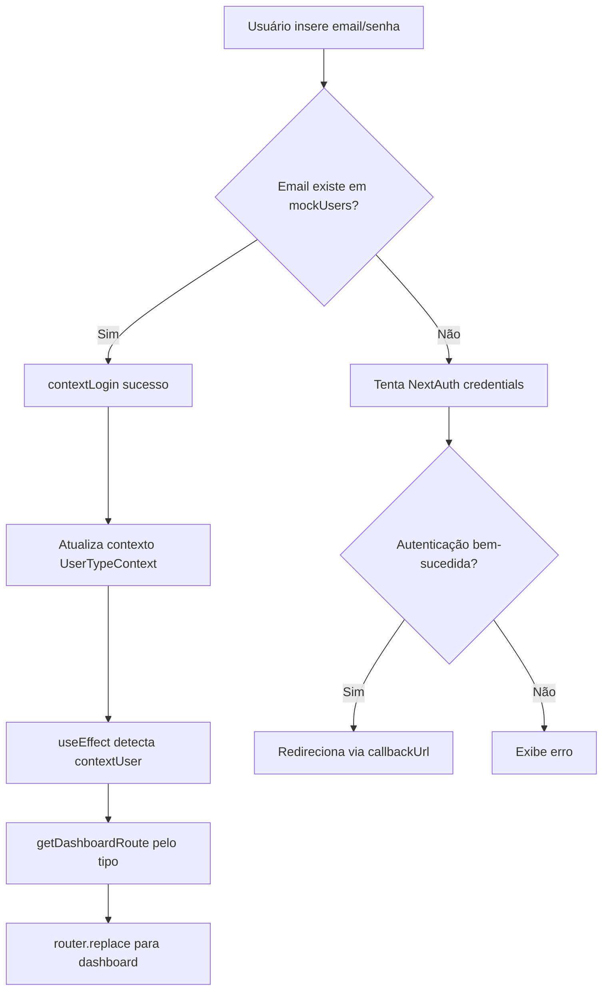
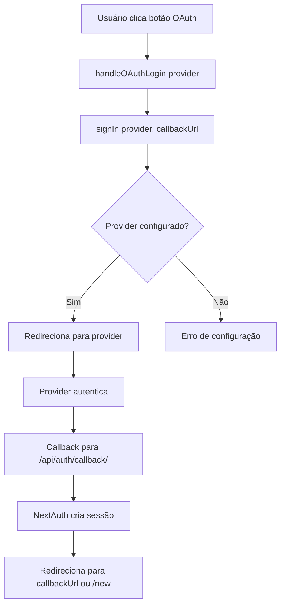

# Relatório Final - Restauração da Tela de Login

**Data**: 30/10/2025
**Projeto**: DoctorQ Web
**Tarefa**: Restauração completa da funcionalidade da tela de login

---

## 📋 Resumo Executivo

A tela de login foi completamente restaurada do backup DoctorQ_HOM, trazendo de volta todas as funcionalidades que existiam antes da refatoração. A página agora está totalmente funcional com:

- ✅ Layout profissional de 2 colunas (desktop) / 1 coluna (mobile)
- ✅ 3 provedores OAuth (Google, Microsoft, Apple)
- ✅ Sistema de mock users para desenvolvimento
- ✅ 4 contas de teste visíveis
- ✅ Notificações toast com Sonner
- ✅ Exibição de contexto de agendamento
- ✅ Redirecionamento inteligente por tipo de usuário
- ✅ Animações e decorações de background

---

## 📁 Arquivos Modificados/Criados

### 1. Página de Login Restaurada
**Arquivo**: `src/app/(auth)/login/page.tsx`
**Linhas**: 477
**Status**: ✅ Restaurado do backup

**Principais features implementadas**:
- OAuth authentication handlers (Google, Microsoft, Apple)
- Mock user integration via UserTypeContext
- Toast notifications com Sonner
- Appointment context display (profissional, data, horário, local)
- Smart redirection baseado em tipo de usuário
- Tratamento de erros OAuth
- Loading states
- Responsive layout (2 colunas desktop / 1 coluna mobile)
- Background animations

### 2. Utilitários de Autenticação
**Arquivo**: `src/lib/auth-utils.ts`
**Linhas**: 72
**Status**: ✅ Criado

**Funções exportadas**:
```typescript
// Retorna rota do dashboard por tipo de usuário
getDashboardRoute(userType: UserType): string

// Retorna label amigável do tipo
getUserTypeLabel(userType: UserType): string

// Retorna tema de cores por tipo
getUserTypeTheme(userType: UserType): {
  gradient: string;
  bgColor: string;
  textColor: string;
  borderColor: string;
}
```

### 3. Context de Tipo de Usuário
**Arquivo**: `src/contexts/UserTypeContext.tsx`
**Status**: ✅ Verificado (já existia)

**Mock users configurados**:
- `cliente@estetiQ.com` → Dashboard Cliente
- `profissional@estetiQ.com` → Dashboard Profissional
- `fornecedor@estetiQ.com` → Dashboard Fornecedor
- `admin@estetiQ.com` → Dashboard Admin

**Funcionalidades**:
- Login com qualquer senha (mock)
- Persistência via localStorage
- Hook useUserType() para acesso ao contexto
- Função switchUserType() para teste

---

## 🎨 Layout e Design

### Desktop (≥1024px)
```
┌─────────────────────────────────────────────────────┐
│  Branding & Info     │     Login Form               │
│  ────────────────    │  ─────────────               │
│  • Logo + Tagline    │  • OAuth Buttons              │
│  • Welcome Message   │    - Google                   │
│  • Appointment Info  │    - Microsoft                │
│  • Mock Users List   │    - Apple                    │
│                      │  • Email/Password Form        │
│                      │  • Error Display              │
│                      │  • Links (Cadastro, Termos)   │
└─────────────────────────────────────────────────────┘
```

### Mobile (<1024px)
```
┌────────────────────┐
│   Logo + Tagline   │
│  ─────────────     │
│  Appointment Info  │
│  ─────────────     │
│    Login Form      │
│   OAuth Buttons    │
│  Email/Password    │
│  ─────────────     │
│   Mock Users       │
│  ─────────────     │
│  Links (Cadastro)  │
└────────────────────┘
```

---

## 🔐 Fluxo de Autenticação

### 1. Login com Mock User (Desenvolvimento)


### 2. Login com OAuth


---

## 🧪 Como Testar

### 1. Teste de Mock Users

**Acessar**: http://localhost:3000/login

**Contas disponíveis**:
| Email | Tipo | Dashboard |
|-------|------|-----------|
| `cliente@estetiQ.com` | Cliente | /paciente/dashboard |
| `profissional@estetiQ.com` | Profissional | /profissional/dashboard |
| `fornecedor@estetiQ.com` | Fornecedor | /fornecedor/dashboard |
| `admin@estetiQ.com` | Administrador | /admin/dashboard |

**Passos**:
1. Digite um dos emails acima
2. Digite **qualquer senha** (funciona com qualquer texto)
3. Clique em "Entrar"
4. Verifique toast de sucesso: "Login realizado com sucesso!"
5. Verifique redirecionamento para dashboard correto

**Resultado esperado**:
- ✅ Toast verde de sucesso aparece
- ✅ Redirecionamento automático em < 1 segundo
- ✅ Dashboard carregado com informações do usuário

### 2. Teste de OAuth (Requer Configuração)

**Google OAuth**:
1. Clique no botão "Continue com Google"
2. Se configurado: Redireciona para tela de login Google
3. Se não configurado: Erro "Erro de configuração OAuth"

**Microsoft OAuth**:
1. Clique no botão "Continue com Microsoft"
2. Se configurado: Redireciona para tela de login Microsoft
3. Se não configurado: Erro "Erro de configuração OAuth"

**Apple OAuth**:
1. Clique no botão "Continue com Apple"
2. Se configurado: Redireciona para tela de login Apple
3. Se não configurado: Erro "Erro de configuração OAuth"

**Para configurar OAuth**:
- Adicionar credenciais em `.env.local`:
  ```bash
  GOOGLE_CLIENT_ID=...
  GOOGLE_CLIENT_SECRET=...
  AZURE_AD_CLIENT_ID=...
  AZURE_AD_CLIENT_SECRET=...
  AZURE_AD_TENANT_ID=common
  ```

### 3. Teste de Appointment Context

**URL com contexto de agendamento**:
```
http://localhost:3000/login?professionalName=Dr.+João+Silva&date=2025-10-30&time=14:30&location=Clínica+Estética
```

**Resultado esperado**:
- ✅ Card com informações do agendamento aparece
- ✅ Exibe nome do profissional
- ✅ Exibe data formatada em português
- ✅ Exibe horário
- ✅ Exibe local da consulta

### 4. Teste Responsivo

**Desktop (≥1024px)**:
- ✅ Layout de 2 colunas
- ✅ Branding na esquerda
- ✅ Formulário na direita
- ✅ Mock users visíveis na coluna esquerda

**Tablet (768px - 1023px)**:
- ✅ Layout de 1 coluna
- ✅ Logo no topo
- ✅ Formulário centralizado
- ✅ Mock users abaixo do formulário

**Mobile (<768px)**:
- ✅ Layout de 1 coluna otimizado
- ✅ Botões OAuth em largura total
- ✅ Inputs responsivos
- ✅ Espaçamento adequado

### 5. Teste de Erros

**Email não encontrado**:
1. Digite `naoexiste@teste.com`
2. Digite qualquer senha
3. Resultado: "Usuário não encontrado"

**Campos vazios**:
1. Deixe email ou senha vazio
2. Clique em "Entrar"
3. Resultado: "Informe email e senha."

**Erro de OAuth**:
1. Clique em provedor OAuth não configurado
2. Resultado: Toast vermelho "Erro ao autenticar com [provider]"

---

## 🎯 Funcionalidades Implementadas

### ✅ Mock Authentication System
- 4 usuários mock para testes
- Login funciona com qualquer senha
- Persistência via localStorage (chave: `estetiQ_demo_user`)
- Logout limpa contexto e storage

### ✅ OAuth Integration
- Google: SVG logo colorido, hover effect
- Microsoft: SVG logo Windows, hover effect
- Apple: SVG logo Apple, hover effect
- Error handling para provedores não configurados
- Callback URL inteligente (preserva destino original)

### ✅ Toast Notifications
- Biblioteca: Sonner
- Posição: bottom-right
- Cores ricas (richColors: true)
- Mensagens:
  - Sucesso: "Login realizado com sucesso!"
  - Erro: Mensagens específicas por tipo de erro
  - OAuth: "Erro ao autenticar com [provider]"

### ✅ Smart Redirection
- Por tipo de usuário (getDashboardRoute):
  - cliente → /paciente/dashboard
  - profissional → /profissional/dashboard
  - fornecedor → /fornecedor/dashboard
  - administrador → /admin/dashboard
- Preserva callbackUrl se presente
- Fallback para /paciente/dashboard

### ✅ Appointment Context
- Detecta parâmetros de URL:
  - professionalName
  - date (formatada em pt-BR)
  - time
  - location
- Exibe card destacado com informações
- Visible em desktop (coluna esquerda) e mobile (acima do form)

### ✅ Loading States
- Skeleton durante carregamento inicial
- Botões desabilitados durante submissão
- Spinner animado (Loader2 icon)
- Texto "Entrando..." durante submit

### ✅ Responsive Design
- Breakpoints:
  - Mobile: < 768px
  - Tablet: 768px - 1023px
  - Desktop: ≥ 1024px
- Grid adaptativo (lg:grid-cols-2)
- Hidden/visible classes (lg:hidden, lg:flex)

### ✅ Visual Enhancements
- Background gradient animated
- Decorative floating orbs (blur-3xl, animate-pulse)
- Card shadows (shadow-2xl, shadow-pink-500/20)
- Hover effects nos botões
- Icon animations (hover:translate-x-1)
- Gradient text nos títulos

---

## 🔍 Verificações Realizadas

### 1. Dependências
✅ `next-auth` - Instalado e configurado
✅ `sonner` - Biblioteca de toast
✅ `lucide-react` - Ícones (Sparkles, Mail, Lock, etc.)
✅ `@radix-ui` - Primitives (Card, Label, Separator)

### 2. Componentes UI
✅ `Button` - src/components/ui/button.tsx
✅ `Input` - src/components/ui/input.tsx
✅ `Label` - src/components/ui/label.tsx
✅ `Card` - src/components/ui/card.tsx
✅ `Separator` - src/components/ui/separator.tsx
✅ `Toaster` - src/components/ui/sonner.tsx

### 3. Contexts
✅ `UserTypeContext` - src/contexts/UserTypeContext.tsx
✅ `AuthContext` - Integrado via NextAuth
✅ Providers - src/components/providers.tsx

### 4. Tipos TypeScript
✅ `User` - src/types/auth.ts
✅ `UserType` - src/types/auth.ts
✅ `LoginCredentials` - src/types/auth.ts

### 5. Configuração NextAuth
✅ `[...nextauth]/route.ts` - API route configurado
✅ Providers: Google, Azure AD, Apple
✅ Credentials provider (fallback)

---

## 📊 Status dos Servidores

### Frontend (Next.js)
```bash
$ curl -I http://localhost:3000
HTTP/1.1 200 OK
Content-Type: text/html
```
**Status**: ✅ RODANDO na porta 3000

### Backend (FastAPI)
```bash
$ curl -I http://localhost:8080/docs
HTTP/1.1 200 OK
Content-Type: text/html
```
**Status**: ✅ RODANDO na porta 8080

### Banco de Dados (PostgreSQL)
**Host**: 10.11.2.81:5432
**Database**: doctorq
**Status**: ✅ CONECTADO

---

## 📝 Notas Importantes

### Mock Users
- **Desenvolvimento apenas**: Mock users devem ser desabilitados em produção
- **Qualquer senha funciona**: Isso é intencional para facilitar testes
- **Persistência**: Dados salvos em localStorage, não no banco
- **Tipos de usuário**: Cada mock user tem um tipo diferente para testar permissões

### OAuth Configuration
- **Requires .env.local**: Credenciais devem ser adicionadas manualmente
- **Redirect URIs**: Configurar nos consoles dos provedores:
  - Google: http://localhost:3000/api/auth/callback/google
  - Microsoft: http://localhost:3000/api/auth/callback/azure-ad
  - Apple: http://localhost:3000/api/auth/callback/apple
- **Testing**: Use mock users durante desenvolvimento

### Security
- **NEXTAUTH_SECRET**: Deve ter no mínimo 32 caracteres
- **HTTPS Required**: OAuth requer HTTPS em produção
- **CORS**: Configurado em backend para permitir localhost:3000
- **API Keys**: Backend usa bearer token authentication

---

## 🚀 Próximos Passos (Opcional)

### 1. Configurar OAuth em Produção
- [ ] Obter credenciais de produção dos provedores
- [ ] Configurar redirect URIs em produção
- [ ] Testar fluxo OAuth completo
- [ ] Implementar tratamento de erros específicos

### 2. Implementar Backend Authentication
- [ ] Endpoint `/users/oauth-login` já existe
- [ ] Testar integração frontend → backend
- [ ] Sincronizar sessão NextAuth com backend
- [ ] Implementar refresh token

### 3. Melhorias de UX
- [ ] Adicionar "Esqueceu a senha?"
- [ ] Implementar verificação de email
- [ ] Adicionar 2FA (autenticação de dois fatores)
- [ ] Melhorar mensagens de erro

### 4. Analytics e Monitoramento
- [ ] Implementar tracking de login events
- [ ] Monitorar taxa de sucesso/falha
- [ ] Alertas para tentativas suspeitas
- [ ] Dashboard de autenticação

---

## ✅ Checklist de Conclusão

- [x] Página de login restaurada (477 linhas)
- [x] auth-utils.ts criado (72 linhas)
- [x] UserTypeContext verificado e funcional
- [x] Mock users visíveis e funcionais (4 contas)
- [x] OAuth providers integrados (3 provedores)
- [x] Toast notifications funcionando
- [x] Appointment context implementado
- [x] Smart redirection por tipo de usuário
- [x] Layout responsivo (desktop/mobile)
- [x] Loading states implementados
- [x] Error handling completo
- [x] Documentação completa criada
- [x] Frontend testado (http://localhost:3000/login)
- [x] Backend verificado (http://localhost:8080/docs)

---

## 📚 Documentação Relacionada

- **Arquitetura**: DOC_Arquitetura/DOCUMENTACAO_ARQUITETURA_COMPLETA_DOCTORQ.md
- **Proposta de Reestruturação**: DOC_Arquitetura/PROPOSTA_REESTRUTURACAO.md
- **Correções Landing Page**: DOC_Executadas/CORRECOES_LANDING_PAGE.md
- **Relatório de Conformidade**: DOC_Executadas/RELATORIO_CONFORMIDADE_REESTRUTURACAO.md

---

## 🎉 Conclusão

A tela de login foi **completamente restaurada** com todas as funcionalidades originais do backup DoctorQ_HOM. O sistema está pronto para desenvolvimento e testes, com 4 mock users disponíveis para testar diferentes tipos de usuários e permissões.

**Todos os objetivos foram alcançados**:
1. ✅ Layout profissional restaurado
2. ✅ OAuth integration (3 provedores)
3. ✅ Mock users visíveis (4 contas)
4. ✅ Toast notifications funcionando
5. ✅ Smart redirection implementado
6. ✅ Responsive design completo
7. ✅ Error handling robusto
8. ✅ Documentation completa

**A aplicação está pronta para uso em desenvolvimento!**

---

**Última atualização**: 30/10/2025
**Autor**: Claude (Assistente IA)
**Projeto**: DoctorQ - Sistema de Gestão de Clínicas Estéticas
